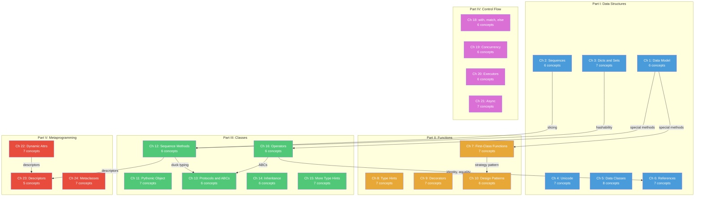
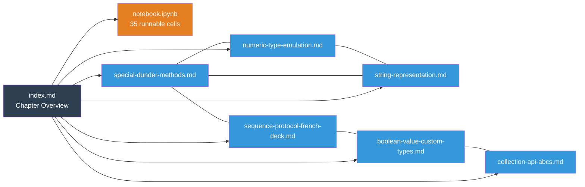

# Distill Tech Books

An automated pipeline that converts dense technical PDFs into interactive, browsable knowledge bases — Jupyter notebooks with runnable code + an Obsidian wiki with cross-linked concept articles.

**Drop a 1000-page book in, get a distilled knowledge base out.**

---

### The Transformation

```
 ┌─────────────────────┐                    ┌──────────────────────────────────┐
 │                     │                    │  library/fluent-python/          │
 │   Fluent Python     │     distill        │  ├── 23 interactive notebooks   │
 │   1,011 pages       │  ──────────────►   │  ├── 150 wiki articles          │
 │   24 chapters       │   Claude Code      │  ├── 943 cross-links            │
 │   ~500 code examples│                    │  └── 699 runnable code cells    │
 │                     │                    │                                  │
 └─────────────────────┘                    └──────────────────────────────────┘
       months to read                             days to master
```

---

## Knowledge Graph

Every concept links to related concepts — within and across chapters. Open the `library/` folder in Obsidian to see the full interactive graph, or preview the structure here:



### What a Chapter Looks Like

Each chapter folder contains an interactive notebook + wiki articles that link to each other:



### What a Wiki Article Looks Like

Every article has YAML frontmatter for metadata queries, cross-linked `[[wikilinks]]`, and runnable code:

```markdown
---
title: "Special (Dunder) Methods"
book: "Fluent Python"
chapter: 1
tags: [python, data-model, dunder-methods]
related:
  - "[[sequence-protocol-french-deck]]"
  - "[[numeric-type-emulation]]"
---

## Summary
Special methods are the foundation of the Python Data Model...

## How It Works
    ```python
    class Deck:
        def __len__(self): return 52
        def __getitem__(self, i): ...

    len(Deck())   # interpreter calls __len__
    Deck()[0]     # interpreter calls __getitem__
    ```

## In Practice
When to implement dunder methods in your own classes...

## Common Pitfalls
- Don't call dunder methods directly...

## See Also
- [[sequence-protocol-french-deck]] — how __getitem__ enables iteration
- [[numeric-type-emulation]] — __add__, __mul__ for custom math
```

### What a Notebook Looks Like

Each notebook follows the same learning structure:

```
 ┌─────────────────────────────────────────────────┐
 │  # Chapter 1: The Python Data Model             │
 │  *From: Fluent Python by Luciano Ramalho*       │
 ├─────────────────────────────────────────────────┤
 │  ## TL;DR                                       │
 │  - Python uses special methods (__len__, etc.)   │
 │  - Implementing __getitem__ gives you iteration  │
 │  - The data model lets your objects feel native   │
 ├─────────────────────────────────────────────────┤
 │  ## 1. The FrenchDeck Example                   │
 │  ┌───────────────────────────────────────┐      │
 │  │ >>> import collections               │ CODE │
 │  │ >>> Card = namedtuple('Card', ...)   │      │
 │  │ >>> deck = FrenchDeck()              │      │
 │  │ >>> len(deck)                        │      │
 │  │ 52                                    │      │
 │  └───────────────────────────────────────┘      │
 ├─────────────────────────────────────────────────┤
 │  ## Try It Yourself                             │
 │  # Exercise 1: Build a Temperature class        │
 │  # that supports abs(), comparison, and repr    │
 ├─────────────────────────────────────────────────┤
 │  ## Key Takeaways                               │
 │  1. Implement __repr__ over __str__             │
 │  2. Use __getitem__ to get iteration for free   │
 │                                                  │
 │  ## See Also                                    │
 │  [[special-dunder-methods]] | [[collection-api]] │
 └─────────────────────────────────────────────────┘
```

> **Tip**: To see the real interactive graph, open `library/` in [Obsidian](https://obsidian.md) and press `Ctrl+G` for the graph view. You'll see all 150 concepts as nodes with 943 links between them.
>
> To add your own screenshots, save them to `docs/` and reference them here:
> ```markdown
> 
> 
> ```

---

## What You Get

For each book, the system produces:

```
library/fluent-python/
├── index.md                              # Book overview with chapter navigation
├── concepts/index.md                     # Alphabetical concept index (150 entries)
└── chapters/
    └── 01-python-data-model/
        ├── index.md                      # Chapter overview linking everything
        ├── notebook.ipynb                # Interactive notebook — runnable code + exercises
        ├── special-dunder-methods.md     # Wiki article: what are dunder methods?
        ├── sequence-protocol-french-deck.md  # Wiki article: the FrenchDeck example
        ├── numeric-type-emulation.md     # Wiki article: Vector class, __add__, __mul__
        └── ...                           # 3-8 concept articles per chapter
```

- **Notebooks**: Self-contained Python 3.11+ code you can run cell by cell. Each has a TL;DR, concept explanations, code examples, exercises, and key takeaways.
- **Wiki articles**: 500-1000 word explainers with YAML frontmatter, `[[wikilinks]]` for Obsidian graph navigation, code examples, "In Practice" and "Common Pitfalls" sections.
- **Indexes**: Book-level, chapter-level, and alphabetical concept indexes — all interlinked.

### Current Library

| Book | Chapters | Concepts | Notebooks | Code Cells | Cross-Links |
|------|----------|----------|-----------|------------|-------------|
| Fluent Python (2nd Ed) | 23 | 150 | 23 | 699 | 943 |

## How It Works

The pipeline has 5 stages, fully automated via Claude Code:

```mermaid
flowchart LR
    PDF["PDF<br/>1,011 pages"]
    Extract["1. EXTRACT<br/>PyMuPDF"]
    Concepts["2. IDENTIFY<br/>CONCEPTS"]
    Distill["3. DISTILL<br/>Parallel Agents"]
    Index["4. INDEX<br/>wiki_builder"]
    Validate["5. VALIDATE<br/>Link Check"]
    KB["Knowledge<br/>Base"]

    PDF --> Extract
    Extract -->|"raw markdown<br/>per chapter"| Concepts
    Concepts -->|"3-7 concepts<br/>per chapter"| Distill
    Distill -->|"notebooks +<br/>wiki articles"| Index
    Index -->|"chapter, concept,<br/>book indexes"| Validate
    Validate --> KB

    style PDF fill:#E74C3C,color:#fff
    style Extract fill:#E67E22,color:#fff
    style Concepts fill:#F1C40F,color:#000
    style Distill fill:#2ECC71,color:#fff
    style Index fill:#3498DB,color:#fff
    style Validate fill:#9B59B6,color:#fff
    style KB fill:#2C3E50,color:#fff
```



| Stage | What Happens | Tool |
|-------|-------------|------|
| **Extract** | PDF TOC parsed, pages converted to markdown per chapter | `src/extract.py` (PyMuPDF + pymupdf4llm) |
| **Identify** | Claude reads raw chapter, picks 3-7 core concepts | Claude agent + `prompts/extract_concepts.md` |
| **Distill** | Parallel agents create notebook + wiki articles simultaneously | Claude agents + `prompts/create_notebook.md`, `create_wiki_article.md` |
| **Index** | Auto-generate chapter, concept, book, and library indexes | `src/wiki_builder.py` |
| **Validate** | Check every `[[wikilink]]` resolves to a real file | `src/wiki_builder.py validate` |

## Quick Start

### Prerequisites

```bash
pip install pymupdf4llm nbformat pyyaml jinja2
```

Also needed: Python 3.11+, JupyterLab (for running notebooks), Claude Code (for the `/distill` skill).

### Viewing the Knowledge Base

**Option A: VS Code** (recommended)
1. Install the [Foam](https://marketplace.visualstudio.com/items?itemName=foam.foam-vscode) extension
2. Open the `library/` folder
3. `[[wikilinks]]` become clickable, backlinks panel shows connections, graph view visualizes the knowledge graph

**Option B: Obsidian**
1. Open `library/` as a vault in [Obsidian](https://obsidian.md)
2. Wikilinks, graph view, and backlinks work out of the box
3. Install the Dataview plugin to query frontmatter metadata

**Option C: JupyterLab**
```bash
jupyter lab library/fluent-python/chapters/01-python-data-model/notebook.ipynb
```

All three can work simultaneously on the same `library/` folder.

### Running the Pipeline

**Extract a book (no LLM needed):**
```bash
# Initialize — parse TOC, create directory structure
make init

# Extract all chapters to raw markdown
make extract

# Or extract a single chapter
make extract-ch CH=1
```

**Distill with Claude Code:**
```bash
# Distill a single chapter (interactive)
# In Claude Code, run:
/distill fluent-python --chapter 1

# Distill the entire book (best in autonomous mode)
claude -p "/distill fluent-python" --dangerously-skip-permissions

# Validate wikilinks
make validate
```

### Adding a New Book

1. Drop the PDF into `books/`
2. Add an entry to `config.yaml`
3. Run `/distill <slug>` in Claude Code — the pipeline handles everything:
   - Extracts raw markdown to `raw-data/<slug>/` (private submodule)
   - Copies PDF to `raw-data/<slug>/book.pdf`
   - Distills into notebooks + wiki articles in `library/<slug>/`
   - Commits and pushes raw data to the private repo, distilled content to the public repo

## Project Structure

```
distill-tech-books/
│
├── books/                          # Local PDF drop zone (git-ignored)
│   └── Fluent Python.pdf
│
├── raw-data/                       # Git submodule → private repo
│   └── fluent-python/              # Raw extractions + source PDF per book
│       ├── book.pdf                # Source PDF (private)
│       ├── chapter-01.md           # Raw extracted markdown (private)
│       ├── chapter-01-concepts.yaml
│       └── ...
│
├── src/                            # Pipeline code
│   ├── extract.py                  # PDF → raw markdown + images
│   ├── notebook_builder.py         # Structured cells → valid .ipynb
│   └── wiki_builder.py             # Index generation + wikilink validation
│
├── prompts/                        # LLM prompt templates
│   ├── extract_concepts.md         # How to identify core concepts
│   ├── create_notebook.md          # How to structure a notebook
│   ├── create_wiki_article.md      # How to write a wiki article
│   └── quality_review.md           # How to review generated content
│
├── .claude/skills/distill/         # Claude Code /distill skill
│   └── SKILL.md                    # Orchestrator — runs the full pipeline
│
├── library/                        # THE OUTPUT — Obsidian-compatible vault (public)
│   ├── index.md                    # Library home
│   └── fluent-python/              # One folder per book
│       ├── index.md                # Book overview
│       ├── _meta.yaml              # Progress tracking
│       ├── concepts/index.md       # Alphabetical concept index
│       └── chapters/               # Distilled output
│           └── NN-chapter-slug/
│               ├── index.md        # Chapter overview
│               ├── notebook.ipynb  # Interactive notebook
│               └── *.md            # Wiki concept articles
│
├── config.yaml                     # Book registry + font mappings
├── Makefile                        # make extract, make index, make validate
└── README.md
```

> **Note:** `raw-data/` is a [git submodule](https://git-scm.com/book/en/v2/Git-Tools-Submodules) pointing to a private repository. It contains source PDFs and raw text extractions (copyrighted material). Public clones will see the submodule reference but cannot access the content.

## Key Design Decisions

- **Folder per chapter**, not file per chapter. Each chapter contains its notebook + concept articles + index — keeps related content together.
- **Wiki articles live with their chapter**, not in a separate wiki/ folder. Obsidian resolves `[[wikilinks]]` by filename across the entire vault, so `[[decorators]]` works from anywhere.
- **Raw extraction is separate from distilled output.** Re-distilling doesn't require re-extracting. Raw data lives in a private submodule (`raw-data/`); `chapters/` is the public output.
- **YAML frontmatter on everything.** Enables Obsidian Dataview queries, programmatic processing, and metadata tracking.
- **All notebook code is self-contained.** No imports from the book's source code. Every cell runs in a fresh Python 3.11+ environment with stdlib only.

## Make Targets

| Command | Description |
|---------|-------------|
| `make help` | Show all targets |
| `make init` | Parse PDF TOC, create directory structure |
| `make extract` | Extract all chapters to raw markdown |
| `make extract-ch CH=N` | Extract single chapter |
| `make index` | Rebuild all indexes |
| `make validate` | Check for broken wikilinks |
| `make clean` | Remove raw extractions (keeps distilled output) |

## Repository Architecture

This project uses **two repositories**:

| Repo | Visibility | Contains |
|------|-----------|----------|
| `distill-tech-books` | Public | Pipeline code, prompts, distilled knowledge base (notebooks + wiki) |
| `distill-tech-books-raw` | Private | Source PDFs, raw text extractions, concept YAML files |

The private repo is linked as a git submodule at `raw-data/`. When you clone this public repo, the submodule appears but its contents are inaccessible without access to the private repo. This keeps copyrighted source material private while sharing the distilled, original content publicly.

## How the Extraction Works

`src/extract.py` uses two libraries:

1. **PyMuPDF** (`pymupdf`) — reads the PDF's Table of Contents to map chapters to page ranges, and extracts images.
2. **pymupdf4llm** — converts PDF pages to markdown with font-aware formatting (headings, code blocks, inline code, italic/bold).

Raw output goes to `raw-data/<slug>/` (private submodule). Post-processing cleans up:
- Page number artifacts (e.g., "**Chapter 1: Title | 5**")
- Inline code blocks that should be fenced code blocks
- Excessive whitespace and OCR artifacts

Font-to-markdown mappings are stored in `config.yaml`, so different publishers (O'Reilly, Manning, Apress) can work without code changes.

## Tech Stack

| Component | Tool |
|-----------|------|
| PDF parsing | PyMuPDF + pymupdf4llm |
| Notebook creation | nbformat |
| LLM distillation | Claude Code (Opus) with parallel agents |
| Wiki format | Obsidian-compatible markdown with YAML frontmatter |
| Viewing | VS Code + Foam, Obsidian, JupyterLab |
| Config | YAML |
| Automation | Makefile + Claude Code `/distill` skill |
