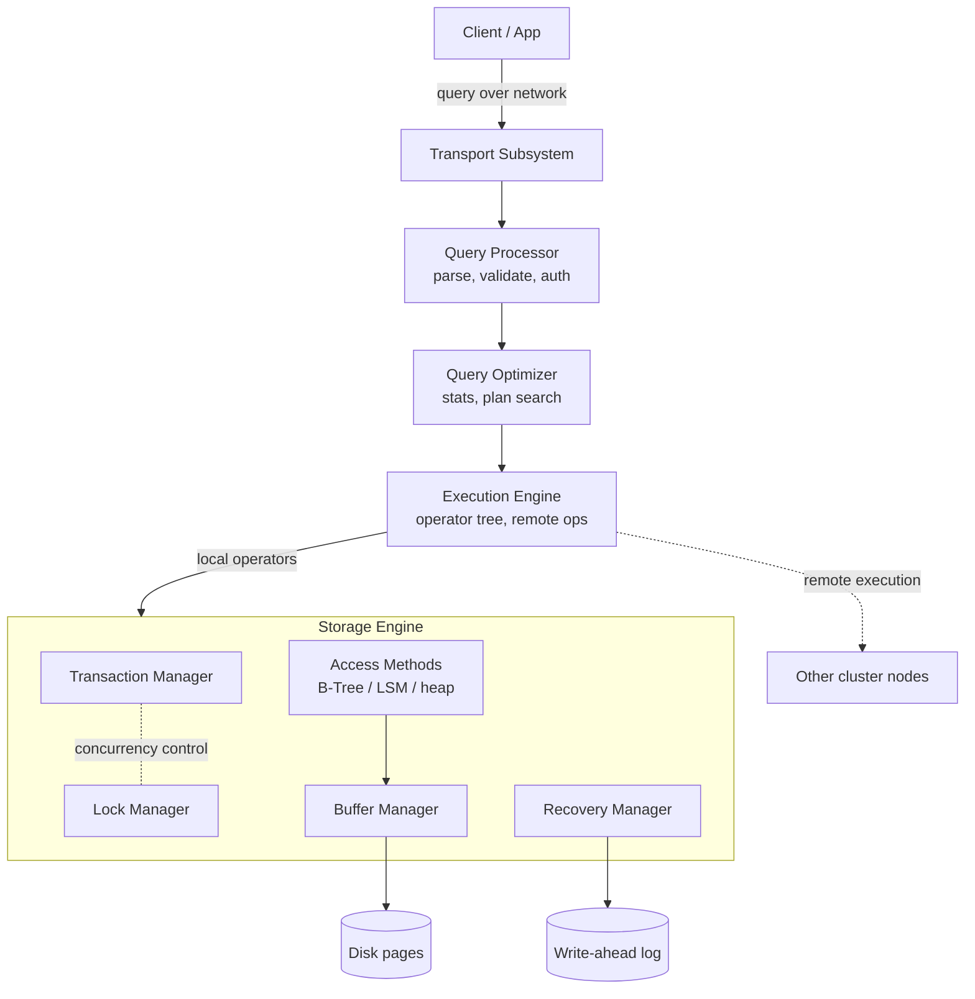

# DBMS Architecture and Component Responsibilities

> **One-sentence summary.** A database management system is a layered pipeline — transport, query processor, optimizer, execution engine, storage engine — where each layer has one job, and almost every interesting behavior of a real database falls out of how those layers divide (or blur) responsibilities.

## How It Works

Every DBMS follows a client/server model: application instances are clients, database nodes are servers, and a request walks a well-defined path from wire to disk and back. The **transport subsystem** receives the query over the network (and also handles node-to-node chatter inside a cluster). It hands the raw query text to the **query processor**, which parses it into a syntax tree, validates it against the schema, and runs access-control checks. The parsed query then goes to the **query optimizer**, which prunes impossible or redundant fragments and searches for the cheapest execution plan using internal statistics — index cardinality, intersection-size estimates, and, in a distributed system, the cost of shipping data between nodes. The output is an **execution plan**: a tree of physical operators (scans, joins, aggregates) that the **execution engine** drives, collecting results from local operators and coordinating any remote execution across the cluster, including replication.

When the plan reaches data that lives on this node, the execution engine calls into the **storage engine**. This is where the DBMS actually touches persistent state, and it is itself split into five sub-managers with tightly scoped jobs. The *transaction manager* schedules transactions and prevents the database from reaching a logically inconsistent state. The *lock manager* takes locks on database objects so concurrent operations don't corrupt physical data integrity. The *access methods* own how records are laid out and retrieved — heap files, B-Trees (see [[05-buffering-immutability-ordering]]), LSM Trees, and the indexes that point into them (see [[04-data-files-and-index-files]]). The *buffer manager* caches disk pages in memory and decides what to evict. The *recovery manager* maintains the write-ahead log and replays it after a crash so the system can restart in a consistent state. Critically, **transaction manager + lock manager together are what "concurrency control" means** — neither one alone is enough; you need scheduling *and* physical mutual exclusion.

## When to Use

This is reference knowledge, not a pattern you "pick" — it's the mental map you use whenever you reason about a database.

- **When placing a feature or bug**: a slow `GROUP BY` over a cold table is rarely a transport problem; it's either the optimizer picking a bad plan, the access method reading too many pages, or the buffer manager thrashing. Knowing the layers tells you where to look first.
- **When reading a database paper or source tree**: Postgres, CockroachDB, RocksDB, and SQLite all use roughly these component names. The paper's novelty is almost always *one* of these boxes (e.g., "we replaced the lock manager with MVCC", "we rewrote the optimizer to be cost-based"). Everything else is table stakes.
- **When debugging performance**: per-query latency splits cleanly across the pipeline. Transport = network + serialization. Query processor = parse/plan time. Execution = CPU in operators. Storage engine = I/O and lock waits. Most DB profiling tools (`EXPLAIN ANALYZE`, `pg_stat_statements`, slow logs) are organized around these same boundaries.

## Trade-offs

| Aspect | Monolithic / Tightly Coupled | Modular / Cleanly Separated |
|---|---|---|
| Performance | Layers share data structures and skip copies; optimizer can peek into storage-engine stats cheaply | Crossing boundaries has overhead (extra allocations, virtual calls, stats plumbing) |
| Testability | Hard to unit-test one layer without booting the whole DB | Each component has a narrow interface and can be tested in isolation |
| Evolvability | Any change risks touching several subsystems at once | Can swap one component (e.g., replace the storage engine) without rewriting the rest |
| Real-world fit | Optimized single-node systems (classic SQLite, early MySQL) | Systems designed for pluggability (MySQL's storage engines, FoundationDB layers, Postgres extensions) |
| Where boundaries leak | Edge cases, perf hot paths, transaction semantics pulling locks into access methods | Strict separation often forces duplicated metadata or weaker optimizer choices |

The honest reading: on paper every DBMS is modular; in code every DBMS is more coupled than its architecture diagram suggests, because the fastest path through these layers is usually the one that cuts across them.

## Real-World Examples

- **PostgreSQL**: the textbook modular layout. A distinct parser, a rewriter, a cost-based optimizer, an executor driving an operator tree, and a storage layer built on buffer pool + heap access method + WAL. You can follow a query from `pq_recvbuf` all the way to `heap_getnext` without ambiguity.
- **MySQL + InnoDB**: the storage engine is pluggable (that's the whole point of the MySQL architecture), and InnoDB further blurs one boundary on purpose — its primary index *is* the data file (index-organized table, see [[04-data-files-and-index-files]]), so the access method and the data file are the same B+Tree.
- **SQLite**: the entire "cluster" is one process linked into your app. Transport is a function call, not a socket; there is no remote execution engine. The storage engine (pager + B-Tree) is most of the code, and it all lives in a single file on disk.
- **CockroachDB / Spanner**: the same five storage-engine sub-managers exist per node, but the transport is gRPC between many nodes, and the execution engine is *distributed* — it routes operators to whichever node holds the relevant range, handles replication via Raft/Paxos, and the transaction manager coordinates two-phase commit across them. The architecture scales out by multiplying the top half of the diagram, not by rewriting the bottom.

## Common Pitfalls

- **Conflating "the storage engine" with "the database".** Engineers coming from RocksDB or LevelDB sometimes reason about Postgres or Spanner as if the storage engine were the whole system, and are surprised when the optimizer, not the B-Tree, is what made their query slow.
- **Assuming the optimizer picks *optimal* plans.** It picks the cheapest plan *according to its cost model and current statistics*. Stale stats, correlated columns, or parameter sniffing can all produce plans that are orders of magnitude worse than hand-written alternatives. `EXPLAIN` exists because this goes wrong often enough to be a skill.
- **Forgetting the buffer manager exists when tuning.** A lot of "the disk is slow" turns out to be "the working set no longer fits in the buffer pool". Page cache hit ratio is often the single most predictive metric for OLTP latency, and it sits between the access method and the disk in a place most application developers never look.
- **Treating "concurrency control" as one thing.** It is transaction manager *and* lock manager (or transaction manager + MVCC). Bugs like phantom reads or write skew usually come from one half doing its job while the other makes an assumption that no longer holds.

## See Also

- [[02-memory-vs-disk-based-storage]] — where the storage engine keeps the primary copy of data, and how that choice rewrites the buffer manager and recovery manager
- [[03-row-vs-column-oriented-layouts]] — how the access methods physically arrange records, and why that decision is downstream of the workload
- [[04-data-files-and-index-files]] — the file-level split inside the access methods: heap/index-organized tables, primary vs secondary indexes, and indirection
- [[05-buffering-immutability-ordering]] — the three design axes that span every real storage engine (B-Tree, LSM Tree, Bitcask, Bw-Tree)
