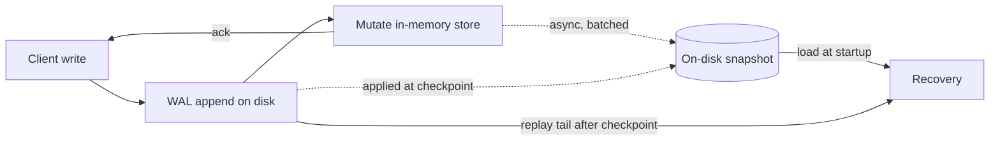

# Memory- Versus Disk-Based DBMS

> **One-sentence summary.** In-memory DBMSs keep the primary copy of data in RAM and use disk only for a write-ahead log plus periodic snapshots, while disk-based systems keep most data on disk and treat RAM as a buffer cache — and that one decision cascades into different data structures, durability mechanics, and cost profiles.

## How It Works

A **disk-based DBMS** treats the disk as the system of record. Pages live on the disk; a *buffer cache* in memory holds hot pages and absorbs writes until they can be flushed. Data structures are chosen to minimize I/O: wide-and-short B-Trees, slotted pages, block-aligned records, and serialization formats that pack values tightly so each block transfer pays off. Durability is mostly a byproduct — the canonical copy already lives on the durable medium, and a write-ahead log records changes before pages are dirtied so crashes can be recovered to a consistent state.

An **in-memory DBMS** (or *main memory DBMS*) inverts this. The primary copy of every record sits in RAM and is accessed directly through pointers. The disk exists only to survive restarts: every mutation is appended to a sequential log (a write-ahead log), and periodically the engine writes a *snapshot* — a sorted on-disk backup copy of the data at some point in time. On recovery the engine loads the latest snapshot, then replays only the log records produced after that snapshot was taken. The mechanism that makes this cheap is **checkpointing**: log entries are applied to the snapshot in asynchronous batches, and once a checkpoint completes, log records up to that point can be discarded. Checkpointing is what bounds recovery time — without it, a long-running server would have to replay a log that grows without end.

The key insight is that an in-memory DBMS is *not* equivalent to a disk-based DBMS with a very large buffer cache. Even when every page is resident, a disk-based engine still pays for its on-disk layout: block-granular access, serialization overhead, wide-and-short tree shapes chosen for seek cost, and manual variable-size record handling. An in-memory engine, freed from block I/O, can chase pointers cheaply, pick from a much larger pool of data structures (skip lists, tries, cache-line-optimized trees), and reference variable-size values as plain allocations. Access granularity shifts from block to byte, and the programming model shifts from "serialize, place, fragment, reclaim" to "allocate and free."

## When to Use

- **In-memory** makes sense when the working set is bounded and fits comfortably in RAM, and latency matters more than cost-per-byte: session stores, leaderboards, hot caches, real-time trading books, feature stores powering online ML inference, or student/customer/inventory records whose size is limited by the real-world entities they represent.
- **Disk-based** is the default when data is unbounded or grows faster than RAM prices fall — document corpora, event histories, user-generated content, log archives — or when cost-per-byte dominates and millisecond-scale latencies are acceptable.
- **Non-Volatile Memory (NVM)** designs increasingly blur the line. Byte-addressable persistent memory narrows the read/write latency gap and eliminates the volatile/durable divide, so new engines targeting NVM borrow structures from both camps.

## Trade-offs

| Aspect | In-Memory DBMS | Disk-Based DBMS |
|---|---|---|
| Primary storage medium | RAM | Disk (SSD / HDD) |
| Durability mechanism | WAL + periodic snapshot/checkpoint | Primary copy is already durable; WAL for crash consistency |
| Cost per byte | High (RAM prices) | Low (SSD/HDD prices) |
| Typical data structures | Skip lists, tries, cache-line-optimized trees; anything pointer-heavy | Wide-and-short B-Trees, LSM Trees, slotted pages |
| Recovery time | Load latest snapshot + replay log tail (bounded by checkpoint interval) | Replay WAL, restore buffer cache on demand |
| Access granularity | Byte-addressable | Block-addressable (minimum unit = page/block) |
| Variable-size data | Dereference a pointer | Manual layout, fragmentation, free-space management |
| Scalability limit | RAM capacity per node (plus cost) | Disk capacity, which is orders of magnitude cheaper to grow |

## Real-World Examples

- **Redis** — in-memory key-value store; durability is optional via an append-only file (AOF, the write-ahead log) and RDB snapshots (the checkpointed backup). The AOF-plus-RDB pairing is the canonical in-memory durability recipe.
- **SingleStore (formerly MemSQL), VoltDB, SAP HANA** — in-memory relational engines that keep row or column data in RAM with snapshot-plus-log durability, targeting sub-millisecond transactions and analytical queries over fresh data.
- **PostgreSQL, MySQL (InnoDB), Oracle** — classical disk-based relational engines built around B-Tree storage, a buffer pool, and a write-ahead log; the buffer pool can be huge, but the engine is still fundamentally disk-shaped.
- **RocksDB, LevelDB, Cassandra** — disk-based LSM-Tree engines optimized for write-heavy workloads on SSD.
- **NVM / Optane-era designs** — research and production systems (e.g., Intel Optane-backed variants of Redis and PostgreSQL, FOEDUS, Peloton) that redraw the boundary by treating persistent memory as both storage and memory at once.

## Common Pitfalls

- **Assuming in-memory means no durability.** An in-memory engine that has been configured with a WAL and checkpoints is fully durable; one that has not will lose data on any crash. Always look up how a specific deployment is configured (e.g., Redis with AOF `appendfsync always` vs. no AOF at all) rather than assuming based on the category.
- **Thinking a big buffer pool turns a disk-based engine into an in-memory one.** Even with every page cached, a disk-based engine still pays for block-granular access, serialization overhead, and wide-and-short tree shapes that exist to minimize seeks you no longer have. The layout is baked in; you cannot cache your way past it.
- **Forgetting that checkpoints interact with WAL retention.** You cannot truncate the write-ahead log past the last successful checkpoint, because recovery depends on replaying log entries that haven't yet been applied to the snapshot. A stalled or misconfigured checkpointer causes the log to grow without bound, which in turn blows out recovery time — the very thing checkpointing was supposed to bound.
- **Provisioning in-memory systems for peak dataset size without headroom.** RAM is a hard ceiling: an in-memory store that exceeds capacity typically evicts, refuses writes, or falls over, unlike a disk-based store that simply gets slower as the working set spills.

## See Also

- [[01-dbms-architecture]] — the buffer manager and recovery manager components live on either side of this divide and are shaped accordingly
- [[05-buffering-immutability-ordering]] — a deeper axis-based framing (buffering, immutability, ordering) that cuts across the memory/disk distinction and explains *why* engines on each side reach for specific data structures
