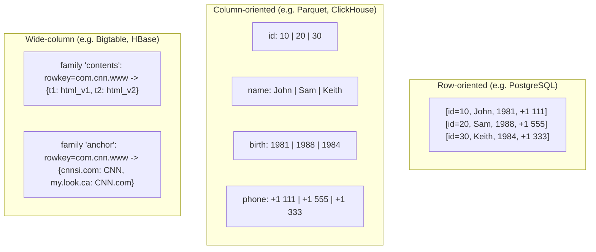

# Row- Versus Column-Oriented Data Layouts

> **One-sentence summary.** The same logical table can be laid out on disk as rows (all columns of one record contiguous, good for OLTP point reads), as columns (all values of one column contiguous, good for OLAP scans and compression), or as a wide-column map (rows grouped by key, columns grouped into families stored separately) — and choosing wrongly turns the storage engine into a bottleneck.

## How It Works

A **row-oriented** store keeps every field of a record next to its siblings on disk. A user record with `id`, `name`, `birth_date`, and `phone_number` is serialized as one contiguous blob, and the blob usually sits inside a single disk block. Because the minimum unit of disk I/O is a block, reading *any* field of that user effectively pulls the whole record into memory — a property called *spatial locality*. That is exactly what you want when the workload fetches, inserts, or updates records one at a time: the bytes you need travel together. It is also exactly what you do *not* want when a query only needs one column across a million rows, because each block read drags in a lot of bytes the query will discard.

A **column-oriented** store flips the layout 90 degrees. Values from the same column are stored contiguously — the `Symbol` column becomes one file segment, `Date` another, `Price` a third. A query like "average price over all DOW quotes" now reads only the two columns it touches, skipping entire segments of unused data. Two second-order wins fall out of this arrangement. First, values in one column share a data type, which means a single compression codec — run-length, bit-packing, dictionary, delta — can be chosen per column and usually beats generic row-level compression by a wide margin. Second, adjacent same-type values fit neatly into SIMD registers, so modern CPUs can apply one instruction to many values at once (vectorized execution). The cost is *tuple reconstruction*: to return a full row, the engine must stitch values back together by position, typically using implicit *virtual IDs* (the ordinal offset of the value inside each column) rather than explicit keys.

A **wide-column store** (Bigtable, HBase, Cassandra) is a different beast and is the source of the most common confusion in this space. It is not a columnar engine in the OLAP sense. Data is a multi-dimensional sorted map keyed by `(row_key, column_family:qualifier, timestamp)`. *Column families* are declared up front and stored on disk as separate files, but *within a family, data is laid out row-wise* — values belonging to the same row key are kept together. The Bigtable paper's Webtable example stores page snapshots indexed by reversed URL, with families like `contents` and `anchor`, each family holding many qualifiers (`html`, `cnnsi.com`, etc.) and multiple timestamped versions. The layout is tuned for key-driven access with predictable grouping of related attributes, not for full-column scans.

## When to Use

- **Row-oriented** for OLTP: checkout flows, auth lookups, CRUD APIs — anywhere the unit of work is a single record identified by a key, writes are small and frequent, and most or all columns of a row are read together. MySQL, PostgreSQL, and Oracle are the default choice because their block layout matches this access pattern.
- **Column-oriented** for OLAP and BI: dashboards, ad-hoc SQL over billions of rows, aggregate queries over a handful of columns, time-series analytics where compression ratio dominates total cost. Parquet/ORC on a data lake or ClickHouse/Vertica as a warehouse pay for themselves the moment query shape becomes "scan a few columns, skip the rest."
- **Wide-column** for high-volume keyed access with sparse, family-grouped attributes: per-device time-series in Cassandra, Bigtable-style Webtables where each page has hundreds of possible attributes but any given page only sets a few, messaging inboxes, feature stores keyed by entity ID with families that can be loaded or skipped as needed.

## Trade-offs

| Aspect | Row-Oriented | Column-Oriented | Wide-Column |
|---|---|---|---|
| Workload fit | OLTP, point queries, CRUD | OLAP, scans, aggregates | Keyed access with sparse attributes |
| Compression ratio | Low (mixed types per block) | High (same type per segment, type-specific codecs) | Moderate (row-wise within family) |
| Point lookup by key | Cheap — one block read returns the whole row | Expensive — must reassemble from N column segments | Cheap — row key indexes directly into each family |
| Aggregate over few columns | Expensive — pages in unused columns | Cheap — touches only relevant segments, SIMD-friendly | Moderate — depends on whether needed columns live in one family |
| Write cost | Cheap — append or update one record in place | Higher — each column segment must be written, often batched | Cheap for append; compaction cost later (LSM-based) |
| Block utilization | Good for full-row reads, wasteful for single-column scans | Excellent for column scans, poor for full-row reads | Good when access aligns with family grouping |

## Real-World Examples

- **Row-oriented**: MySQL, PostgreSQL, Oracle — the traditional relational OLTP stack. Block-per-record layout, B-Tree primary index, row-level MVCC.
- **Column-oriented**: MonetDB and C-Store (C-Store is the open-source predecessor to Vertica) are the two pioneer open-source columnar systems. Modern incarnations include Apache Parquet and Apache ORC (on-disk columnar file formats), RCFile (an earlier Hadoop format), Apache Kudu (columnar storage with fast row-level mutations), and ClickHouse (columnar OLAP engine used for real-time analytics).
- **Wide-column**: Bigtable (Google's original paper introduced the model and the Webtable example), HBase (the open-source Bigtable clone on HDFS), and Cassandra (whose SSTable-based storage engine is rooted in the Bigtable design, combined with a Dynamo-style replication model).

## Common Pitfalls

- **Conflating "column-oriented" with "wide-column."** The book calls this out explicitly: Bigtable and HBase are *not* OLAP columnar stores. They store data row-wise inside each column family. Choosing HBase because you heard "columnar is good for analytics" leads to a system tuned for keyed access being asked to do full-table scans, and performing poorly at both.
- **Picking columnar for a point-lookup workload.** Reassembling a single row from a columnar store means one seek (or segment read) per column. For a hundred-column table that is a hundred I/Os to return what a row store would return in one. If your workload is "fetch user by ID and render a profile page," a row store is the right answer.
- **Ignoring tuple reconstruction cost.** Column stores rely on *virtual IDs* — the positional offset of a value inside its column segment — to stitch rows back together. Any operation that preserves row identity (joins, multi-column filters, ORDER BY feeding a SELECT *) pays this cost. Engines mitigate with late materialization, zone maps, and vectorized reconstruction, but it is never free.
- **Using columnar formats for high-frequency single-row updates.** Parquet and ORC files are effectively immutable; updating one row typically means rewriting a row group or relying on delete-vectors plus compaction. Apache Kudu exists precisely because this gap hurt real workloads.
- **Under-designing column families in wide-column stores.** Column families are a physical boundary — they become separate files. Putting unrelated data in one family forces unnecessary I/O; spreading related data across many families forces unnecessary seeks. The model rewards thought up front about access patterns.

## See Also

- [[01-dbms-architecture]] — the storage engine is where layout decisions live, and row/column/wide-column choice constrains almost every other storage-engine component
- [[04-data-files-and-index-files]] — once a layout is chosen, the next question is how records inside the data file are located (heap vs index-organized, primary vs secondary indexes)
