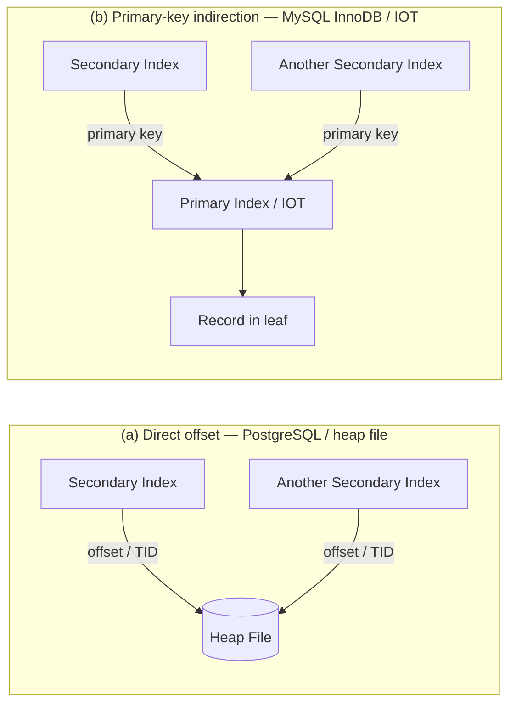

# Data Files, Index Files, and Indirection

> **One-sentence summary.** Databases split storage into data files that hold records and index files that map keys to those records, and a handful of knobs — heap vs hash vs index-organized, primary vs secondary, clustered vs non-clustered, direct-offset vs primary-key indirection — explain most of the storage-engine design space.

## How It Works

A storage engine separates *data files* (the actual records) from *index files* (metadata that maps a search key to a location in a data file). Data files hold the payload; index files are auxiliary structures that exist so the engine does not have to scan every record on every lookup. Both kinds of files are partitioned into fixed-size **pages**, where a page is one or several disk blocks — pages are the unit of I/O between disk and buffer pool, and the unit everything above the storage layer reasons about. Index files are typically much smaller than data files because they store only keys plus pointers, not full rows.

Data files come in three flavors. **Heap-organized tables** place records in write order with no ordering invariant — appending is cheap because you just tack the record onto the last page, but finding anything requires an external index. **Hash-organized tables** bucket records by `hash(key)`, so an equality lookup goes straight to the right bucket at the cost of useless range scans (neighboring keys land in unrelated buckets). **Index-organized tables (IOTs)** store the records *inside* the primary index itself, keyed in sorted order — once the engine traverses the index and finds the key, it already holds the record, saving at least one disk seek per lookup, and range scans become a sequential walk of leaf pages.

Indexes themselves slice along two orthogonal axes. An index on the primary key is the **primary index**; anything else is a **secondary index**, and a table can have many. Orthogonally, an index is **clustered** when the data file is physically ordered by that index's key (so the index leaves and the data pages are in lockstep, or are literally the same thing) and **non-clustered** otherwise. IOTs are clustered by definition — the "data" is the index — and secondary indexes are non-clustered by definition, since only one physical ordering per table is possible. A secondary index can only point *to* records; it cannot rearrange them.

This is where the indirection trade-off bites. A secondary index entry has to get the reader to the actual record somehow, and there are two choices. **Direct offsets** (often called row locators, TIDs, or RIDs) point straight at a page+slot in the data file — one seek, minimum cost. But if the record is ever relocated (a page split, a compaction, an update that grows the row past the page), every secondary index entry pointing at the old offset must be rewritten. **Primary-key indirection** has the secondary index store the primary key of the record; a read then does two lookups — secondary → primary key → primary index → record — but writes only have to keep the primary index consistent when rows move. MySQL InnoDB uses primary-key indirection; PostgreSQL uses TIDs (direct offsets). Deletions in both approaches are handled by **tombstones** — markers that shadow the old record — and real space reclamation happens later during garbage collection.

## When to Use

- **Index-organized tables** when the dominant access pattern is range-scan or lookup-by-primary-key and the table has few secondary indexes — the saved seek on every read compounds, and range scans over the primary key become free.
- **Heap files with external indexes** when the table has many secondary indexes or frequent updates, especially write-heavy workloads where the cost of keeping record order in the data file would dominate. Heap appends are the cheapest possible write.
- **Hash-organized tables** when the only query shape is key-equality (think KV caches, session stores, hash-partitioned buckets) and range queries are known to be irrelevant.
- **Primary-key indirection** when records move often — write-heavy workloads with updates, page splits, or online reorganization — since only the primary index has to be patched when rows relocate.
- **Direct offsets** when the workload is read-heavy and records are relatively stable; you get to skip the extra primary-index lookup on every read.

## Trade-offs

### Data file organization

| Aspect | Heap-organized | Hash-organized | Index-organized (IOT) |
|---|---|---|---|
| Insert cost | Cheapest (append) | Cheap (hash + append in bucket) | More expensive (maintain sort order) |
| Point lookup (primary key) | Requires primary index | O(1) average, one bucket | One index traversal, record is inline |
| Range scan | Needs clustered index or full scan | Not supported efficiently | Sequential walk of leaves |
| Secondary indexes | Typically direct offset | Typically bucket ID | Typically primary-key indirection |
| Ordering invariant | None | By hash bucket | By primary key |
| Example systems | PostgreSQL | DBM-family, some KV stores | MySQL InnoDB, SQLite `WITHOUT ROWID`, Oracle IOT |

### Secondary-index indirection

| Aspect | Direct offset (TID/RID) | Primary-key indirection |
|---|---|---|
| Read cost | One seek to data | Two lookups: secondary → primary → record |
| Write cost on record relocation | Must update every secondary index | Only primary index updates |
| Space overhead per secondary entry | Small (offset is compact) | Larger (full primary key) |
| Works with IOTs | No — no stable offset | Yes (the natural fit) |
| Example | PostgreSQL heap + TID | MySQL InnoDB, Oracle IOT |

## Real-World Examples

- **PostgreSQL** uses heap-organized tables with TOAST for oversized values; every secondary index (including the primary-key index) stores TIDs pointing directly at heap tuples. Updates produce new tuple versions (MVCC) and eventually force index rewrites for moved rows — one reason `VACUUM` matters so much.
- **MySQL InnoDB** organizes tables as IOTs clustered on the primary key; secondary indexes store the primary key rather than a physical pointer, so splits and page moves inside the clustered index do not cascade into every secondary index. The price is two B-tree traversals on any secondary-key lookup.
- **SQLite** uses a rowid-based B-tree by default but supports `WITHOUT ROWID` tables, which are true IOTs clustered on the declared primary key.
- **Oracle** supports both heap-organized tables (the default) and index-organized tables; for IOTs it uses logical rowids that can resolve through the primary-key index when rows have physically moved since the rowid was cached.
- **Hash-organized** designs show up in the DBM family (GDBM, Berkeley DB hash tables) and in bucket layouts used by some NoSQL engines for equality-only workloads.

## Common Pitfalls

- **Assuming every table is a heap.** Developers coming from PostgreSQL often reason about "row IDs you can point at" — but in InnoDB the primary key *is* the pointer, and choosing a wide or volatile primary key bloats every secondary index and makes updates expensive.
- **Adding many secondary indexes to an IOT without thinking.** Each secondary index in an IOT stores the full primary key per entry; with ten secondary indexes and a 30-byte primary key, you are carrying 300 bytes of key data per row across indexes alone — on top of the read-time cost of two traversals per lookup.
- **Expecting deletions to free space immediately.** Tombstones shadow the old record but do not reclaim pages; read amplification and on-disk footprint grow until garbage collection / vacuum / compaction runs. Heavy delete or update workloads need that cycle sized correctly.
- **Using a hash-organized layout when you later want range queries.** Hashing destroys key locality by design; retrofitting a range index on top of a hash-organized table is usually worse than having picked a different layout from the start.
- **Forgetting that "clustered" is a physical property, not a logical one.** You cannot have two clustered indexes on the same table — the data is only laid out in one order. Every additional "clustering" you want costs a covering secondary index or a second copy of the data.

## See Also

- [[01-dbms-architecture]] — places the storage engine's access methods (where data/index files live) inside the full DBMS stack
- [[03-row-vs-column-oriented-layouts]] — orthogonal choice about how individual records are laid out *within* pages, independent of heap/hash/IOT
- [[05-buffering-immutability-ordering]] — the three axes (buffering, mutability, ordering) that determine which of these layouts a given storage structure prefers
