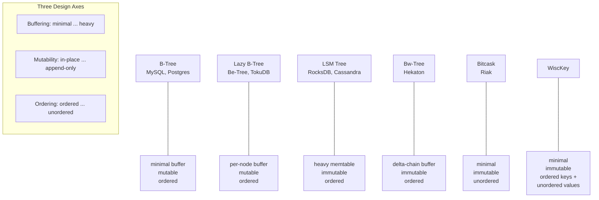

# Buffering, Immutability, and Ordering

> **One-sentence summary.** Most of the diversity in on-disk storage engines collapses onto three common design variables — how much you buffer in memory, whether files are mutable or append-only, and whether records are stored in key order — and almost every B-Tree variant, LSM Tree, Bitcask, or Bw-Tree is a different point in that space.

## How It Works

*Database Internals* closes Chapter 1 with a framing device that the rest of the book leans on: storage structures look bewilderingly varied, but three **common variables** explain most of the differences. These axes are not fully independent — choices on one often make choices on another more attractive (heavy write buffering pairs naturally with immutability, for example) — but treating them as roughly orthogonal lets you place B-Trees, Lazy B-Trees, LSM Trees, Bitcask, WiscKey, and Bw-Trees on the same map instead of memorizing each as a standalone thing. The storage structure itself only describes *how bytes sit on disk*; caching, recovery, and transactionality are layered on top, and this lens keeps the two concerns separate.

The three axes and their spectra:

- **Buffering — avoidable in-memory accumulation before flushing.** Every on-disk structure buffers *at least* one block, because the block is the I/O unit and partial-block writes are wasteful. The real design choice is whether to buffer *more* than that. Lazy B-Trees attach a small in-memory buffer to each node so updates can be batched and amortized against a single node I/O. Two-component LSM Trees push the idea much further: a whole memtable accumulates writes until it is flushed to disk as a complete immutable segment.
- **Mutability (or Immutability) — do we overwrite in place or append?** Classic B-Trees update a page at its original location. Immutable variants never do: append-only logs add records at the tail, copy-on-write writes the modified page to a *new* location and rewires the parent, and Bw-Trees attach delta records instead of rewriting the node. The "LSM = immutable, B-Tree = mutable" slogan is a useful first approximation but a generalization — Bw-Trees are B-Tree-shaped and immutable, proving the two axes are genuinely separate.
- **Ordering — are records laid out in key order on disk?** Ordered layouts cluster keys that sort together into contiguous pages, which is what makes efficient *range scans* possible. Unordered layouts (usually insertion order) trade range-scan performance for cheaper writes, because the engine never has to find the "right" spot for a new record. Bitcask and WiscKey are deliberate unordered append-only stores; they accept slow ranges in exchange for very fast point writes.

## When to Use

This is a **design lens**, not a system you deploy. Reach for it whenever you need to reason about a storage engine — reading a paper, evaluating a new database, or choosing between engines for a workload.

- **"Do I need range scans or only point lookups?"** drives the ordering axis. Time-series queries, sorted iteration, and secondary-index range predicates all want ordered storage. A pure key-value cache or a content-addressed blob store can happily skip it.
- **"Is the workload write-heavy or read-heavy?"** drives the buffering and mutability axes together. Write-heavy workloads benefit from heavy buffering + immutability (batch writes, avoid random I/O). Read-heavy workloads with relatively low write rates often do better with minimal buffering + in-place mutation (every read goes to the authoritative location without merging).
- **"How do I explain this engine to my team?"** — placing a new system onto the three axes is faster than reading the whole paper. "RocksDB is heavy-buffer, immutable, ordered" communicates more in one line than a paragraph of feature bullets.

## Trade-offs

| Axis | Option A | Option B | When A wins | When B wins |
|---|---|---|---|---|
| Buffering | Minimal (write-through) | Heavy (memtable / per-node buffer) | Reads must see the freshest state without merging across layers; latency-sensitive point reads | Write-heavy workloads where batching amortizes I/O; sequential-write disks (HDD/SSD endurance) |
| Mutability | Mutable (in-place update) | Immutable (append-only, copy-on-write) | Page locality is crucial; snapshot/MVCC is not required; you want to avoid background compaction cost | Write-heavy workloads benefit from sequential I/O; easy snapshots, easier crash recovery, lock-free reads |
| Ordering | Ordered by key | Unordered (insertion / hash) | Range scans, sorted iteration, efficient secondary indexes | Pure point-lookup / hash workloads, log-style ingest, value-heavy stores where ordering cost is not justified |

## Real-World Examples

| System | Buffering | Mutability | Ordering |
|---|---|---|---|
| B-Tree (MySQL InnoDB, PostgreSQL) | minimal | mutable (in-place) | ordered |
| Lazy B-Tree / Be-Tree (Tokutek / TokuDB fractal tree) | per-node buffered | mutable | ordered |
| LSM-Tree (RocksDB, LevelDB, Cassandra) | heavy (memtable) | immutable (SSTables) | ordered |
| Bitcask (Riak) | minimal | immutable (append-only) | unordered |
| WiscKey | minimal (key-value separation) | immutable | ordered keys, unordered values |
| Bw-Tree (Hekaton, CMU Peloton) | delta-chain per node | immutable | ordered |

A useful pattern here: moving a system along one axis usually forces a rethink on another. LSM Trees added heavy buffering, and that only pays off because files are *also* immutable (a memtable flush can be a whole new segment). Bw-Trees kept the B-Tree shape but swapped mutability for delta chains — and added per-node buffering almost as a side effect, because that is what the delta chain is.

## Common Pitfalls

- **Treating "LSM vs B-Tree" as the dichotomy.** It is the most famous pairing, but it collapses three axes into one. Bw-Trees (immutable *and* B-Tree-shaped) and Bitcask (immutable *and* unordered) show the space is genuinely 3D; the LSM/B-Tree rivalry is one diagonal through it.
- **Forgetting that immutability moves the write cost, it does not remove it.** Append-only structures have cheap writes *at the moment of ingest*, but they accumulate dead versions that compaction or garbage collection must later reclaim. If you ignore that background work when sizing hardware, your "fast writes" engine will stall under sustained load.
- **Assuming ordered always wins.** Ordered storage pays an insertion cost (find the right page, possibly split). Write-heavy, point-lookup-only workloads — event logs, object stores, some caches — genuinely benefit from unordered append-only stores like Bitcask. Ordering is a feature, not a default.
- **Conflating the axes with data-structure names.** "LSM" is not a synonym for "immutable"; "B-Tree" is not a synonym for "mutable." The axes describe choices, not families — name the choice, not the structure.

## See Also

- [[04-data-files-and-index-files]] — the substrate these axes apply to: data files hold records, index files map keys to them, and each can independently pick a point on the buffering/mutability/ordering cube
- [[02-memory-vs-disk-based-storage]] — the earlier split between where data *lives*; once you commit to disk-based storage, these three axes are how you organize it
