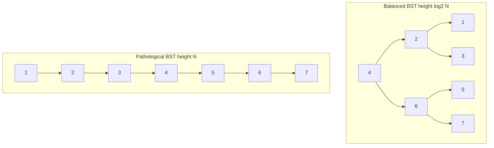
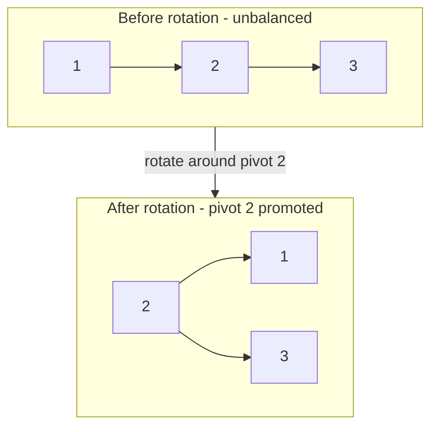

# Why Binary Search Trees Fail on Disk

> **One-sentence summary.** Balanced BSTs give logarithmic in-memory lookups, but their low fanout, pointer-heavy layout, and balancing-driven node relocation make them impractical as a persistent on-disk data structure.

## How It Works

A **binary search tree (BST)** is a sorted tree where each node holds one key, one associated value, and two child pointers. The node invariant is strict and simple: every key in the left subtree is *less than* the node's key, and every key in the right subtree is *greater than* it. A lookup descends from the root, choosing left or right at each level, halving the remaining search space every step. If the tree is *balanced* — that is, its height is roughly `log2 N` and the two subtrees of any node differ in height by at most a small constant — that descent costs `O(log2 N)` comparisons. If it is not balanced, the descent costs up to `O(N)`.

The shape of a BST depends entirely on insertion order. Insert keys `1, 2, 3, 4, 5` in order and you get a **pathological tree** that looks like a linked list: every new key hangs off the rightmost leaf, and lookups degrade to linear scans. To prevent that, balanced-BST variants (AVL, red-black, 2-3 trees) perform a *rotation* after each insert or delete that would otherwise grow one side of the tree too long. A rotation picks a pivot (the middle of three unbalanced nodes), promotes it one level up, and rewires two or three parent/child pointers so the pivot's former parent becomes its new child. The end result is a shorter, wider subtree with the same key ordering — and several pointers rewritten.

In memory, all of this is fine: pointer chases cost a few nanoseconds, and rebalancing moves a handful of words around. On disk, every one of these properties turns into a problem. A child pointer is no longer a cheap memory address — it is a *disk offset*, and following it may require fetching an entire page (see [[02-disk-hardware-and-block-io]]). Because keys arrive in random order, a newly created node is written wherever there was room, not next to its parent, so descending the tree sprays reads across the disk with no locality. Because fanout is just two, a tree of `N` keys has height `log2 N`, and in the worst case each level is a separate page, producing `log2 N` independent disk seeks per lookup. And because balancing rotations rewrite pointers on every modification, maintaining the tree means constantly dirtying and rewriting pages whose contents barely changed.

## When the BST Model Applies / Breaks Down

**It applies** when the tree fits comfortably in RAM, pointer-chasing is cheap, and the tree is the primary index for a data set that rarely touches disk directly. In that regime, the `O(log2 N)` bound is real and competitive, and rotations are a few instructions.

**It breaks down** the moment the working set exceeds memory. Three specific pressures cause the collapse:

- **Low fanout forces too many seeks.** With binary fanout, each level divides the search by 2, so you need `log2 N` levels — for a billion keys, that is ~30 levels. If each level sits on a different page, that is ~30 random disk seeks per lookup. High-fanout structures (hundreds of children per node) can do the same lookup in 3–4 seeks.
- **Random inserts destroy locality.** A BST has no notion of "the page I belong on." A newly-inserted key is written to whatever free space the allocator hands out, which is almost never next to its logical neighbors. Tree descents become random-access patterns, which is the worst case for both HDDs (seek-bound) and SSDs (prefetch-defeating).
- **Balancing rewrites pointers everywhere.** Each rotation rewrites two or three pointers. On disk, that means dirtying one or more pages per insert just for structural maintenance, on top of the write for the actual key. Over millions of inserts, this churn dominates write amplification.

## Trade-offs

| Desired on-disk property | What BSTs provide | Why it hurts |
|---|---|---|
| **High fanout** (many children per node) | Exactly 2 | Forces `log2 N` levels and one disk seek per level |
| **Low height** | `log2 N` at best | Billion-key index = ~30 seeks vs ~3–4 for high fanout |
| **Locality of related keys** | None — insertion order drives layout | Sibling keys may live on entirely different pages |
| **Cheap structural maintenance** | Rotation rewrites pointers | Each rebalance dirties multiple pages |
| **Worst-case bound** | `O(log2 N)` balanced, `O(N)` pathological | Any workload skew can still slow a naive implementation |
| **Aligned with block I/O** | Node is a few words; page is kilobytes | Most of each fetched page is wasted |

## Real-World Examples

- **C++ `std::map` and Java `TreeMap`**: both are red-black trees (a balanced-BST variant) living purely in memory. They rely on cheap pointer dereferencing and small rotations; they would be unusable as a persistent index.
- **In-memory database indexes**: Redis sorted sets, LevelDB's memtable (skip list, a BST cousin), and many in-memory OLAP engines use balanced-tree variants where RAM residency makes the fanout issue irrelevant.
- **On-disk systems that picked B-Trees instead**: PostgreSQL, MySQL/InnoDB, SQLite, and BerkeleyDB all use B-Trees (or B+ Trees, see [[04-btree-hierarchy-and-separator-keys]]) precisely because a B-Tree node is sized to one disk page, packing hundreds of keys into one seek. A PostgreSQL index over a billion rows has a height of roughly 4 — two orders of magnitude fewer seeks than a BST over the same data.
- **Paged binary trees** are a half-measure: group BST nodes into pages so that a page fetch serves many pointer-follows. They improve locality but keep the low-fanout height, and maintaining the page grouping under random inserts is itself complex.

## Common Pitfalls

- **Assuming `O(log N)` means "fast" regardless of the constant.** The logarithm base matters enormously on disk. `log2` with a seek on every level is 10x worse than `log100` with a seek on every level — same asymptotic class, wildly different wall-clock times.
- **Forgetting that insertion order controls BST shape.** A BST fed sorted (or reverse-sorted) keys degenerates to a linked list unless a balancer is running. Many "just use a tree" prototypes collapse the first time they see sequential IDs.
- **Confusing rotation with free.** Rotations are cheap in RAM but expensive on disk because pointer rewrites become page writes. Any structure that rebalances on every insert is going to amplify writes heavily on persistent storage.
- **Treating "paged binary tree" as equivalent to a B-Tree.** It is not. Paging the layout helps locality but does not raise fanout, so lookups still pay `log2 N` levels and inserts still trigger pointer churn across pages.

## See Also

- [[02-disk-hardware-and-block-io]] — why the smallest unit of I/O is a block, and what that implies for any structure that pretends pointers are free
- [[03-on-disk-structure-design-principles]] — high fanout, low height, locality, few out-of-page pointers: the design axes a BST fails and a B-Tree targets
- [[04-btree-hierarchy-and-separator-keys]] — the structure that takes the BST idea and widens every node to a full page, directly solving the fanout and height problems raised here
