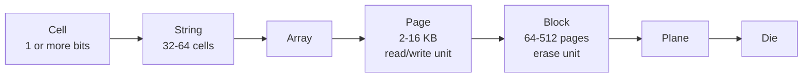
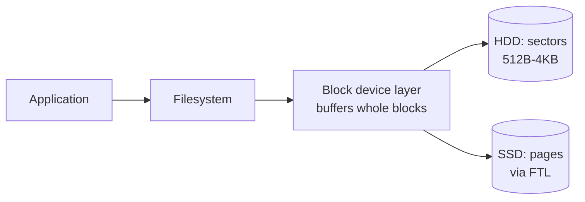

# Disk Hardware and the Block I/O Model

> **One-sentence summary.** On-disk storage structures must be designed around the block-device abstraction: HDDs pay a large seek cost and prefer sequential I/O, SSDs work with page/block/erase-block hierarchies managed by a Flash Translation Layer, and in both cases the OS transfers whole blocks rather than individual bytes.

## How It Works

A database's data structures are not free to treat the disk as an array of bytes. Both HDDs and SSDs are **block devices**: the smallest addressable unit is a sector (HDD) or a page (SSD), and the operating system layers a uniform *block device abstraction* on top. When you read a single word, the kernel actually fetches the entire block containing that word into a page cache, and when you write a single word, the whole block eventually gets written back. This is the single most important constraint on-disk layouts must respect — locality within a block is essentially free, while crossing a block boundary costs another I/O.

On a **hard disk drive**, the dominant cost is the *seek*: a mechanical arm must physically move the read/write head to the correct track, and the platter must rotate the target sector under it. Once positioned, streaming contiguous bytes is cheap. That asymmetry is the root cause of HDD design folklore: "sequential I/O is orders of magnitude faster than random I/O." Sector sizes typically range from 512 bytes to 4 KB, and everything a storage engine does — from B-Tree page sizing to write-ahead log layout — is shaped by the goal of either avoiding seeks or amortising them over large contiguous transfers.

A **solid state drive** has no moving parts, but it trades mechanical cost for a different set of rules. Flash memory is organised into a strict hierarchy: individual *cells* are wired into *strings*, strings into *arrays*, arrays into *pages*, pages into *blocks*, blocks into *planes*, and planes onto *dies*. The smallest readable or programmable unit is a page (typically 2–16 KB), but the smallest unit that can be *erased* is an entire block (64–512 pages), which is why it's called an *erase block*. A page can only be written once after its containing block has been erased, and pages within an empty block must be written sequentially. A **Flash Translation Layer (FTL)** inside the SSD controller hides this mess: it maps logical page IDs to physical locations, tracks which pages are empty, live, or discarded, and runs background *garbage collection* that relocates live pages out of mostly-dead blocks so those blocks can be erased and reused.

## When to Use

These hardware assumptions matter any time you are designing or reasoning about an on-disk data structure. In particular:

- When choosing a **node/page size** for a tree or heap. Match the filesystem block and/or the device's native page so one logical read equals one physical I/O.
- When deciding between **in-place updates and append-only writes**. On HDDs, in-place updates are cheap if access is sequential; on SSDs, append-only patterns align naturally with erase-before-write and reduce write amplification.
- When architecting the **write path**. Write-ahead logs, LSM trees, and log-structured filesystems all exist because turning random writes into sequential block-aligned writes is friendlier to both device types.

## Trade-offs

| Aspect | HDD | SSD |
|---|---|---|
| Smallest transfer unit | Sector (512 B – 4 KB) | Page (2 – 16 KB) |
| Random vs sequential | Huge penalty for random (seek-bound); sequential is orders of magnitude faster | Small but real penalty for random; prefetching and internal parallelism still favour sequential |
| Write semantics | In-place; a sector can be rewritten directly | Erase-before-write; pages only writable after their block is erased |
| Garbage-collection cost | None at device level | Background GC relocates live pages and erases blocks; can stall writes under random/unaligned load |
| Typical granularities | 512 B – 4 KB sectors | 4 – 16 KB pages, 256 KB – several MB erase blocks |
| Dominant latency term | Head positioning (seek + rotation) | Channel/plane contention and GC pauses |

## Real-World Examples

- **PostgreSQL** uses an 8 KB page by default — a sweet spot between SSD pages and filesystem blocks that keeps a B-Tree node aligned to one device I/O.
- **MySQL InnoDB** uses 16 KB pages; larger nodes mean higher B-Tree fanout and fewer seeks, at the cost of more work per node rewrite.
- **Write-ahead logs** (PostgreSQL WAL, MySQL redo log, SQLite journal) are laid out as long sequential files precisely because sequential writes are cheap on HDDs and align-friendly on SSDs.
- **LSM trees** (RocksDB, LevelDB, Cassandra) buffer mutations in memory and flush them as sorted immutable runs, then compact in the background — a pattern that turns a random-write workload into large sequential block writes that cooperate with SSD erase-block semantics.
- **Filesystem alignment** tools (`fdisk`/`parted` with 1 MiB starting offset) exist so that partition and filesystem blocks line up with SSD erase blocks and avoid crossing-boundary writes.

## Common Pitfalls

- **Assuming sequential-vs-random doesn't matter on SSDs.** The gap is smaller than on HDDs, but it is not zero: prefetching, channel parallelism, and GC all reward large sequential I/O. "SSD is fast so random is fine" is a trap.
- **Ignoring write amplification from small random writes.** A 100-byte update to a 16 KB page triggers a full page rewrite; on SSDs, it also contributes to block-level churn and eventual GC cost. Random small writes can amplify into many times their logical size.
- **Conflating sector with page with block.** A 4 KB filesystem block, an 8 KB DB page, a 16 KB SSD flash page, and a several-MB SSD erase block are four different units. Mis-aligning them produces partial-block I/O, write amplification, and surprising tail latencies.
- **Designing for RAM-like semantics on a block device.** Reading one word always costs one block — so structures should be laid out so that whole block is useful (packed keys, slot arrays, co-located children) rather than scattering related data across blocks.

## See Also

- [[01-bst-limitations-for-disk]] — why binary trees, with their low fanout and pointer-chasing, collide with exactly these block-I/O realities
- [[03-on-disk-structure-design-principles]] — the design rules (high fanout, low height, locality, minimal out-of-page pointers) that fall out of the block model described here
- [[04-btree-hierarchy-and-separator-keys]] — how B-Trees concretely pack separator keys and child pointers into a single block to respect the block-I/O model
