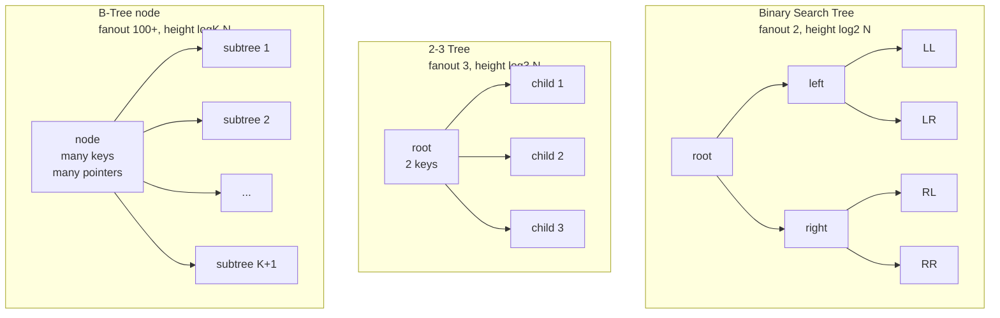

# On-Disk Structure Design Principles

> **One-sentence summary.** Because the smallest unit of disk I/O is a block, efficient on-disk data structures maximise fanout, minimise tree height, keep related keys adjacent for locality, and avoid long chains of out-of-page pointers.

## How It Works

On-disk data structures live under a constraint that in-memory structures ignore: the hardware cannot hand back a single byte or a single pointer cell — it hands back an entire block. Whether the medium is an HDD sector or an SSD page, the operating system's block-device abstraction reads and writes in fixed-size chunks, usually several kilobytes. To follow a single child pointer, the engine pays for a whole block transfer. Once that cost is paid, the rest of the block is essentially free to consume. Good on-disk structures are the ones that arrange for that "rest of the block" to be *useful*.

*Database Internals* distils this constraint into a small set of design principles that explain why B-Trees displaced binary search trees for persistent storage, and why even modern variants still obey the same laws:

1. **High fanout.** Pack many keys and many child pointers into a single node, so each block-sized node discriminates between dozens or hundreds of subtrees instead of just two. Fanout turns one expensive disk access into a large amount of useful comparison work.
2. **Low height.** The number of levels in the tree is exactly the number of block transfers a lookup costs. Fanout and height are inversely correlated — raise one and you automatically drop the other — so "high fanout" and "low height" are two views of the same principle.
3. **Locality of neighbouring keys.** Keys that will be compared together, or scanned in order, should live in the same block. This is what makes a single block fetch pay off: after one seek, many relevant comparisons happen in RAM.
4. **Minimise out-of-page pointers.** Pointers that cross block boundaries force extra fetches and complicate maintenance — every rebalancing operation has to chase and rewrite them. Keep pointers local to the node wherever possible.
5. **Precompute or cache offsets.** On-disk "pointers" are really byte offsets that the engine manages by hand. Long dependency chains of offsets — where the address of one structure can only be resolved after writing another — inflate complexity. Either compute offsets before writing, or cache them in RAM until flush time.
6. **The block is the unit of I/O.** Everything above is a corollary of this one fact. The layout of the structure should be designed so that whole blocks are useful when fetched, and whole blocks are written when modified.

The paged binary tree is a useful intermediate design to reason about. If you take an ordinary BST and group its nodes into pages, you improve locality — once a page is fetched, following internal pointers is free. But the structure still pays pointer overhead *inside* every page, and rebalancing still triggers page reorganisations that rewrite those pointers. The B-Tree takes this idea to its conclusion: the node itself is the page, there are no intra-page pointers to chase, and rebalancing happens rarely because each split moves a large batch of keys at once.

## When to Use

These principles apply whenever data lives on a block device and the working set does not fit in RAM:

- **Designing a primary index for a durable store.** B-Trees, B+ Trees, LSM sorted runs, and skip-list-on-disk hybrids all start from the "minimise seeks, maximise per-block work" posture.
- **Laying out a new file format.** Column stores, Parquet-style row groups, and wide-column SSTables all organise bytes into large contiguous chunks precisely to amortise the block-fetch cost over many values.
- **Porting an in-memory structure to disk.** A red-black tree or skip list that performs beautifully in RAM will collapse on disk unless you redesign the node size upward and fold pointer chains inward.

Skip these principles when data genuinely fits in memory, or when the access pattern is streaming append-only writes where seeks never happen.

## Trade-offs

| Principle | What it gives you | What it costs |
|---|---|---|
| High fanout | Fewer levels, fewer disk seeks per lookup, better amortisation of each block fetch | Bigger nodes mean bigger writes on update; wasted space if occupancy is low |
| Low height | Bounded seek count even for billions of keys (e.g. ~4 seeks for 4 billion items) | Only achievable *because* fanout is high — you cannot pick low height independently |
| Locality of neighbouring keys | Range scans become sequential block reads; binary search inside a node is cache-friendly | Requires keeping keys sorted, which makes insertions more expensive than unsorted appends |
| Minimising out-of-page pointers | No extra seeks to follow a pointer; simpler maintenance during splits and merges | Constrains node layout — large values may need overflow pages, reintroducing out-of-page pointers for payloads |
| Precomputed or cached offsets | No long write-ordering dependency chains; simpler crash recovery | Requires either two-pass writes or enough RAM to buffer offset tables until flush |
| Block as the unit of I/O | Write amplification is bounded by block size; partial writes are avoided | Small updates still cost a full-block write — single-byte changes are expensive |

## Real-World Examples

- **MySQL InnoDB and PostgreSQL heap/index files** use B+ Trees with 8 KB or 16 KB pages. Each page holds many keys; internal nodes hold only separators and child pointers; leaf pages are linked so range scans walk siblings instead of climbing the tree.
- **LSM sorted runs** (RocksDB, LevelDB, Cassandra SSTables) pick a different point in the same design space: they keep data *sorted within a file* for locality and range scans, but accept that multiple runs must be merged at read time. Their "fanout" lives in the per-level size ratio rather than in a single node.
- **Column stores** (Parquet, ORC, ClickHouse parts) take the "block as unit of I/O" principle to the extreme — column chunks are hundreds of kilobytes to megabytes, so a single seek returns an enormous amount of useful compressed data for analytical scans.
- **Bw-Tree** keeps B-Tree shape and high fanout but replaces in-place updates with delta chains, showing that fanout and immutability are orthogonal decisions.

## Common Pitfalls

- **Optimising for in-memory access patterns.** A fanout of 2 or 3 is perfectly fine in RAM — pointer chasing is nanoseconds. On disk it is catastrophic, because every pointer hop is a block transfer. "It was fast in my unit tests" often means "my data fit in page cache."
- **Chasing pointers across block boundaries.** Large overflow records, variable-length keys, and secondary indexes can silently introduce out-of-page pointers. Each one undoes the locality guarantee of the parent structure.
- **Ignoring rebalancing cost.** High fanout makes splits rarer, but when they do happen they move more data and can propagate all the way to the root. A design that "works" at small scale can stall under the write load that triggers cascading splits.
- **Confusing in-memory logarithms with on-disk logarithms.** `O(log N)` with a base of 2 versus a base of 100 looks the same in Big-O notation but differs by a factor of 6 or 7 in real seek counts — which is the difference between a fast and an unusable index.
- **Treating the block size as a tuning knob rather than a constraint.** Picking a node size smaller than the disk block size wastes I/O (you pay for the whole block anyway); picking one much larger wastes memory and write bandwidth on partial updates.

## See Also

- [[01-bst-limitations-for-disk]] — the negative case that motivates these principles: low fanout + pointer-heavy layout + frequent rebalancing = wrong shape for disk
- [[02-disk-hardware-and-block-io]] — the hardware substrate (HDD seeks, SSD pages, block-device abstraction) that makes the block the inescapable unit of work
- [[04-btree-hierarchy-and-separator-keys]] — the concrete structure that applies these principles: a page-oriented, high-fanout, sorted, bottom-up balanced tree
