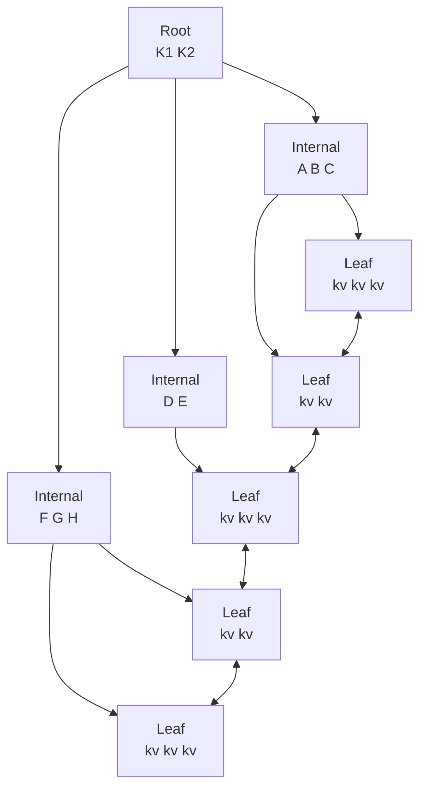
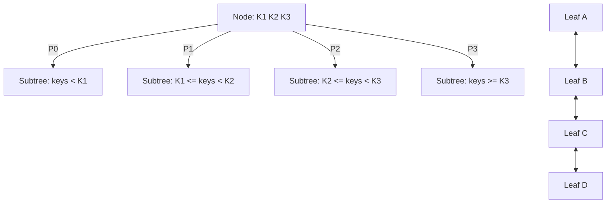

# B-Tree Hierarchy, B+ Trees, and Separator Keys

> **One-sentence summary.** A B-Tree is a page-oriented, high-fanout balanced tree built bottom-up; the common B+ variant keeps values only in leaves while internal and root nodes hold separator keys that partition the key space into subtrees.

## How It Works

A B-Tree is a sorted tree built out of fixed-size pages, where each node can hold up to N keys and up to N+1 child pointers. The nodes form three roles: a single **root** at the top, zero or more levels of **internal nodes** in the middle, and a bottom layer of **leaf nodes** that terminate each root-to-leaf path. Because B-Trees are a page-organization technique, the terms *node* and *page* are used interchangeably throughout the literature.

Each node is sized to match a disk or SSD page, so a single I/O fetches many keys at once. The number of keys per node is called the **fanout**, and it is deliberately kept high (dozens to hundreds of keys per node). High fanout makes the tree short (logarithmic with a large base), which means very few block transfers to reach any leaf. It also amortises the cost of balancing: restructuring happens far less often than in a binary search tree, because each node can absorb many inserts before it overflows.

Unlike a BST, which grows top-down from the root, a B-Tree grows **bottom-up**. Leaves accumulate data, and when they overflow, splits propagate a separator key upward, lengthening the internal levels and, rarely, adding a new root. To make room for future inserts without forcing a split on every write, nodes reserve free space. **Occupancy** (the ratio of used slots to node capacity) can be as low as about 50% and is typically somewhere between there and full; lower occupancy does not hurt lookup performance because each node still fits in one page.

The **B+ Tree** is the variant that dominates real systems. In a plain B-Tree, values can sit at any level, including internal nodes. In a B+ Tree, values live **only in leaves**; internal nodes carry separator keys and child pointers and nothing else. This has two big consequences. First, inserts, updates, and deletes touch only leaves and propagate upward only when a split or merge is required. Second, because internal nodes hold only keys, fanout gets even higher, shrinking the tree further. Most B+ Tree implementations also chain sibling leaves into a linked list (often double-linked) so range scans walk the bottom level directly, without climbing back to a parent to find the next leaf.

The separator keys inside a node obey a simple invariant. For a node holding sorted keys `K1 <= K2 <= ... <= Kn` and pointers `P0, P1, ..., Pn`: the first pointer `P0` points to the subtree with all keys strictly less than `K1`; the last pointer `Pn` points to the subtree with keys greater than or equal to `Kn`; and each intermediate pointer `Pi` points to the subtree holding keys `Ks` such that `Ki-1 <= Ks < Ki`. Because keys are sorted, a node is searched with binary search, and the correct child is picked in one step.

The catalog-room metaphor from the book makes the hierarchy concrete. To find a card, you pick the correct **cabinet** (root), then the correct **shelf** (internal level), then the correct **drawer** (next internal level or leaf), and finally the **card** itself (the value in the leaf). Each level narrows the search from coarse to fine; at no point do you scan the whole library.

## When to Use

- **Primary indexes and clustered storage** for OLTP workloads where both point lookups and range scans must be fast, and writes are in-place rather than append-only.
- **Secondary indexes** over fields used in equality and range predicates (`=`, `<`, `>`, `BETWEEN`, `ORDER BY`). The sorted leaf chain makes ordered iteration cheap.
- **General-purpose key-value stores** that need predictable read latency and a small, bounded number of I/Os per lookup, rather than the write-optimised amplification profile of LSM trees.

## Trade-offs

| Aspect | B-Tree (classic) | B+ Tree |
|--------|------------------|---------|
| Where values live | Any node (root, internal, leaf) | Leaves only |
| Internal node contents | Separator keys + values + child pointers | Separator keys + child pointers only |
| Fanout | Lower (values take space in internals) | Higher (internals hold only keys) |
| Update propagation | Can modify any level directly | Only leaves; internals change on split/merge |
| Leaf sibling links | Uncommon | Standard (often double-linked) |
| Range scans | May require tree re-traversal | Walk the leaf linked list |
| Modern DB usage | Rare in pure form | De facto standard |

## Real-World Examples

- **MySQL InnoDB**: Uses B+ Trees for both the clustered primary index and secondary indexes, though the documentation calls them "B-trees." Leaves are linked to accelerate range scans and `ORDER BY`.
- **PostgreSQL**: The default `btree` access method is a B+ Tree (a Lehman-Yao variant with concurrency-friendly links). Internal pages hold separator keys only.
- **SQLite**: Stores tables and indexes as B+ Trees inside the database file, one tree per table or index, with all rows at the leaf level.
- **Berkeley DB**: One of the classic embedded B+ Tree implementations, widely used before the LSM era.

## Common Pitfalls

- **Conflating B-Tree and B+ Tree**: Textbook diagrams often show values in internal nodes, but virtually every production "B-tree" is actually a B+ Tree. Reasoning about update costs with the wrong mental model leads to wrong predictions about write amplification.
- **Assuming 100% occupancy**: B-Trees deliberately leave slack in each page for future inserts. Capacity planning that multiplies `rows * row_size` underestimates the on-disk size by a large factor when occupancy sits near 50-70%.
- **Forgetting the leaf sibling list**: Range scans are cheap *because* leaves are linked. Implementations that skip these pointers force every range step to re-descend from the root, turning an `O(k)` walk into `O(k log N)`.
- **Confusing fanout with balance mechanism**: High fanout is not what keeps the tree balanced; splits and merges do that. Fanout is what keeps the tree *short*, so balancing work stays rare.
- **Reading the separator rule backwards**: The invariant is `Ki-1 <= Ks < Ki`, not the other way around. Getting the boundary direction wrong causes subtle off-by-one bugs on the child-pointer selection during lookup and insert.

## See Also

- [[03-on-disk-structure-design-principles]] — the page-oriented design constraints B-Trees are built to satisfy
- [[05-btree-lookup-algorithm-and-complexity]] — how a root-to-leaf traversal uses separator keys to find values
- [[06-btree-node-splits-and-merges]] — how bottom-up growth and shrinkage actually happen
