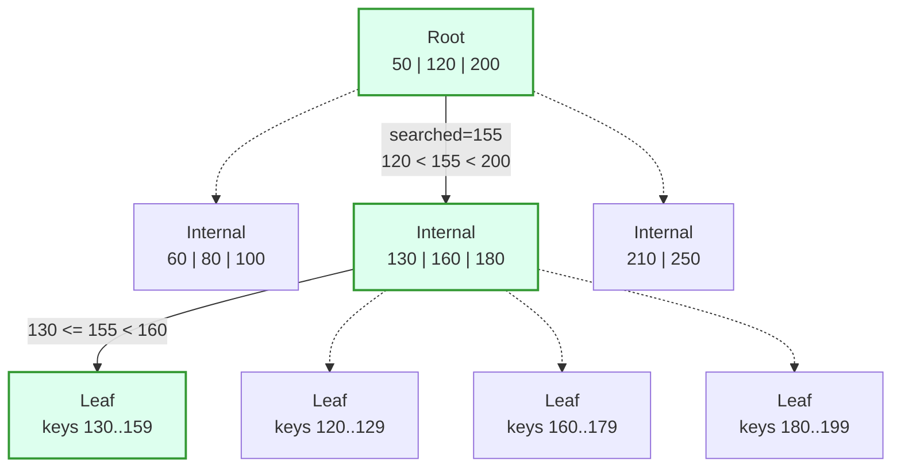

# B-Tree Lookup Algorithm and Complexity

> **One-sentence summary.** A B-Tree lookup is a single root-to-leaf traversal that binary-searches each node for the first separator greater than the searched key, costing `O(log_K M)` page transfers (the tree height) and `O(log2 M)` key comparisons overall.

## How It Works

A B-Tree lookup is deliberately simple: there is exactly **one** path from the root to any leaf, and a lookup walks it top-down. At each node the algorithm binary-searches the sorted array of separator keys for the first key strictly greater than the searched value. The pointer just before that separator identifies the subtree that must contain the key, so the search follows it to the next level. This repeats until a leaf is reached, where the algorithm either finds the exact key (a point-query hit) or its immediate predecessor (enough to serve range scans and to locate the insertion point for a new key).

The algorithm in five steps:

1. Start at the root; binary-search its separator keys for the first one greater than the searched key.
2. Follow the corresponding child pointer to the next level.
3. Repeat step 1 at that node, and keep descending until a leaf is reached.
4. At the leaf, either report the exact match (point query, update, or delete) or its predecessor (range scan, insert).
5. For a range scan, once the closest leaf is located, follow sibling pointers across the leaf level until the range predicate is exhausted.

Recall from [[04-btree-hierarchy-and-separator-keys]] that each node holds up to `N` separator keys and `N + 1` child pointers. The first pointer covers keys less than `K1`; the last covers keys greater than or equal to `Kn`; an interior pointer between `Ki-1` and `Ki` covers the half-open subrange `[Ki-1, Ki)`. At each level the visible key range narrows — the root partitions the whole key space into a handful of coarse subranges, every descent picks one, and by the leaf the range has collapsed to a single page.

The solid edges show the chosen root-to-leaf path for searched key `155`; the dashed edges are the subtrees the search *pruned* at each level. Three page reads reach the target leaf, and at each page a short in-memory binary search picks the next pointer.

## When to Use

This is not an opt-in pattern — it is the lookup primitive every mutable B-Tree-backed index uses. Concretely:

- **Point queries on an indexed column** — primary-key equality, unique lookups, `WHERE id = ?`.
- **The locate phase of inserts, updates, and deletes** — before modifying data the engine must find the target leaf; the splits/merges in [[06-btree-node-splits-and-merges]] depend on this same descent.
- **Range scans** — the lookup finds the left endpoint of the range; sibling pointers on the leaf level carry the scan forward without ever climbing back to the parent.

## Trade-offs

Lookup cost is most usefully analysed from **two independent standpoints**, because I/O and CPU have very different unit costs.

| Dimension | Cost | Why | Example (M = 4 × 10⁹, K = 200) |
|-----------|------|-----|--------------------------------|
| Page transfers (disk seeks) | `O(log_K M)` = tree height `h` | Each level-jump follows one child pointer and fetches one page | ≈ 4–5 levels, i.e. 4–5 page reads |
| Key comparisons (CPU) | `O(log2 M)` | Binary search inside each node halves the search space per comparison | ≈ 32 comparisons total |
| Textbook notation | `O(log M)` | Changing logarithm base is a constant factor, which `O(·)` discards | Same |

Block transfers dominate wall-clock latency because each miss is potentially a disk seek (milliseconds on an HDD, tens to hundreds of microseconds on an SSD). Comparisons dominate CPU time but are nanoseconds apiece. Engine designers therefore spend the fanout budget aggressively: pushing `K` (keys per node) from 2 to a few hundred turns a 32-level binary tree into a 4-level B-Tree while keeping comparisons almost unchanged — four orders of magnitude fewer seeks for the same comparison budget.

## Real-World Examples

- **PostgreSQL index scans.** A btree index lookup on a column descends a B+ Tree; typical indexes in production have height 3–5. Each level is a buffer-pool lookup that in the warm case is an in-memory page read, and in the cold case a single disk I/O.
- **MySQL InnoDB clustered and secondary indexes.** InnoDB stores table rows inside a clustered B+ Tree keyed by the primary key; secondary indexes are separate B+ Trees whose leaves store primary-key values and then do a second B+ Tree descent. OLTP latency budgets assume only a handful of page reads per query — exactly the `log_K M` behaviour.
- **SQLite, BoltDB, LMDB.** Embedded B+ Tree stores with fanouts of hundreds; 4 KB–16 KB page sizes give heights of 3–4 even for multi-gigabyte databases.

Across all of these, OLTP query latency typically decomposes as *a handful of page reads plus a few dozen CPU comparisons per page* — exactly what the two-view cost model predicts.

## Common Pitfalls

- **Confusing height with total comparisons.** Height is `log_K M`; total comparisons are `log2 M`. Mixing the two leads to mis-sized node layouts ("let's make nodes bigger, binary search is free") or mis-estimated cache footprints.
- **Forgetting the log base is hidden by Big-O.** `O(log_K M) = O(log_2 M)` formally, but the *constant factor* — roughly `1 / log2 K` — is exactly why high fanout matters in practice. Never let the Big-O equivalence lull you into thinking `K` is irrelevant.
- **Underestimating how much tree-height reduction helps on disk.** Every additional level is potentially a cold-cache disk seek. Going from height 5 to height 4 is a 20 % saving in the warm case but can be a 10× latency saving for a cold query.
- **Ignoring the N vs N+1 convention.** Each node holds up to `N` separator keys and `N + 1` child pointers. Off-by-one errors here are the source of surprisingly many B-Tree bugs in hand-rolled implementations.
- **Treating range-scan cost as `h × range_size`.** After the initial `O(log_K M)` descent, range scans follow sibling pointers at the leaf level; extra pages cost one sequential read each, not another full descent.

## See Also

- [[04-btree-hierarchy-and-separator-keys]] — the node structure and separator-key invariants the algorithm relies on.
- [[06-btree-node-splits-and-merges]] — mutations reuse this lookup to find the target leaf before modifying it.
- [[03-on-disk-structure-design-principles]] — why high fanout and low height make the two-cost model favourable in the first place.
