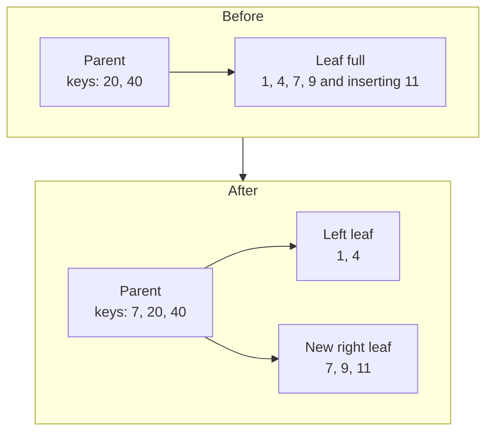
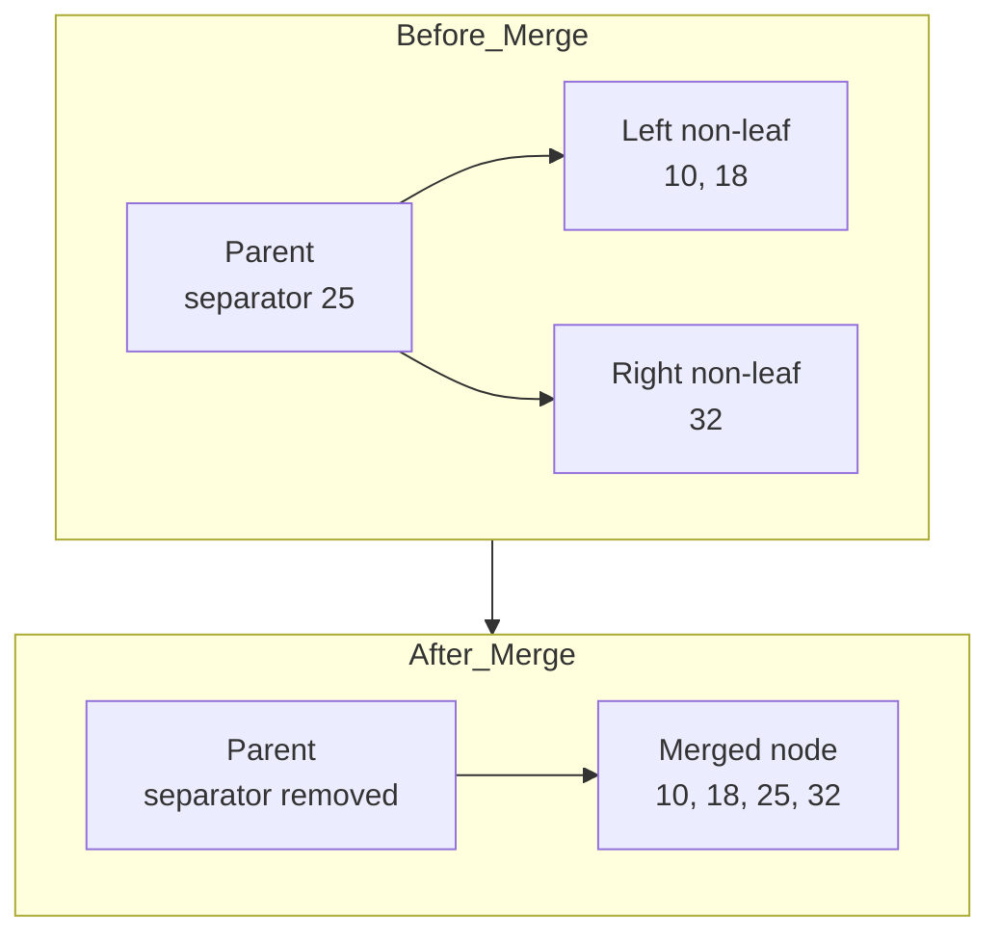

# B-Tree Node Splits and Merges

> **Summary.** Insertions that overflow a node trigger a split — half the entries move to a new sibling and a separator key is promoted to the parent — while deletions that underflow a node merge adjacent siblings and demote a separator; both operations can propagate recursively up to the root, changing tree height only when the root itself splits or merges.

## How It Works

A B-Tree keeps itself balanced not by rotating nodes, but by splitting full nodes in two when they overflow and by merging adjacent nodes when they underflow. This is what lets the tree grow from the bottom up while preserving the invariant that every root-to-leaf path has the same length.

**Splits (on insertion).** Insertion starts with the lookup algorithm from [[05-btree-lookup-algorithm-and-complexity]]: descend from the root using separator keys until you reach the target leaf, then append the new key-value pair. A split is required when this push takes the node past its capacity. For a leaf that can hold up to `N` key-value pairs, the split fires when a new pair would make it `N + 1`. For a non-leaf node that can hold `N + 1` child pointers, the split fires when an incoming pointer would make it `N + 2`. The algorithm itself is four steps:

1. Allocate a new sibling node.
2. Copy half the entries from the splitting node to the new node (everything after the split point).
3. Place the new element into whichever of the two nodes its key belongs to.
4. In the parent, insert a separator key plus a pointer to the new sibling. This is the *promoted* key.

If the parent was already full, the promoted entry overflows *it*, and the parent splits too. This can cascade all the way to the root. When the root splits, a brand new root is allocated to hold the single promoted key, and the old root is demoted to an internal node alongside its new sibling. **This is the only way a B-Tree's height ever increases** — at every other level, the tree grows horizontally.

**Merges (on deletion).** Deletion locates the target leaf, removes the entry, and checks whether the node has underflowed. If two neighbouring siblings under a common parent together hold no more than `N` entries (or `N + 1` pointers for non-leaf nodes), they are concatenated into one node. If they do not fit into a single node but one is underfull, keys are redistributed between them instead — see "Trade-offs" below. The merge itself is three steps:

1. Copy all entries from the *right* node into the *left* node.
2. Remove the right node's pointer from the parent. For a non-leaf merge, the separator key that used to sit between the two siblings is *demoted* — pulled down from the parent into the merged node, because without it the merged node would be missing the boundary between the two former halves.
3. Free the right node.

Like splits, merges can propagate: demoting the separator removes a key from the parent, which may itself underflow and merge with *its* sibling. If the merge reaches the root and the root ends up with a single child, that child becomes the new root and tree height drops by one.

Notice the `25` in the merged node: it came down from the parent, not from either sibling. That is the *demotion* step.

## When to Use

Splits and merges are not an optional feature you choose — any mutable B-Tree must implement them. Where engineering judgement does enter is in *how aggressively* to rebalance and *when* to prefer redistribution over structural change:

- **Pure split/merge** fits workloads where churn is rare or where simpler code is worth the occasional extra allocation.
- **Redistribution (rebalancing)** is worth adding when occupancy swings cause frequent back-to-back merges and splits on the same region of the tree.
- **Fill-factor tuning** (leaving some slack in every node) is the right lever when insertion patterns are random and you want to amortise future splits away from the hot path.

## Trade-offs

| Aspect | Split/Merge | Redistribution (Rebalancing) | When Preferred |
|--------|-------------|------------------------------|----------------|
| Disk allocation | Split allocates a new page; merge frees one | No allocation, just in-place moves | Rebalance when allocator pressure matters |
| Parent pointer updates | Always updates parent (insert or remove a pointer) | Only updates the separator key in the parent | Rebalance to avoid touching pointer arrays |
| Propagation | Can cascade recursively to the root | Bounded — one level only | Rebalance to cap worst-case write fan-out |
| Occupancy after op | Can leave nodes near 50% full | Keeps both siblings well-filled | Rebalance for steadier occupancy |
| Implementation cost | Simpler, two cases (split, merge) | Extra case plus redistribution logic | Plain split/merge for simpler engines |

## Real-World Examples

- **MySQL InnoDB** uses a B+ Tree for its clustered primary index. Page splits are a well-known source of write amplification on random-key inserts (e.g. UUID primary keys), which is why InnoDB exposes `innodb_fill_factor` so operators can pre-reserve free space in each page and delay splits.
- **PostgreSQL** B-Tree indexes suffer from *index bloat* when random inserts drive frequent splits and subsequent deletes leave pages half-empty; `REINDEX` and `VACUUM` exist in part to reclaim space that split/merge churn left behind.
- **Write amplification from cascading splits** is a general fact: a single logical insert can dirty one leaf plus every ancestor on the path to the root, multiplying the number of pages that have to be written.
- **Fill-factor defaults in the 70-90% range** (PostgreSQL's default is 90% for B-Tree, InnoDB's default is around 100% but lowerable) are an explicit trade: waste some space per page, buy fewer future splits.

## Common Pitfalls

- **Assuming splits only touch the leaf.** A split cascades to every ancestor whose capacity is already at its limit. One unlucky insert can rewrite every level from leaf to root.
- **Thinking "delete then insert" is free.** Deleting a key can trigger a merge; the follow-up insert can then trigger a split of a different neighbour. The pair costs strictly more than a single in-place update.
- **Ignoring key ordering in your workload.** Sorted or mostly-sorted inserts fill the rightmost leaf predictably and split it cleanly once it is full. Uniformly random keys scatter splits across the whole tree and pull in many more dirty pages.
- **Overlooking split-driven write amplification.** One tiny logical write can turn into many page writes once cascading splits and parent updates are counted — this matters on SSDs, where it translates directly into flash wear (see [[03-on-disk-structure-design-principles]]).
- **Forgetting that non-leaf merges demote.** A non-leaf merge that omits the separator-key demotion step corrupts the tree: the merged node is missing the boundary between its former halves and subsequent lookups will skip keys.

## See Also

- [[04-btree-hierarchy-and-separator-keys]] — what the split point *is* and why the parent needs a separator per child boundary
- [[05-btree-lookup-algorithm-and-complexity]] — the traversal both insertions and deletions use to find the target leaf before splitting or merging
- [[03-on-disk-structure-design-principles]] — why page allocation, pointer updates, and write amplification from splits matter on real hardware

The next chapters move from these abstract algorithms into the mechanics of on-disk B-Tree variants, page layouts, and how splits and merges are made safe under concurrent access.
