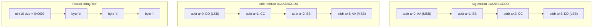

# Binary Encoding of Primitives and Variable-Size Data

> **One-sentence summary.** On-disk records are assembled from fixed-size primitive types encoded with a chosen endianness, strings and arrays are written as length-prefixed byte runs, and booleans/flags are bit-packed behind bitmasks so a page is as compact and as random-access-friendly as possible.

## How It Works

A database file has no `malloc` or pointers — only `read` and `write` against a byte stream. Every record must therefore be serialised into a layout whose widths, offsets, and byte order the reader can reconstruct deterministically. The foundation is a fixed palette of primitives whose sizes never vary: `byte` (1), `short` (2), `int` (4), `long` (8), plus IEEE 754 `float` (4) and `double` (8), each split into sign, exponent, and fraction bits. Because a multibyte integer can be laid out MSB-first (big-endian) or LSB-first (little-endian), the writer and reader must agree on endianness; otherwise the same four bytes decode to two different numbers.

Variable-size data (strings, blobs, arrays) cannot be embedded directly — the reader would have no way to know where the field ends. The classic fix is the **Pascal string**: a fixed-width length prefix (e.g., `uint16`) followed by exactly that many bytes. This gives O(1) length lookup and lets the reader slice the payload straight into a language-native buffer. Booleans and enums collapse even further: since each boolean needs only one bit, eight of them pack into a single byte, and mutually-compatible flags are stored as power-of-two bitmasks (`IS_LEAF_MASK = 0x01`, `VARIABLE_SIZE_VALUES = 0x02`, `HAS_OVERFLOW_PAGES = 0x04`) that are set, cleared, and tested with bitwise `OR`, `AND`, and negation.

## When to Use

- **Designing any on-disk page format** — B-Tree pages, SSTable blocks, WAL records, index files. Once you commit to `read`/`write` instead of a heap, you need these primitives.
- **Wire protocols and RPC framing** — the same rules govern TCP-level framing in systems like Redis RESP, PostgreSQL frontend/backend messages, and Kafka's record batches.
- **Space-sensitive metadata** — page headers, cell headers, and tombstones, where saving 7 bits per boolean adds up across millions of records.

## Trade-offs

| Aspect | Advantage | Disadvantage |
|--------|-----------|--------------|
| Pascal string (length + bytes) | O(1) length, zero-copy slicing, embedded NULs allowed | Fixed prefix width caps max length; two writes (size then data) |
| Null-terminated string | No prefix overhead, simple C interop | O(n) length (must scan), cannot hold `\0` bytes, easy buffer overruns |
| Full-byte booleans | Trivial to read/write, debuggable in a hex dump | 8x space waste; cache line pollution across many records |
| Bit-packed flags | 1 bit per flag, one atomic mask update per page | Readers need the mask constants; harder to evolve without versioning |
| Big-endian | Network order standard, numeric order matches lex byte order (useful for key comparison) | Requires byte-swap on common x86/ARM little-endian CPUs |
| Little-endian | Native on x86/ARM, zero-cost loads | Portable files must byte-swap on mixed-endian environments |

## Real-World Examples

- **RocksDB** ships `EncodeFixed64WithEndian` that checks a platform-specific `kLittleEndian` constant and calls `EndianTransform` (a byte-reverse) when the target endianness does not match the value, so SSTables move cleanly between ARM, x86, and SPARC hosts.
- **Protocol Buffers** use length-prefixed (varint-size + bytes) encoding for strings and embedded messages — the same Pascal-string idea with a variable-width prefix that saves bytes on short fields.
- **PostgreSQL** stores page-level flags in the `PageHeaderData.pd_flags` bitfield (`PD_HAS_FREE_LINES`, `PD_PAGE_FULL`, `PD_ALL_VISIBLE`) and uses a bit-packed `t_infomask` on every tuple to record null-ness, updated-ness, and transaction state.
- **SQLite's file format** uses big-endian throughout precisely so that a memcmp over encoded keys yields the correct numeric ordering on any host.

## Common Pitfalls

- **Assuming host endianness.** A file written by a little-endian laptop and read by a big-endian storage array will silently return garbage integers. Pick one endianness in the spec and always transform at the I/O boundary.
- **Forgetting struct padding.** C compilers insert padding to align fields to their natural boundary, so `sizeof(struct)` is not the sum of field sizes. Either use `__attribute__((packed))` (with alignment penalties) or serialise field-by-field rather than `memcpy`-ing the struct.
- **Mixing signed and unsigned prefix decoding.** A Pascal string whose length is decoded as `int16` instead of `uint16` caps strings at 32 KiB and treats any byte ≥ 0x8000 as negative, corrupting the rest of the record.
- **Reusing an `int` for both flags and a counter.** Once a flag spills into a high bit the counter overflows into the flag space. Reserve the bitfield explicitly in the format spec.
- **Changing a flag's bit position across versions.** Bitmasks are part of the wire format; evolving them without a version tag (see `[[06-file-format-versioning]]`) will misinterpret old pages as if the new flags were set.
- **Null-terminated binary keys.** Binary keys can contain `\0`; null-termination silently truncates them. Always length-prefix arbitrary byte data.

## See Also

- [[02-file-organization-principles]] — how these primitives compose into page headers, fixed-schema records, and offset/length descriptors for variable fields.
- [[03-slotted-pages]] — the page layout where bit-packed flags live in the header and length-prefixed cells live in the body.
- [[04-cell-layout]] — concrete use of `key_size` / `value_size` length prefixes and flag bytes inside an individual B-Tree cell.
