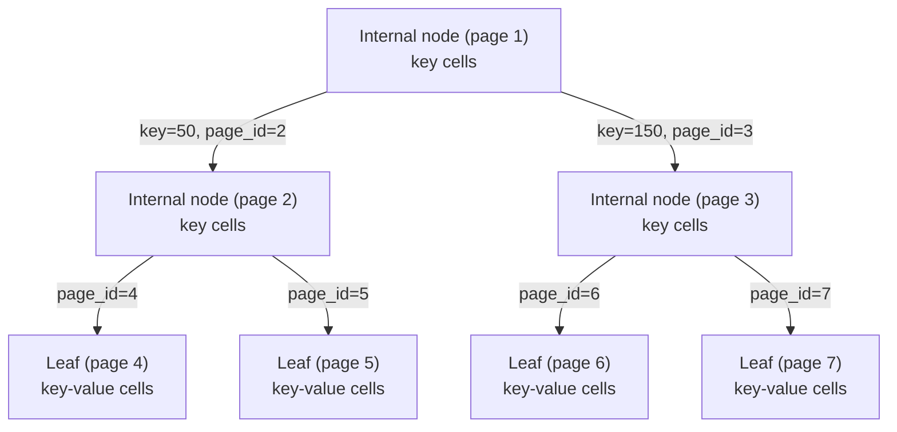

# Cell Layout: Key Cells and Key-Value Cells

> **One-sentence summary.** A cell is a page's smallest addressable record, laid out as a tiny fixed-size header of sizes and flags followed by variable key/value bytes — with two flavors: *key cells* (separator key + child page ID) inside internal B-Tree nodes, and *key-value cells* (key + value bytes) inside leaf nodes.

## How It Works

A B-Tree is built from pages, and each page is a collection of cells. Cells come in two shapes depending on where they live in the tree.

**Key cells** live in *internal* nodes. They carry a separator key and a pointer to a child page. Their job is pure navigation: "keys less than this separator live down that way." The pointer is not a file offset — it is a logical `page_id` that the buffer manager translates into an actual file offset via a lookup table. Using a logical ID decouples the on-disk position of a page from how the tree references it, so pages can be rewritten, cached, or relocated without invalidating every parent that points at them.

```
Key cell (variable-size key):
+----------------+-----------------+------------------+
| [int] key_size | [int] page_id   | [bytes] key ...  |
+----------------+-----------------+------------------+
```

**Key-value cells** live in *leaf* nodes. They carry the key and the associated data record (or a pointer to it, if values overflow). Both the key and the value can be variable-size, so the header declares both lengths up front, plus a `flags` byte for per-cell boolean metadata (overflow present, tombstone, etc.).

```
Key-value cell (variable-size key and value):
+-------------+----------------+------------------+------------------+-------------------+
| [byte]      | [int] key_size | [int] value_size | [bytes] key ...  | [bytes] value ... |
| flags       |                |                  |                  |                   |
+-------------+----------------+------------------+------------------+-------------------+
```

Both layouts follow the same rule: **group fixed-size fields at the front so every variable field's offset is statically computable from the header.** Once you know `key_size` and `value_size`, you know exactly where the key starts, where it ends, and where the value starts — no scanning, no delimiters.

Notice what is *not* stored per cell: the cell type itself. Internal pages hold only key cells; leaf pages hold only key-value cells. Because cells within a page are uniform, the type, the fixed-vs-variable-size property, and the has-overflow-pages flag are recorded once in the page header rather than duplicated across every cell. This is a deliberate amortization: with hundreds of cells per page, per-cell type bytes would dwarf the page header.



## When to Use

- **B-Tree page design** — the canonical use: separator keys with child pointers at interior levels, real records at leaves.
- **Any page format with heterogeneous but uniform-within-a-page records** — different page kinds (index vs data, hot vs cold, compressed vs raw) where each page declares its kind once and all cells on it share that shape.
- **Columnar or hybrid stores** choosing a cell shape per page to trade index density against record density without forking the file format.

## Trade-offs

| Aspect | Advantage | Disadvantage |
|--------|-----------|--------------|
| Fixed-size cells | O(1) indexing by slot, no per-cell size header | Wastes space on short keys; forces padding; variable data needs overflow |
| Variable-size cells | Space-efficient for skewed key/value sizes; flexible schemas | Must store `key_size`/`value_size`; access goes through header arithmetic |
| Inline values | Single read fetches key + value; great cache locality | Large values balloon the page and reduce fan-out, hurting tree height |
| Overflow pointers for big values | Keeps pages dense and fan-out high | Extra I/O to chase the pointer; complicates writes and deletes |
| Cell type stored per-cell | Self-describing cells; mixed-kind pages possible | Bytes spent on every cell; loses the uniformity invariant |
| Cell type stored on the page | Tiny cells, one decode path per page | All cells on a page must share shape; requires separate pages per kind |

## Real-World Examples

- **SQLite cell format**: Exactly this split. Interior B-Tree pages hold *key cells* (separator key + left-child page number), and leaf pages hold *key-value cells* (key + payload, with overflow pages when payload exceeds a threshold). The page type is recorded once in the page header byte.
- **PostgreSQL index tuples**: Index pages store `IndexTuple` structs — a small fixed header (length + flags) followed by the indexed key bytes and a `TID` pointing to the heap tuple. Heap pages store `HeapTuple` records with a different shape, kept uniform within each page kind.
- **InnoDB clustered index**: Leaf pages of the clustered index hold the *entire row* next to the primary key (fat key-value cells), while secondary index leaves hold only the indexed columns plus the primary key — a second lookup fetches the row. Interior pages everywhere hold slim key cells.

## Common Pitfalls

- **Miscomputing offsets when mixing fixed and variable fields**: Putting a variable-size field between fixed ones forces every subsequent access to do a length-add chain. Always front-load fixed fields.
- **Assuming cell type per cell when page metadata suffices**: Duplicating a type tag on every cell looks "self-describing" but burns bytes and breaks the uniformity that lets the page header do the job once.
- **Conflating cell offset with page ID**: A *cell offset* is page-local — its cardinality is bounded by `page_size / min_cell_size`, so a 2-byte integer usually suffices. A *page ID* is file-global — it must span the entire file, so it needs 4 or 8 bytes. Using the wrong integer width either corrupts pointers or wastes space.
- **Letting large values bloat the page**: Without an overflow-page strategy, one 10 KB value on a 4 KB page is a structural impossibility; design the flags byte to carry the overflow indicator from day one.

## See Also

- [[01-binary-encoding-primitives]] — how the `int`, `byte`, and length-prefixed bytes inside a cell are actually encoded.
- [[03-slotted-pages]] — how cells are packed into a page with a sorted offset array that lets cells sit in insertion order.
- [[05-managing-free-space]] — what happens to a cell's bytes after deletion, and how the availability list reuses them on the next insert.
