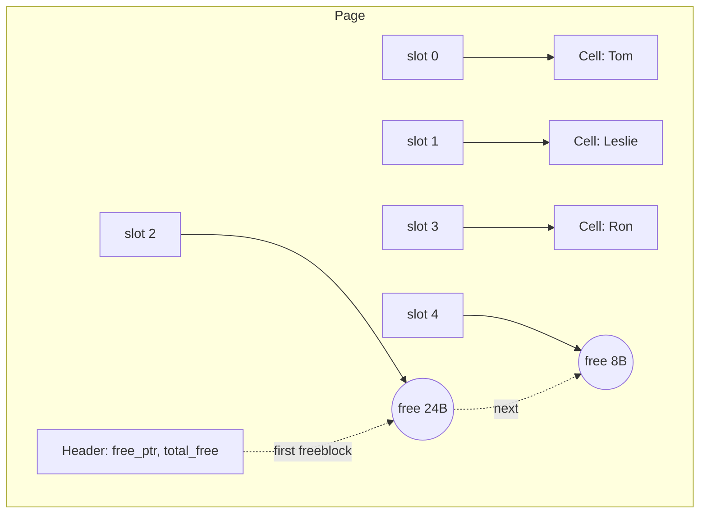

# Free-Space Management and Fit Strategies

> **One-sentence summary.** Slotted pages reclaim space from deleted variable-size records via an in-memory availability list of (offset, size) freeblocks, consulted on insert with a first-fit or best-fit strategy, with page defragmentation and overflow pages as escalation steps.

## The Problem

Deleting a variable-size cell leaves a hole. Rewriting the page on every delete is expensive and invalidates any external pointer referencing cells by byte offset. Leaving holes untouched fragments the page: inserts fail even when plenty of bytes are free, just not contiguous. Slotted pages already decouple external references from physical offsets — cells are addressed by slot ID — so we can move cells internally. The question is how to reclaim and reuse holes cheaply under a mixed delete/insert stream.

## How It Works

Three tiers of escalation, each cheaper than the last fallback.

**1. On delete — append to the availability list.** Mark the cell freed and record the segment as an (offset, size) pair. SQLite calls these segments *freeblocks*, chains them in a linked list, and stores a pointer to the first freeblock in the page header along with a total free-byte count — cheap to decide later whether defragmentation could recover enough space.

**2. On insert — consult the list with a fit strategy.** Before allocating fresh space at the upper boundary, scan for a large-enough freeblock:

- *First fit*: take the first match. Fast (early exit), but may leave an unusable remainder.
- *Best fit*: pick the freeblock with the smallest remainder. Tighter packing, but O(n) per insert.

**3. Defragment, then overflow.** If no freeblock fits but total free bytes suffice, rewrite the live cells contiguously and insert into the now-clean region. Slot pointers are updated in place; slot IDs remain stable. If even defragmentation does not produce enough contiguous space, allocate an overflow page and link it from the original.

Solid nodes are occupied cells; circular nodes are freeblocks chained from the header pointer.

## When to Use

Apply this pattern for **fixed-size pages holding variable-size records with frequent in-place deletes or updates** — the classic B-Tree leaf scenario. Slotted pages plus an availability list give O(1) delete, amortized cheap insert, and stable external references.

It is *not* the right model for append-only or log-structured stores. LSM-tree SSTables are immutable; there are no in-place deletes and no per-page free list. Space is reclaimed by compaction — merging segments and dropping tombstoned keys. Log-structured WALs similarly truncate prefixes rather than reclaim in place.

## Trade-offs

| Aspect | Option | Advantage | Disadvantage |
|--------|--------|-----------|--------------|
| Fit strategy | First fit | Fast — early exit on first match | Leaves small unusable remainders, raising effective fragmentation |
| Fit strategy | Best fit | Tighter packing, less wasted space | Full list scan per insert; remainders are often too small to reuse |
| Reclamation timing | Immediate rewrite on delete | No bookkeeping; page always compact | Every delete is a full page rewrite — CPU and write-amplification cost |
| Reclamation timing | Availability list | Deletes are O(1); amortize defrag | Memory overhead; page can fragment between defrags |
| Defrag policy | Eager (after every delete) | Inserts always find contiguous space | Repeats work the availability list was meant to defer |
| Defrag policy | Lazy (only when insert cannot fit) | Defrag cost paid only when needed | An insert can unexpectedly trigger a rewrite; tail-latency spike |

## Real-World Examples

- **SQLite freeblocks**: the textbook pattern. Page header stores the first-freeblock pointer and total free bytes; freeblocks form a linked list on the page. On insert, SQLite walks the list; if nothing fits but free bytes suffice, it defragments; otherwise it overflows.
- **PostgreSQL**: slotted pages with item pointers and tuples growing from opposite ends. Dead tuples from deletes/updates are reclaimed at the table level by **VACUUM** — a periodic batch process rather than a per-insert availability-list walk. Trades immediate reuse for simpler hot-path code.
- **InnoDB (MySQL)**: tracks per-page free space and triggers page reorganization (defragmentation) when inserts no longer find room, plus background purge for MVCC versions.
- **LSM / SSTable engines (RocksDB, Cassandra)**: no in-page free list. SSTables are immutable; deletes write tombstones; space is reclaimed when compaction merges segments and drops shadowed keys.

## Common Pitfalls

- **Stale first-freeblock pointer.** After allocating from the list head, advance the header pointer to the next freeblock (or null). Forgetting this corrupts the list or leaks the block.
- **Fragmentation death spiral under best-fit.** Best-fit minimizes remainder *per insert* but systematically produces remainders too small to reuse, until defragmentation is forced on nearly every insert.
- **Overflowing too eagerly.** If no freeblock fits, check the header's total-free count first — defragmentation may recover enough contiguous space. Jumping straight to an overflow page wastes space and adds a pointer hop on reads.
- **Forgetting header counters on defrag.** Defragmentation rewrites cells and slot offsets, but `total_free` and the first-freeblock pointer must also be reset to reflect the new single contiguous region — otherwise the next insert sees a stale view.
- **Compacting the slot array itself.** Cells can move freely, but slot IDs must not. Removing a nulled slot entry breaks every external pointer that referenced it.

## See Also

- [[03-slotted-pages]] — the page layout this free-space scheme lives inside
- [[04-cell-layout]] — how individual variable-size cells are sized and framed
