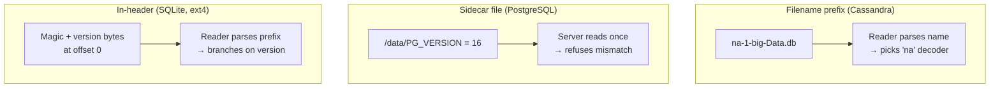

# Versioning On-Disk File Formats

> **Every on-disk file must declare the format version it was written with, somewhere a reader can find *before* decoding anything else.**

## The Problem

Storage engines are living software. Page layouts gain new flags, record headers grow new fields, encoders switch endianness, new compression codecs appear. But the files on disk are not rewritten the moment a new binary ships. A production cluster at any given time holds a mix of files written by several engine versions — last month's SSTables alongside today's, a base backup from an older release alongside freshly-replayed WAL segments.

This creates a chicken-and-egg situation. To decode a file, the reader has to know which version of the layout to apply. But "which version" is itself a piece of metadata that lives *inside* the file. If the reader guesses wrong and reads the version field at offset 12 when the new format put it at offset 16, it will parse garbage and silently misinterpret everything downstream. The version must live in a part of the file (or filesystem) that is **guaranteed stable across every version the engine will ever accept**.

## How It Works

There are three common places to put the version marker, each with different discoverability and coupling characteristics.

**Filename prefix.** The version is baked into the file's name itself, so a reader can pick the right decoder from a directory listing without ever opening the file. Cassandra's SSTables use this: each component is named `<version>-<generation>-<format>-<component>.db`, so a `Data.db` file is called `ma-1-big-Data.db` under one release and `na-1-big-Data.db` under the next. The two-letter prefix (`ma`, `na`, `oa`, …) marks schema/layout evolution between major Cassandra versions. Ops tooling, compaction planners, and even `ls` can group files by version at zero cost.

**Sidecar file.** A separate tiny file at the root of the data directory holds the version for everything underneath. PostgreSQL's `PG_VERSION` is the canonical example — a single-line file containing the major version number (e.g., `16`). The server reads it first; if it does not match the running binary, startup aborts. This treats the entire cluster directory as one versioned unit rather than versioning each file individually.

**In-header magic number + version bytes.** A small, format-stable prefix lives at offset 0 of every file. The first few bytes are a **magic number** — a fixed byte string that confirms "yes, this really is a file of format X, not random bytes or a different format that happens to live here." Immediately after comes one or two version bytes that select the decoder branch for the rest of the file. SQLite puts the 16-byte string `"SQLite format 3\000"` at offset 0 followed by a 1-byte write version and a 1-byte read version. ext4's superblock uses the magic number `0xEF53` plus feature-flag bitmaps that let the kernel refuse to mount a filesystem whose features it does not implement.

## When to Use

- **Filename prefix** shines when there are many independent files of the same format and ops tools frequently list or filter them — LSM-tree SSTables, WAL segments, object-store blobs. Discoverability without opening is the killer feature.
- **Sidecar file** fits when the entire data directory evolves atomically and there is a single startup moment at which to enforce compatibility — an RDBMS cluster, a data volume for a service.
- **In-header magic + version** is right for per-file versioning with random-access reads, especially when files can be moved around the filesystem or embedded inside other containers (SQLite databases shipped as a single file, ext4 partitions appearing on arbitrary devices).

## Trade-offs

| Aspect                            | Filename prefix              | Sidecar file                  | In-header magic + version       |
|-----------------------------------|------------------------------|-------------------------------|---------------------------------|
| Discoverable without opening file | Yes (directory listing)      | Yes, but one version for all  | No (must read bytes)            |
| Granularity                       | Per file                     | Per data directory            | Per file                        |
| Couples to filesystem layout      | Strongly (rename = re-label) | Moderately (needs sibling)    | None (self-contained)           |
| Migration ergonomics              | Rename-on-upgrade            | Atomic: bump one file         | Rewrite header (or dual-read)   |
| Identifies format vs random bytes | Weak (name can lie)          | Weak                          | Strong (magic number)           |
| Risk if header/name format itself changes | Low (prefix is short) | Low (sidecar is trivial)      | High — must keep prefix stable  |

## Real-World Examples

- **Cassandra SSTables** use two-letter filename prefixes; each Cassandra major version introduces a new prefix (`ma`, `na`, `oa`, …) whenever on-disk layout changes, so mixed-version directories during upgrade are unambiguous.
- **PostgreSQL `PG_VERSION`** is a sidecar file at the cluster data directory root; mismatched versions block server startup and force `pg_upgrade`.
- **SQLite header** begins with the 16-byte magic `"SQLite format 3\000"` followed by separate write- and read-format version bytes, letting an older engine refuse a file with a write version it does not understand while still reading compatible databases.
- **ext4 superblock** uses magic `0xEF53` plus compat/incompat/ro-compat feature flags, so a kernel lacking an incompat feature refuses to mount rather than risk corruption.
- **LevelDB MANIFEST** files carry a format version inside the log record stream, letting the engine distinguish manifest generations while reusing the same filename pattern.

## Common Pitfalls

- **Placing the version inside a part of the header that itself changes format.** If v2 moves the version field from offset 8 to offset 12, a v1 reader cannot find the version to discover that the file is v2. The version and magic must live in a byte range that is frozen forever.
- **No magic number.** Without a fixed identifier, a corrupted or misfiled blob can be decoded as a valid (but wrong) format, producing silent garbage instead of a clean "this is not one of my files" rejection.
- **Assuming the latest binary can always write the old format.** Forgetting to keep a writer for the previous version breaks rolling upgrades and downgrade paths — readers handle backward compatibility, but operators often need forward-compatible writes too.
- **Trusting the filename alone.** A filename prefix is a hint, not a guarantee; pair it with an in-file magic number in anything safety-critical, because filenames get renamed, copied, and tampered with.

## See Also

- [[02-file-organization-principles]] — the header where in-header version bytes live.
- [[07-checksums-and-crcs]] — another piece of metadata, also stored in a stable header region, for detecting corruption rather than identifying format.
