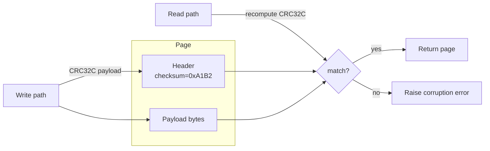

# Checksums and CRCs for Corruption Detection

> **Every page carries a small integrity code computed at write time and re-checked on read, so silent corruption is caught at the boundary instead of being served to clients as truth.**

## The Problem

Storage is not a reliable channel. Bits rot on platters and flash cells, disk controllers have firmware bugs, cables and RAM flip bits under cosmic rays, power is lost mid-write leaving half a page on one side of a sector boundary and half on the other. If the database blindly trusts whatever comes back from `pread()`, a corrupted page is parsed as valid structure. Its garbage pointers follow into the buffer cache, its wrong row values flow into query results, and — worst of all — the corruption is copied onto replicas, streamed to followers, and folded into the next backup. A detection failure upstream becomes a consistency failure everywhere.

The goal of a checksum is narrow but crucial: refuse to return data that was not written. It is a tripwire, not a repair mechanism.

## How It Works

At write time the engine computes a small integrity code over a page and stores it inside the page header. At read time it recomputes the same code over the payload and compares. A mismatch aborts the read, surfaces an error, and (in engines that have redundancy) triggers repair from a replica or backup.

The granularity is **per page**, not per file. A page is already the natural I/O unit — typically 4 KB to 16 KB — so a whole-file hash would force rewriting every byte on every mutation, and a single rotten sector would invalidate the entire table. Per-page codes localize the damage, keep verification cheap, and fit the existing read/write path.

There is a spectrum of techniques with very different cost and strength:

- **Simple checksums** — XOR, byte summation, parity. One-cycle-per-word cheap, but blind to many multi-bit errors: two flipped bits in the same column cancel.
- **CRC (Cyclic Redundancy Check)** — polynomial division over GF(2), implemented with a 256-entry lookup table or a hardware instruction. CRCs were designed for exactly the error patterns that storage and networks produce: **burst errors**, where adjacent bits flip together. CRC32 detects all bursts up to 32 bits and the overwhelming majority of longer ones.
- **Cryptographic hashes** — SHA-256, BLAKE3. Resistant to adversarial tampering because they are collision-resistant, but an order of magnitude slower and oversized for accidental corruption. Using them on every page read is real CPU tax paid against a threat the engine does not actually defend against.

## When to Use

Any durable storage engine built on pages — B-trees, LSM SSTables, heap files — needs per-page checksums; it is table stakes. Write-ahead logs check each record so a torn tail of the log can be detected and truncated on recovery. Network protocols do the same at a different layer: TCP carries a 16-bit checksum per segment, Kafka wraps each record batch in CRC32C, gRPC/HTTP2 frames are length-delimited with integrity checks further down the stack. RAID and modern filesystems (ZFS, Btrfs) run background **scrubbers** that read every block, verify its checksum, and rewrite from parity when a mismatch is found — catching bit rot long before the application tries to read it.

## Trade-offs

| Technique | Speed | Burst-error detection | Tamper resistance | Typical use |
|-----------|-------|-----------------------|-------------------|-------------|
| XOR / parity | Fastest | Weak (misses even-count flips) | None | Toy / legacy |
| CRC32 (IEEE) | Fast | Strong | None | Ethernet, gzip |
| CRC32C (Castagnoli) | Fastest (HW-accelerated on x86/ARM) | Strong | None | Modern DBs, Kafka |
| SHA-256 | Slow | Strong | Strong | Content addressing, signing |

The key caveat sits in the "tamper resistance" column: **CRCs do not protect against an attacker**. Given a CRC and a target value, it is trivial to construct a payload that matches. CRC catches nature; it does not catch adversaries.

## Real-World Examples

- **PostgreSQL page checksums**: CRC32C over each 8 KB page, stored in the page header, enabled at `initdb` with `--data-checksums` (or added later via `pg_checksums`).
- **SQLite**: an optional checksum VFS shim computes an 8-byte checksum per page for databases where silent corruption is a concern.
- **Kafka**: every record batch carries a CRC32C; brokers reject and producers retry batches that fail verification in flight or on disk.
- **ZFS / Btrfs**: checksums are stored in the parent block pointer, not inline, so a whole-block corruption cannot take both data and checksum down together. Scrubs run continuously.
- **LevelDB / RocksDB**: each SST block (index, filter, data) carries a CRC32C; a compaction that reads a bad block fails loudly rather than merging garbage into the next level.
- **Git** uses SHA-1 (migrating to SHA-256) over every object, but this is **content addressing** — the hash is the name — not corruption detection. Different problem, same primitive.

## Common Pitfalls

- **Using CRC as a security boundary.** Signed updates, auth tokens, tamper-evident logs — none of these are safe on CRC. Reach for HMAC or a signature.
- **Checksum scope too narrow.** If the checksum covers only the payload but not the page header (slot directory, free-space pointers, LSN), corruption in the metadata slips through and is just as lethal.
- **Same-page co-location.** Storing the checksum inside the page it protects means a whole-page overwrite destroys both. ZFS puts the checksum in the parent block pointer to avoid exactly this.
- **Skipping verification on repair paths.** Background scrubbing, backup restore, and replication catch-up must all re-verify — otherwise corruption that entered via one path goes unchecked on another.
- **Confusing noncryptographic with cryptographic.** `xxhash` and CRC32C are fast, excellent for corruption, and trivially forgeable. SHA-256 is slow, excellent for tamper detection, and wasted CPU on a corruption check.

## See Also

- [[02-file-organization-principles]] — why pages are the fixed-size unit the checksum is computed over.
- [[06-file-format-versioning]] — the other piece of header metadata that must itself be covered by (or verified before trusting) the checksum.
