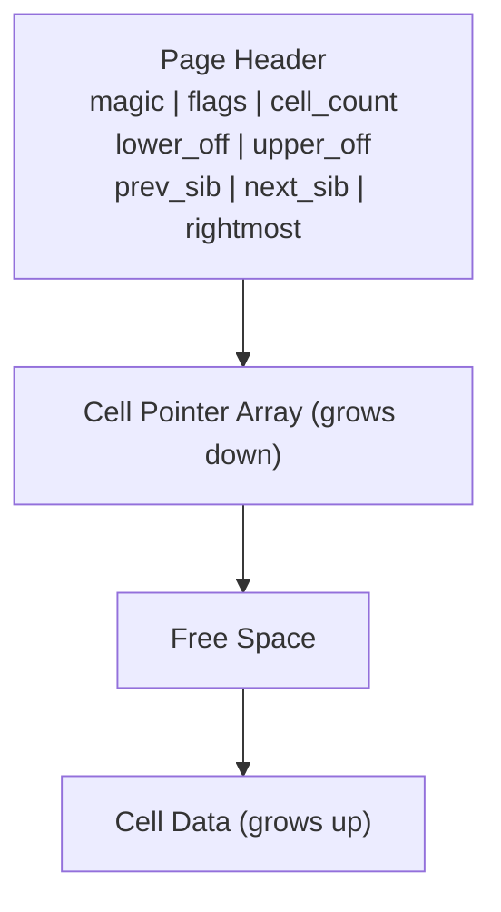
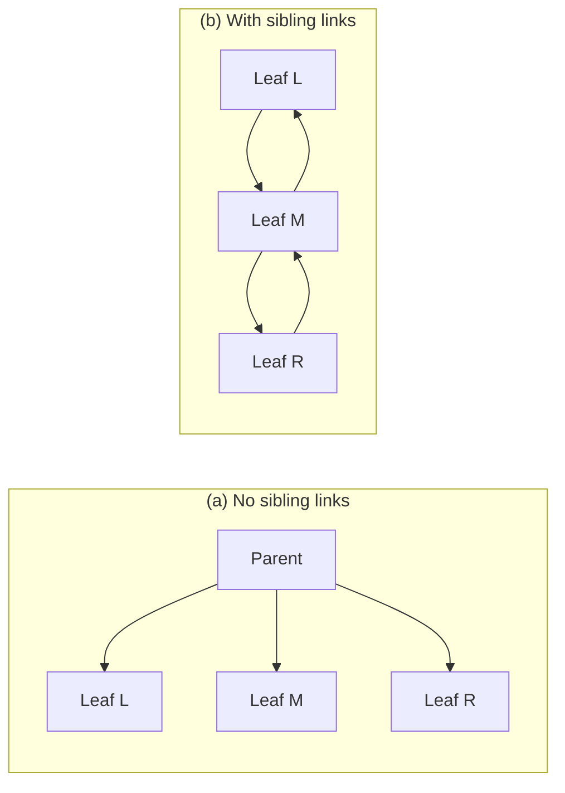
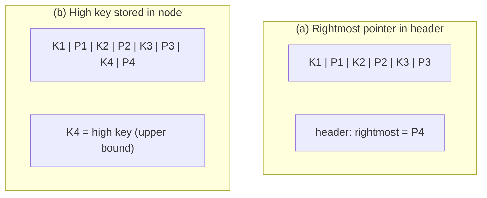

# Page Header and Navigation Links

> **One-sentence summary.** The page header and its navigation fields (magic numbers, sibling links, rightmost pointers, high keys) let a B-Tree page identify itself and reach its neighbors without always climbing back to the root.

A B-Tree node lives inside a fixed-size page on disk. When that page is loaded into a buffer, the storage engine needs to answer two questions: **what is this page?** and **how do I reach an adjacent page?** The answer lives in a small region at the top of the page called the header.

## How It Works

The header reserves a few dozen bytes at a known offset and stores fixed-shape metadata: flags describing the page kind (leaf vs. internal), the cell count, and the lower and upper free-space offsets that mark where cell pointers grow down from and where cell data grows up from. Optionally it also carries sibling pointers, a rightmost child pointer, and a high key. Everything else on the page is positioned relative to these header-declared offsets.

### 1. Page header contents

Different engines cram different fields in. PostgreSQL records the page size and layout version so that a mismatched build refuses to read a stale on-disk format. MySQL InnoDB puts the heap record count and the B-Tree level there. SQLite packs the cell count and the rightmost pointer into the same header. All three agree on the *purpose* (navigation, maintenance, validation) but disagree on the *contents*.

### 2. Magic numbers as integrity checks

A magic number is a multi-byte constant at a fixed header offset. On write, the engine stamps a known byte sequence — for example `50 41 47 45`, the ASCII bytes for `PAGE`. On read, it compares the first four bytes against the expected constant. If they do not match, the page is corrupt, truncated, or a misaligned read landed in the middle of some unrelated region. The odds of a random block starting with the right four bytes are low enough to make this a cheap sanity check against disk, filesystem, or pointer-arithmetic bugs.

### 3. Sibling links

Some implementations store a `prev` and `next` page ID in the header so that a full-level scan (for example, a range scan on a leaf level) can hop directly from one node to the next. Without these links, moving to a neighbor means climbing to the parent — and if the target sibling lives under a different parent, climbing further, sometimes all the way to the root.

The cost is update complexity. When a non-rightmost node splits, its original right neighbor holds a `prev` pointer to the node that just split; that neighbor must be rewritten so its `prev` points at the newly created sibling. Because the update touches a page other than the one being split, extra locking is required to keep concurrent readers and writers consistent. The book notes that concurrent B-Tree variants that rely on sibling links (discussed in later chapters under Blink-Trees) handle exactly this problem.

### 4. Rightmost pointers

A B-Tree internal node with `N` separator keys has `N + 1` child pointers — there is always one extra pointer with no key partner. Many layouts pair keys and pointers cell-by-cell and then stash the leftover `N+1`th pointer separately in the header. SQLite does this. The awkward part: when the rightmost child splits, the promoted key and its pointer are appended to the parent as a new cell, and the parent's header rightmost pointer must be reassigned to the freshly created child. SQLite's `balance_deeper` routine codifies this case.

### 5. Node high keys (B[link]-Trees)

PostgreSQL takes a different route. It adds one extra key, `K[N+1]`, to every node — the *high key* — representing the highest key that can appear in the subtree rooted at this node. Now every pointer, including what used to be the "rightmost" one, has a key partner, and the upper bound is an explicit value in the node rather than an implicit `+infinity`.

## Comparison: What Goes in the Header

| Field | PostgreSQL | MySQL InnoDB | SQLite |
|-------|-----------|--------------|--------|
| Page size | yes | - | - |
| Layout version | yes | - | - |
| Heap record count | - | yes | - |
| Level | - | yes | - |
| Cell count | - | - | yes |
| Rightmost pointer | stored as high-key pair | - | yes (in header) |
| High key per node | yes (B[link]-Trees) | - | - |

## Trade-offs

| Aspect | Advantage | Disadvantage |
|--------|-----------|--------------|
| Sibling links | O(1) sibling traversal for range scans | Split/merge must lock and update neighbors |
| Rightmost pointer in header | Saves bytes by not repeating a key | Many edge cases on split (`balance_deeper`) |
| High key per node | Uniform cell layout, fewer edge cases, enables B[link]-Trees | One extra key's worth of storage per node |
| Magic number | Cheap corruption and version detection | Costs a few header bytes on every page |

## Why This Matters for the Rest of the Chapter

Every later topic in this chapter assumes a well-defined header. [[02-overflow-pages]] link their extension pages through a page ID stored in the primary page's header. [[03-binary-search-with-indirection-pointers]] relies on the cell-count and offset fields the header declares. [[04-breadcrumbs-and-parent-pointers]] are alternatives to — or complements of — sibling links. [[07-vacuum-and-page-defragmentation]] rewrite cell regions but leave the header's identity and navigation fields intact so that readers keep working during reorganization. Get the header wrong and none of the rest can stand up.
