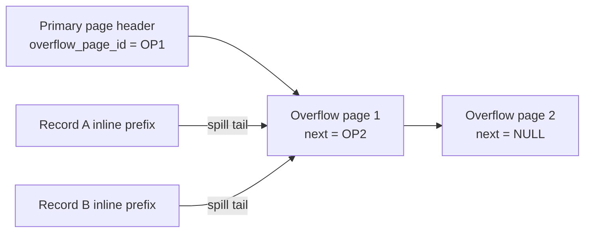

# Overflow Pages for Variable-Size Records

> **One-sentence summary.** Overflow pages are linked extension pages that let a fixed-size B-Tree node spill any payload bytes exceeding `max_payload_size`, so the primary page always has room to hold another entry and the tree keeps its promised fanout.

## How It Works

A B-Tree is designed with a fixed page size (say 4 KiB) and a fixed fanout. That yields predictable I/O, a predictable tree height, and simple math for splits and merges. But real payloads are not fixed size: one row might be 20 bytes, another might be 4 MB. The algorithm's notion of "node full" (count of items) no longer lines up with the physical notion of "page full" (bytes of free space). A node could be only half full by count yet have zero free bytes.

The fix is to decouple the two notions. Each primary page reserves at most `max_payload_size = page_size / fanout` bytes for any single entry. As long as the record's inline portion fits inside that budget, the page can always accept a new entry, which preserves the fanout invariant. Anything larger is truncated in place and the remaining bytes are written to an **overflow page** — a regular page allocated from the free list and marked as an extension of the primary. The primary page's header stores the ID of the first overflow page; if one overflow page is not enough, each overflow page's own header stores the ID of the next in the chain. Walking the chain is just pointer-chasing, one 4 KiB read per hop.

For separator keys in internal nodes, the inline prefix alone is usually sufficient: most key comparisons succeed or fail before they need the tail bytes. Overflow is only traversed for the final data-record return, which is rare on the hot path.

## When to Use

- **Row stores with TEXT / BLOB columns.** Most rows are small, but a few carry large strings or binary payloads. Overflow keeps the common case fast without forcing a separate storage engine.
- **Variable-length keys in indexes.** Index entries on long string columns (URLs, emails, tokenized paths) can exceed the per-entry budget. A key prefix in the primary page lets most descents short-circuit.
- **Schema-flexible formats.** JSON, protobuf, or other formats where a single document may blow up unexpectedly. Overflow pages absorb the outliers without rewriting the page layout.

## Trade-offs

| Aspect | Advantage | Disadvantage |
|--------|-----------|--------------|
| Fixed page size | Predictable fanout, height, and I/O budget | Oversized payloads need extra bookkeeping |
| `max_payload_size` floor | Primary page always accepts one more entry | Wastes a slot if most records are tiny |
| Inline key prefix | Comparisons usually resolve without overflow I/O | Full key still needed for exact-match resolution |
| Chained overflow pages | Simple, uses the same allocator as normal pages | Extra seeks per oversized read; overflow pages fragment too |
| Alternative: dedicated blob storage | Keeps the B-Tree compact when nearly all records are oversized | Adds a second storage subsystem; only worthwhile when blobs dominate |

The book notes that if *all* records are oversized, a specialized blob store is usually the better call — overflow pages are optimized for the common case where only a minority of entries spill.

## Real-World Examples

- **SQLite.** Spills record payloads beyond a per-record threshold into a linked chain of overflow pages; the primary cell stores the first overflow page number. The local-storage formula is documented in the SQLite file-format spec under "Cell Payload Overflow".
- **MySQL InnoDB.** Stores long variable-length columns (`VARCHAR`, `TEXT`, `BLOB`) off-page in dedicated overflow pages (`BLOB` pages). Only a 20-byte pointer remains inline when the row format is DYNAMIC or COMPRESSED.
- **PostgreSQL.** Takes a slightly different route with TOAST (The Oversized-Attribute Storage Technique) — conceptually similar to overflow pages but implemented as a separate shadow relation rather than chained pages inside the same index.

## Common Pitfalls

- **Forgetting to vacuum overflow chains.** Overflow pages suffer the same fragmentation and dead-row pressure as primary pages. Freed overflow pages must return to the allocator. See [[07-vacuum-and-page-defragmentation]].
- **Over-reading overflow on internal node comparisons.** If your comparator pulls the full key every time, you lose most of the benefit of the inline prefix. Compare prefixes first and only dereference overflow on the remaining ambiguous tail.
- **Picking a `max_payload_size` that is too small.** A tiny per-entry budget forces even modestly sized records onto overflow pages, multiplying random I/O. Tune it against the expected row-size distribution, not worst-case outliers.

## See Also

- [[01-page-header-and-navigation-links]] — the primary page header is where the first overflow page ID lives, alongside sibling and rightmost pointers.
- [[07-vacuum-and-page-defragmentation]] — overflow pages fragment too and need the same reclamation machinery as primaries.
- [[03-binary-search-with-indirection-pointers]] — explains why an inline key prefix is usually enough to resolve a descent without chasing overflow.
