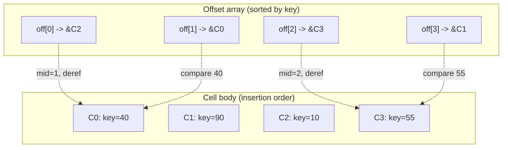

# Binary Search with Indirection Pointers

> **One-sentence summary.** Inside a slotted page, keys are located by binary-searching the sorted array of cell offsets in the header and dereferencing each mid-offset to the physical cell for comparison, because cells themselves sit in insertion order in the page body.

## How It Works

A B-Tree node can hold hundreds of keys. Scanning linearly on every descent would turn an O(log n) tree walk into O(n) per level, destroying the entire point of the structure. Binary search is what restores O(log k) inside a page of k keys. But binary search has a strict precondition: the data must be sorted. That is why the sorted-key invariant is non-negotiable at every level of a B-Tree.

Classical binary search on an array returns a signed integer. A non-negative value is the index where an exact match was found. A negative value encodes the *insertion point*: the first index whose key is strictly greater than the search key. Per the classical convention (SEDGEWICK11), the negative return is typically `-(insertion_point + 1)`, so the sign bit signals "miss" while the magnitude still tells the caller where the key would go if inserted. Non-leaf searches lean on this insertion-point case: they rarely land on an exact match and instead follow the child pointer immediately left of the insertion point into the correct subtree.

The twist inside a slotted page is that the sorted array is not the data array. When cells are inserted, shifting hundreds of variable-length cell bodies around to keep them physically ordered would be prohibitive. So cells are appended in insertion order in the page body, and only a small array of fixed-width cell offsets (stored in the header / slot directory) is kept in logical key order. Binary search therefore pivots indices into the offset array, then dereferences each midpoint offset to fetch the cell body for the actual key comparison. See [[01-page-header-and-navigation-links]] for how the offset array lives alongside the empty-space pointers in the header region.



## The Algorithm

```python
def search_page(page, target):
    offsets = page.offset_array  # sorted logically by cell key
    lo, hi = 0, len(offsets) - 1
    while lo <= hi:
        mid = (lo + hi) // 2
        cell = page.cells[offsets[mid]]  # indirection: slot -> cell body
        if cell.key == target:
            return mid                    # non-negative: exact hit
        elif cell.key < target:
            lo = mid + 1
        else:
            hi = mid - 1
    return -(lo + 1)                      # encodes insertion point
```

At a leaf, a non-negative return yields the payload. At an internal node, callers almost always take the negative branch, decode the insertion point, and descend into the child link that sits to the left of that position. The breadcrumbs collected along the way are consumed later during splits and merges, which is covered in [[04-breadcrumbs-and-parent-pointers]].

## When to Use

- Any on-disk page format where cells are variable-length and inserts must be cheap (no shifting of cell bodies).
- Index nodes where you need ordered traversal *and* fast point lookup without a second data structure.
- Formats that must support in-place deletes by just trimming an offset (the cell body becomes garbage until vacuum reclaims it).

## Trade-offs

| Aspect | Advantage | Disadvantage |
|--------|-----------|--------------|
| Memory access pattern | Small offset array is cache-friendly to binary-search | Each compare costs two memory accesses: offset then cell body |
| Insert cost | No need to shift cell bodies; only the offset array moves | Logical order and physical order diverge, complicating scans |
| Delete cost | Trimming an offset is O(1); cell body left for vacuum | Page fragments over time and needs defragmentation |
| Branch prediction | Uniform loop, easy to reason about | Pointer chasing defeats hardware prefetchers on large pages |

## Real-World Examples

- **PostgreSQL heap and index pages**: Line pointers form the sorted directory; tuples live lower in the page in insertion order.
- **SQLite B-Tree pages**: A cell pointer array near the header is binary-searched; cells grow from the other end of the page.
- **InnoDB compact pages**: Record directory slots index groups of records; within a slot, a short linear scan finishes the lookup, a hybrid that trades some search precision for fewer indirections.

## Common Pitfalls

- **Assuming cells are physically sorted**: Iterating by physical offset returns insertion order, not key order. Always iterate through the offset array.
- **Mishandling the negative return**: Treating `-1` as "not found" loses the insertion point. Decode it via `-(ret + 1)` so callers can descend into the correct child or insert in place.
- **Ignoring cache cost of indirection**: On a hot page, the double access per compare can dominate. Some engines cache the first few key bytes alongside the offset to short-circuit comparisons and skip the dereference on a mismatch.

## See Also

- [[01-page-header-and-navigation-links]] — where the offset array physically lives, and how lower/upper bounds delimit free space
- [[04-breadcrumbs-and-parent-pointers]] — what happens with the search result after the leaf is found, on the way back up for splits and merges
