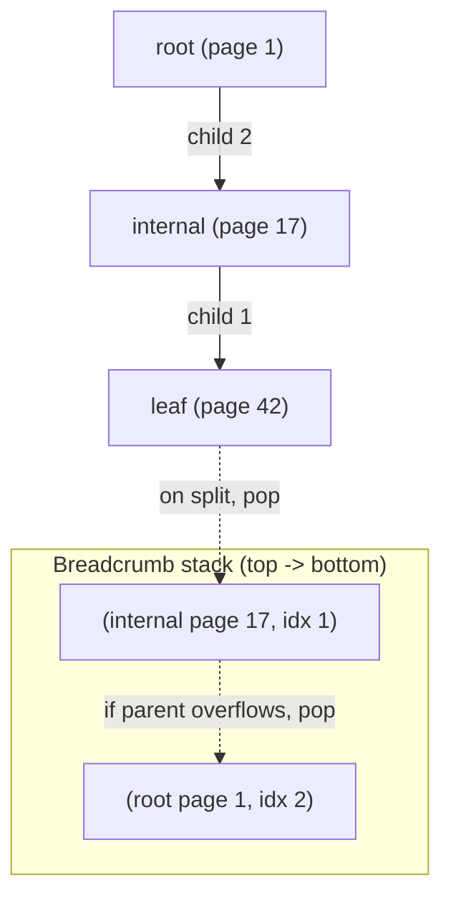

# Breadcrumbs and Parent Pointers

> **One-sentence summary.** To propagate structural changes from a leaf back toward the root after a split or merge, a B-Tree must know how to climb upward — either by storing parent page IDs inside every node header, or by recording a stack of visited (node, cell-index) pairs during the initial descent.

## How It Works

A B-Tree lookup is naturally top-down: we start at the root and pick a child pointer at each level until we hit a leaf. Structural mutations run in the opposite direction. An insert that overflows a leaf triggers a split whose promoted separator key has to land in the parent; if the parent also overflows, the split cascades upward, potentially all the way to the root. Deletes behave symmetrically through merges and rebalancing. The B-Tree therefore needs a reliable way to walk from any node back toward the root, but child pointers only go downward.

Two approaches solve this:

**Parent pointers** embed the parent page ID in each node's header. Because lower-level pages are always paged in via a reference from their parent, the pointer can be populated in memory as a byproduct of the descent and does not strictly need to be persisted on disk. The cost is that any structural change in a parent — split, merge, or rebalance — must update the parent pointer of every affected child, much like the way [[01-page-header-and-navigation-links]] sibling links are maintained.

**Breadcrumbs** avoid node-header bookkeeping entirely. The tree collects a stack of `(node, child_index)` entries during the top-down lookup (the same descent that uses [[03-binary-search-with-indirection-pointers]] to choose each child). When a structural change fires at the leaf, we pop the stack to find the immediate parent and the exact cell slot where the promoted separator belongs. PostgreSQL's `BTStack` is the canonical example. The stack is strictly in-memory and scoped to a single operation.



## When to Use

- **Parent pointers** fit systems that need to navigate upward *outside* of a single insert or delete — for example, WiredTiger walks leaves through the parent to avoid the deadlocks that can arise from sibling-pointer traversal under concurrent modifications.
- **Breadcrumbs** fit systems where structural mutations are always scoped to the lookup that discovered the target node. They keep node headers lean and avoid the write amplification of updating parent IDs on every parent split.
- **Both together** appear in real engines: parent pointers for navigation, breadcrumbs for propagating a specific insert or delete without reading the parent header again.

## Trade-offs

| Aspect | Parent Pointers | Breadcrumbs |
|---|---|---|
| Persistence | Stored in node header; often kept in-memory only | In-memory per-operation stack |
| Update cost | Every parent split/merge/rebalance updates N child headers | Zero — stack is rebuilt each lookup |
| Memory usage | Extra bytes per node | O(tree height) per operation |
| Concurrency | Enables upward traversal outside the lookup path; but parent-pointer updates are a contention hazard under concurrent splits | Private to one thread; no shared state to lock |
| Example systems | WiredTiger (leaf traversal) | PostgreSQL (`BTStack`) |

## Real-World Examples

- **PostgreSQL** descends from the root, pushes every `(page, child_offset)` onto a `BTStack`, and on overflow pops the stack to find the parent and the slot where the new separator should be inserted. If the parent also overflows, the pop repeats until the stack is empty (meaning the root itself split) or a parent has room.
- **WiredTiger** uses parent pointers for upward leaf navigation, sidestepping the sibling-pointer-based traversal deadlocks described in classical B-Tree concurrency literature (MILLER78, LEHMAN81). The sibling is reached by walking to the parent and descending through the next child pointer.
- **B-link trees** (generalized) sidestep the update-the-parent-pointer-under-contention problem with high keys and right-links, which forward-links [[05-rebalancing-and-b-star-trees]] and later concurrency chapters.

## A Breadcrumb-Driven Split in Code

```python
def insert(tree, key, value):
    crumbs = []  # stack of (node, child_index)
    node = tree.root
    while not node.is_leaf:
        idx = node.find_child(key)
        crumbs.append((node, idx))
        node = node.children[idx]
    node.insert(key, value)
    while node.overflowed() and crumbs:
        parent, idx = crumbs.pop()
        promoted_key, new_node = node.split()
        parent.insert_child(idx + 1, promoted_key, new_node)
        node = parent
    if node.overflowed():  # stack empty -> root split
        tree.root = node.split_into_new_root()
```

The stack makes the recursion explicit: each pop jumps exactly one level and tells us the cell index where the promoted separator belongs, without re-searching the parent.

## Common Pitfalls

- **Stale cell indices.** If concurrent writers mutate a parent between the descent and the split, the stored index may no longer point to the right slot. Locking protocols or re-validation on pop are required.
- **Parent-pointer update storms.** A split that touches many children must update each child's header. Under heavy concurrency this becomes a write-amplification and contention hotspot; B-link variants exist precisely to dodge this.
- **Skipping root-split handling.** If the stack empties while the current node is still overflowed, the root itself must split and a new root node must be allocated — forgetting this corrupts the tree height invariant.
- **Persisting parent pointers unnecessarily.** Since parents always page in their children, parent pointers can live purely in memory; persisting them on disk adds I/O for no benefit.

## See Also

- [[03-binary-search-with-indirection-pointers]] — how each `child_index` in the breadcrumb is chosen during descent
- [[01-page-header-and-navigation-links]] — where parent and sibling pointers live in the node header
- [[05-rebalancing-and-b-star-trees]] — an alternative that postpones splits entirely, reducing how often we need to climb back up
