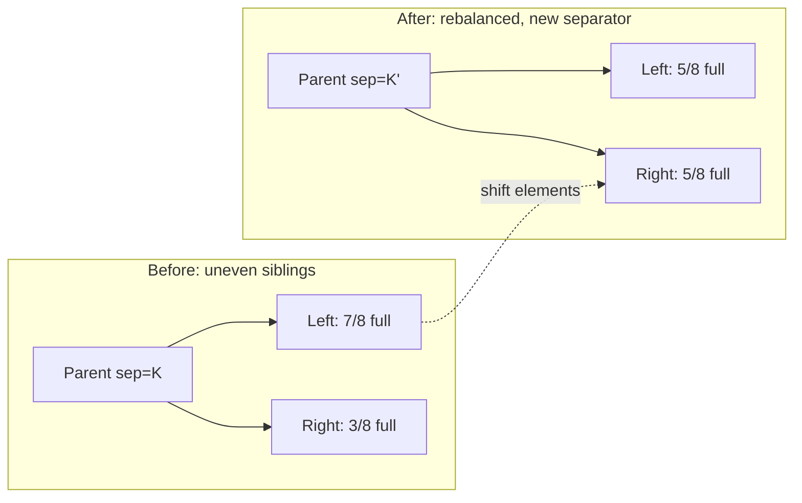

# Rebalancing and B*-Trees

> **One-sentence summary.** Defer expensive splits and merges by first redistributing elements between sibling nodes; B*-Trees push the idea further by splitting two full siblings into three two-thirds-full nodes, raising occupancy and flattening the tree.

## How It Works

A naive B-Tree split is wasteful. When a leaf overflows by a single element, the node is cut in half: the original full page and its freshly allocated partner both end up roughly 50% full. That doubles the page count for the sake of one extra key, worsens occupancy, and grows the tree height over time. Rebalancing asks a cheaper question first: does a neighbor have room?

On insert into a full node, the implementation peeks at the left or right sibling. If the sibling has free space, some elements migrate across the boundary and the overflowing node makes room for the new key without allocating a new page. A symmetric dance happens on delete: instead of merging an under-full node with its neighbor, the algorithm borrows elements from a more-occupied sibling so the node stays at or above the minimum fill threshold. Either way, no split or merge actually occurs.

**B*-Trees** (Knuth's variant) take this to its logical conclusion. They keep redistributing between neighbors until *both* siblings are full. Only then do they split, but the split is 2 into 3: the two full pages and the overflow become three pages that are each two-thirds full. Average occupancy rises from ~50% (after a plain split) toward ~66%, the tree stays shorter, and searches touch fewer pages. SQLite's `balance-siblings` routine is the canonical reference implementation.

## When to Use

- **Write-heavy OLTP on disk** where every allocated page is a fsync candidate and a cache line. Delaying a split saves a page write and an index-metadata update.
- **Tight storage budgets**, for example embedded engines such as SQLite: higher occupancy means fewer pages to mmap and a measurably shorter search path.
- **Workloads with hotspotted inserts** into a small key range. Plain splits keep fragmenting the hot region; rebalancing smears the load across neighbors.

## Trade-offs

| Aspect | Standard split | Rebalance-then-split | B*-Tree 2 to 3 split |
|--------|----------------|----------------------|----------------------|
| Avg. occupancy | ~50% | 50-66% (workload dependent) | ~66% |
| Tree height | Tallest | Shorter | Shortest |
| Balancing logic | Trivial | Must peek at one sibling, rewrite separator | Must peek at both, rewrite two separators, 3-way page rewrite |
| Write amplification on hot nodes | Low per event, frequent events | Medium (sibling also rewritten) | Highest per event, but least frequent |
| Implementation risk | Well-understood | Isolated, retrofittable | Invasive; touches page-split algebra |

## Real-World Examples

- **SQLite**: Ships both flavors. `balance-siblings` rebalances on overflow and underflow before resorting to a split; the 2-to-3 B*-style split is used when siblings are full together.
- **PostgreSQL**: Sticks with classic splits in its nbtree but pairs them with optimizations such as fastpath rightmost inserts (see [[06-right-only-appends-and-bulk-loading]]).
- **WiredTiger**: Uses parent pointers (see [[04-breadcrumbs-and-parent-pointers]]) during leaf traversal, which interacts with how rebalancing re-binds separator keys upward.

## Common Pitfalls

- **Stale parent separator.** Shifting elements changes each sibling's min/max invariant. If the parent separator is not updated atomically with the sibling write, a search can descend into the wrong subtree. Cross-link: when high keys are stored in page headers (see [[01-page-header-and-navigation-links]]), those must be updated too.
- **Parent located via breadcrumb, not lookup.** The parent separator to rewrite is the one on the path taken down, reachable from the recorded [[04-breadcrumbs-and-parent-pointers]]. Re-searching the tree to find it re-introduces the concurrency races breadcrumbs were meant to avoid.
- **Unbounded cascading.** Done carelessly, rebalancing can chain across many siblings per operation. Bound the work: most implementations only examine one immediate neighbor before falling back to a split.
- **Concurrency cost.** Rebalancing touches two or three pages (plus the parent) under one logical operation, so the locking footprint is larger than a plain split. Measure before enabling under high contention.

## See Also

- [[04-breadcrumbs-and-parent-pointers]] — how the rebalancer reaches the parent separator without re-descending.
- [[01-page-header-and-navigation-links]] — high keys and sibling links that must stay consistent when elements move across page boundaries.
- [[06-right-only-appends-and-bulk-loading]] — complementary optimizations (SQLite's `quickbalance`, PostgreSQL's fastpath) for the monotonic-insert case that rebalancing does not help.

Practical note: rebalancing is an *isolated* optimization. Correctness of a B-Tree does not depend on it; plain splits and merges produce a valid tree. This means implementers can ship a straightforward B-Tree first and retrofit rebalancing, or even the full B*-Tree 2-to-3 split, once the hot paths are instrumented and the occupancy wins are measured.
