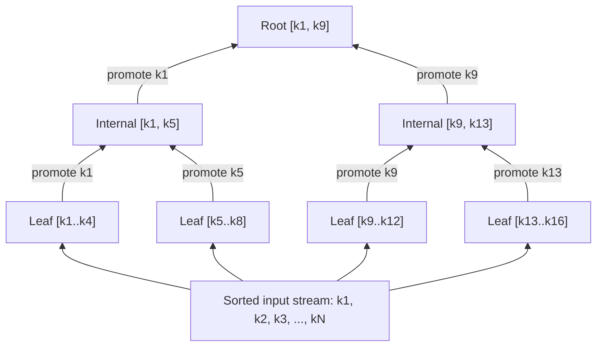

# Right-Only Appends and Bulk Loading

> **One-sentence summary.** When every insert lands at the rightmost leaf (auto-increment keys) or every key is known up front (restore, index rebuild), a B-Tree implementation can skip most of the read path, skip splits entirely, and pack pages to 100% occupancy.

## How It Works

A huge fraction of real-world primary keys are auto-incremented integers: `SERIAL`, `AUTO_INCREMENT`, `bigserial`, ULIDs. Every new key is strictly greater than any key already in the tree, so every insert descends to the same leaf, the rightmost one. A general-purpose B-Tree insert still pays the full cost: root-to-leaf descent, binary search at every level, occasional splits that ripple up. Both PostgreSQL and SQLite recognize this workload and take shortcuts. A separate but related shortcut, *bulk loading*, applies when the entire sorted dataset is already in hand, for example during a restore, index rebuild, or ETL final stage.

**PostgreSQL fastpath.** The access method caches a pointer to the rightmost leaf. On insert, it compares the new key to the first key of the cached leaf. If the new key is strictly greater and the leaf has free space, the entry is written directly into that leaf. The root-to-leaf descent, the binary search on each interior page, and the lock coupling from top to bottom are all skipped. The cache is invalidated only when the rightmost leaf splits.

**SQLite quickbalance.** When the rightmost leaf is full and the new key becomes the largest in the tree, the generic balancing code would split the full leaf (leaving two half-full pages). Quickbalance instead allocates a brand-new rightmost leaf, writes the single new entry into it, and links it from the parent. The freshly-allocated page is nearly empty, but under a monotonic-append workload it will fill up shortly. No keys are moved; the full page is left intact. See [[05-rebalancing-and-b-star-trees]] for the general sibling-balancing algorithm that quickbalance short-circuits.

**Bulk loading.** Given presorted input, the tree is built bottom-up. The loader fills a leaf page key-by-key; when the page is full it is flushed and its first key is promoted to the parent spine. The parent is itself a page being filled in memory; when it fills, its first key bubbles up another level, and so on. At any moment only the currently-filling spine (one page per level, roughly `log_B(N)` pages) is resident. No splits, no merges, no rebalancing, because every insertion is by construction a right append to the incomplete rightmost chain. The algorithm is the standard bottom-up construction described in [RAMAKRISHNAN03].

Because there is no fear of future splits mid-page, bulk-loaded pages can be packed to 100% occupancy. Mutable B-Trees built this way still reserve some free space per page (to absorb later inserts without immediate splits), but *immutable* B-Trees, where no in-place mutation is ever allowed, fill every page to the brim. Higher occupancy means higher fanout, which means a shallower tree and fewer disk seeks per lookup.

## When to Use

- **Auto-increment PK workloads (fastpath / quickbalance)**: any OLTP table whose surrogate key is monotonically generated, which in practice is most of them.
- **Restore from logical dump**: `pg_restore`, `mysqldump --order-by-primary`, or any backup that emits rows in primary-key order — bulk load the index in one pass.
- **Offline index build**: `CREATE INDEX` on a large existing table sorts the column externally, then bulk-loads the resulting run.
- **Defragmentation rebuild**: as discussed in [[07-vacuum-and-page-defragmentation]], a fragmented tree is sometimes rebuilt from scratch by reading entries in key order and bulk-loading a fresh tree.

## Trade-offs

| Strategy | Startup cost | Final occupancy | Splits during load | Applicability |
|----------|--------------|-----------------|--------------------|----|
| Naive insert loop | None | ~50-70% (post-split halves) | Many, ripple up | Any key order |
| PostgreSQL fastpath | Cache rightmost leaf | Normal (splits still happen when the leaf fills) | Only at rightmost edge | Strictly increasing keys |
| SQLite quickbalance | None | Lower briefly (new leaf starts near-empty) | None, but wastes half a page temporarily | Strictly increasing keys |
| Bulk load | Requires presorted input | ~100% (immutable) or configurable | Zero | One-shot construction from sorted data |

## Real-World Examples

- **PostgreSQL**: `_bt_doinsert` checks the fastpath before descending; the rightmost block number is cached in `RelationData`. A separate `pg_restore --disable-triggers` workflow bulk-loads tables, then builds indexes afterward.
- **SQLite**: `balance_quick()` in `btree.c` allocates a new rightmost page when the target is full and the key is the new maximum.
- **LSM-tree SSTables**: every SSTable is effectively bulk-loaded from a sorted memtable flush, and its internal index pages are packed full because the file is immutable once written.

## Common Pitfalls

- **Non-monotonic "auto-increment" keys**: UUIDv4 is random; inserting UUIDv4 PKs defeats fastpath entirely and causes write amplification across the whole tree. Prefer ULIDs or UUIDv7 if you want the optimization.
- **Bulk load without presort**: appending out-of-order keys in "bulk" mode corrupts the B-Tree invariant. The sort step is mandatory, not optional.
- **Overpacked mutable trees**: filling a mutable tree to 100% via bulk load means the first random insert splits a page immediately. Reserve free space (e.g., PostgreSQL's `fillfactor`) if the tree will accept writes after loading.

## See Also

- [[05-rebalancing-and-b-star-trees]] — the general-purpose occupancy optimization that quickbalance and bulk loading both bypass.
- [[07-vacuum-and-page-defragmentation]] — bulk loading is the mechanism behind full-index rebuild as a defragmentation strategy.
- [[04-breadcrumbs-and-parent-pointers]] — fastpath works because the rightmost leaf pointer is a form of cached breadcrumb, skipping the normal descent.
