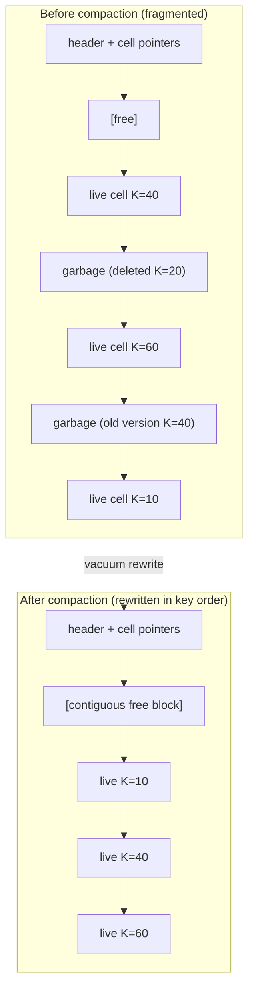

# Vacuum, Compression, and Page Defragmentation

> **One-sentence summary.** Because slotted-page deletes and updates only trim offsets without moving cell bodies, B-Trees need a background vacuum process that rewrites pages in key order, returns reclaimed page IDs to a persistent freelist, and can optionally compress pages to trade CPU for I/O.

## How It Works

A slotted page (see [[01-page-header-and-navigation-links]]) grows from both ends: the cell-pointer array grows downward from the header, and variable-length cell bodies grow upward from the end of the page. When a record is deleted, the engine takes the cheap path: it removes the pointer from the offset array and leaves the cell body untouched. The body is now **unreachable from the root** and therefore "garbage," but the bytes it occupies are still there, stranded between live cells. Zero-filling is typically skipped because those bytes will eventually be overwritten anyway.

Three mechanisms produce this garbage. First, **deletes** trim offsets but never relocate cells. Second, **updates**, especially under MVCC, deliberately keep the old version in place so concurrent transactions can still read it; some engines track these as "ghost records" [WEIKUM01] and collect them once no reader is left. Third, **splits** truncate the offset list on the left half without physically reclaiming the cell bodies that moved to the new right sibling.

The net effect is a page that still has plenty of *logical* free space but not enough *contiguous* free space for a new cell. Vacuum (also called compaction or maintenance) is the process that fixes this: it walks pages, discards garbage, and rewrites survivors in logical key order. Rewriting can happen synchronously on write when no contiguous block is available (so the engine does not have to chain an unnecessary overflow page), but is usually an asynchronous background job. Rewritten pages may be relocated in the file; freed page IDs are pushed onto a **free page list** (freelist) that must be persisted so crashes do not leak space. SQLite, for example, uses a linked list of "trunk" pages, each holding addresses of freed pages.

Compression is a complementary space optimization. Compressing the whole index file is impractical because any page access would force a decompress of a large region, so mature engines compress **page by page**: fixed-size pages couple naturally with the page cache's load/flush path, and each page can be encoded and decoded independently. The catch is alignment: a compressed page may not fill a disk block, so the engine still reads padding, and a page spanning two blocks costs an extra block read. An alternative is to compress *data* rather than *pages*: row-wise (whole records) or column-wise (per column), which decouples compression from page management. Most open-source engines expose this as pluggable libraries: Snappy, zLib, lz4, and others.

## When to Use

- **Write-heavy workloads with frequent deletes or in-place updates** — without periodic vacuum, pages accumulate dead cells and the engine wastes I/O reading mostly-garbage pages.
- **MVCC engines** — multiple versions of the same key pile up by design; vacuum is the only way old versions ever leave the file.
- **Bulk deletes followed by steady-state load** — a one-shot vacuum (or an outright rebuild via bulk load, see [[06-right-only-appends-and-bulk-loading]]) shrinks the file back and restores read locality.
- **Storage-constrained deployments** — enable page compression when CPU is cheaper than the I/O or disk you would otherwise buy.

## Trade-offs

| Aspect | Page-wise compression | Row-wise compression | Column-wise compression |
|--------|-----------------------|----------------------|-------------------------|
| Granularity | One page at a time | One record at a time | One column segment |
| Coupling with cache | Tight — slots into load/flush | Decoupled | Decoupled |
| Random-read cost | Decompress one page | Decompress one row | Decompress one column stripe |
| Update cost | Rewrite + recompress page | Recompress the row | Recompress column segment |
| Compression ratio | Moderate (page-sized input) | Lower (tiny input) | High (homogeneous values) |
| Block alignment | Can waste or cross disk blocks | Not an issue | Not an issue |

When picking a library, the book highlights four metrics: **memory overhead, compression throughput, decompression throughput, and compression ratio**. Decompression speed usually matters most because reads dominate.

## Real-World Examples

- **SQLite**: maintains a freelist of unused pages organized as a linked list of trunk pages, each holding the IDs of freed leaf pages — a persistent structure so a crash does not leak space.
- **PostgreSQL**: MVCC leaves old tuple versions in place; `VACUUM` reclaims them and updates the free space map, and `VACUUM FULL` performs a full rewrite akin to a bulk rebuild.
- **MVCC engines in general**: keep ghost records until no transaction can still see them [WEIKUM01], then collect on the next pass.

## Common Pitfalls

- **Treating delete as "free"**: a delete only unlinks the offset. Without vacuum, the page still occupies the same disk footprint and still gets faulted into the cache.
- **Losing the freelist on crash**: if the freelist is not persisted (or not fsynced), freed pages become orphan storage on restart.
- **Compressing without considering block alignment**: a compressed page smaller than a disk block still costs a full block read; pages spanning two blocks cost two reads. Measure before assuming compression saves I/O.
- **Ignoring overflow pages**: [[02-overflow-pages]] fragment and leak space the same way leaf pages do and must participate in vacuum.
- **Vacuuming too aggressively under MVCC**: collecting a version a running transaction still needs breaks snapshot isolation. Always gate on the oldest live reader.

## See Also

- [[01-page-header-and-navigation-links]] — the slotted-page layout with lower/upper offsets that makes fragmentation possible in the first place.
- [[02-overflow-pages]] — overflow pages need their own reclamation path once the primary cell is deleted.
- [[06-right-only-appends-and-bulk-loading]] — bulk loading is the extreme form of defragmentation: throw the tree away and rebuild it from sorted data.

Practitioners often view vacuum as a background tax the database charges, but it is load-bearing: logical deletes never become physical free space without it. An index that is never vacuumed keeps growing even as rows disappear.
