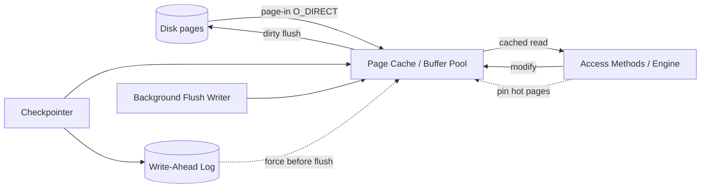

# Page Cache and Buffer Management

> **One-sentence summary.** The page cache (a.k.a. buffer pool) is an application-level, DB-managed mirror of hot disk pages in RAM — it serves reads, absorbs writes as dirty pages, pins the ones the engine wants kept, and coordinates flushes with the WAL so a crash never loses committed data.

## How It Works

A disk-based DBMS spans a two-level memory hierarchy: slow durable storage and fast volatile RAM. The **page cache** (the book's preferred term; "buffer pool" in InnoDB/Oracle) bridges them. Access methods like B-Trees never read the disk directly — they ask the cache for a page by logical number, and it either returns a cached copy or **pages it in**, translating the logical address to a physical block. Slots fill out of order, so on-disk and in-memory layouts do not correspond.

Every cached frame carries a few bits of state. A **referenced** page has a caller still using it and must not be evicted. A **dirty** page has been modified in memory and must be **flushed** before eviction. A **pinned** page is explicitly locked in — typically because it is hot, like the upper levels of a B-Tree where every query lands. The lifecycle: page-in → referenced → dereferenced → possibly dirtied → flushed → evictable → evicted.

Two constraints shape every flush. **Durability**: anything dirty-but-unflushed disappears on crash. **WAL coordination**: a dirty page cannot be evicted until the write-ahead log records describing its modifications are on disk. The *checkpoint* process drives WAL and cache in lockstep — log records are only trimmed once the pages they cover have been flushed, and dirty pages are held until their log prefix is durable. This is the [[03-write-ahead-log-and-recovery]] contract that makes recovery possible.

Most databases bypass the kernel's own page cache by opening files with `O_DIRECT`, so the DB alone decides what stays in RAM. The alternatives — `fadvise()` hints the kernel may ignore, or `mmap()` which forfeits control of eviction and flush timing — are weaker tools for a system that must synchronize caching with logging.

## When to Use

Every disk-based OLTP database builds one of these. The real question is why you wouldn't just rely on the kernel's page cache or `mmap`:

- **Precise eviction control** — the DB knows that B-Tree upper levels are hit by every query and leaf pages usually aren't; the kernel doesn't. A DB-managed cache can pin the root and interior nodes so a multi-level traversal costs zero physical I/O.
- **WAL coordination** — `mmap` writes pages back on the kernel's schedule, which is exactly the wrong schedule if you need log-before-data ordering. A custom buffer pool enforces the steal/no-force policy (see [[04-steal-force-policies-and-aries]]) directly.
- **Fine-grained prefetching and immediate eviction** — range scans can preload the next leaves; one-shot maintenance reads (e.g., `VACUUM`) can be routed through a small circular buffer so they don't evict the working set. PostgreSQL does exactly this for large sequential scans.

## Trade-offs

| Aspect | Advantage | Disadvantage |
|---|---|---|
| Postpone flushes (write-back) | Coalesces repeated writes to the same page; fewer disk ops | Longer crash recovery; larger window of in-memory-only state |
| Preemptive background flushing | Eviction is fast (pages already clean); steady I/O | Writes pages that may be re-dirtied, wasting I/O |
| App-managed cache (buffer pool) | Full control over eviction, pinning, prefetch, WAL ordering | Reimplements a lot of OS machinery; two caches may double-buffer if not careful |
| OS page cache (let kernel do it) | Zero code; reuses unused RAM transparently | No pinning, no WAL-aware flushing, no per-scan policy; kernel is blind to access semantics |
| `mmap` the data file | Trivial to implement; no read syscalls | Lose control of eviction timing and flush ordering; page faults stall random threads; hard to coordinate with WAL |

## Real-World Examples

- **PostgreSQL** — a single `shared_buffers` region holds all cached pages. The **bgwriter** asynchronously flushes dirty pages that are likely eviction candidates so foreground queries rarely do the writing; the **checkpointer** periodically forces all dirty pages and advances the WAL trim point. PostgreSQL also uses a small circular FIFO ring buffer for sequential scans to protect the main pool from scan-induced eviction.
- **MySQL / InnoDB** — the **buffer pool** is split into old and young LRU sublists (a 2Q variant) so a sequential scan touching every page once does not flush the hot set. Dirty pages are written out by a pool of page-cleaner threads, with flush thresholds driven by the size of the undo/redo log tail.
- **SQLite** — the **pager** module is an in-process page cache that sits between the B-Tree and the VFS; its size is bounded (`PRAGMA cache_size`), and all WAL/rollback-journal coordination flows through it in the same process as the application.

## Common Pitfalls

- **Trusting `fsync()` after an I/O error.** On Linux, `fsync` clears the dirty flag on kernel pages even when the underlying write failed, and errors are only reported to file descriptors that were open *at the time of failure*. A checkpointer that closes and reopens files can silently miss I/O errors and believe data is durable when it is not — the infamous "fsyncgate" that bit PostgreSQL in 2018.
- **Dirty page starvation under write-heavy load.** If incoming modifications dirty pages faster than the background writer can flush them, eviction stalls waiting for flushes, foreground transactions block, and the checkpoint window blows out — making recovery after a crash extremely slow. Tuning checkpoint frequency, writer bandwidth, and WAL segment size is fundamentally about keeping this rate balanced.
- **Double buffering with `mmap` plus a user cache.** If the DB maintains its own cached pages *and* also maps files into memory, the same page lives in two places and RAM is wasted; writes also travel through both caches with unclear flush semantics. This is why DBs that use `mmap` (e.g., LMDB) typically do *not* layer a user-level buffer pool on top, and DBs with a buffer pool open files with `O_DIRECT`.
- **Pinning too aggressively.** Every pinned page shrinks the evictable pool. Pin the B-Tree root and a couple of interior levels; don't pin what you wish was hot.

## See Also

- [[02-page-replacement-algorithms]] — how the cache actually chooses which unpinned, clean page to evict: FIFO, LRU, 2Q, LRU-K, CLOCK-sweep, TinyLFU.
- [[03-write-ahead-log-and-recovery]] — the log that must be forced before a dirty page may be flushed; the other half of the checkpoint handshake.
- [[04-steal-force-policies-and-aries]] — the formal framework (steal/no-steal × force/no-force) that names the flushing policies sketched here, and how ARIES combines steal + no-force with a 3-phase recovery.
