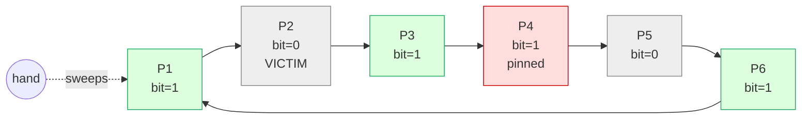

# Page Replacement Algorithms

> **One-sentence summary.** When the buffer pool fills, the cache must pick a victim page to evict — and the algorithm it uses (FIFO, LRU, CLOCK, LFU, or one of their hybrids) is a bet about whether *recency*, *frequency*, or *concurrency cost* best predicts what the workload will touch next.

## How It Works

The eviction problem is deceptively simple: when you need to load a new page and the [[01-page-cache-and-buffer-management]] is full, which cached page should you throw away? The ideal answer requires a crystal ball — evict the page whose next access is farthest in the future. Real algorithms only have the *past* to work with, and they differ in what slice of the past they keep. A sharper warning comes from **Bélády's anomaly**: with a bad algorithm, giving the cache *more* pages can actually increase the number of evictions, because pages start competing for space faster than the policy can stabilize.

The family of practical algorithms forms a short tour. **FIFO** keeps a queue of page IDs in insertion order and evicts the head. It is trivial but catastrophically wrong for B-trees: the root and upper interior nodes are the *first* pages paged in, and FIFO targets them first even though every query touches them. **LRU** fixes this by moving a page back to the tail on every access, so hot pages stay young — but relinking the queue under concurrent readers becomes a contention hot spot. **LRU variants** refine the idea: **2Q** splits the queue into a cold intake queue and a hot queue that a page only enters on a second access, filtering out one-shot scan pages. **LRU-K** tracks the last K access timestamps per page to estimate access frequency, moving the predictor from pure recency toward frequency.

**CLOCK-sweep** trades precision for concurrency. Pages live in a circular buffer with one *access bit* (or small counter) each. A hand sweeps the ring: if the bit is 1, clear it and advance; if it is 0, that page is the victim. Access is cheap — just set your bit — and the hand pointer and bits can be updated with compare-and-swap, so no global lock is needed. Finally, **LFU / TinyLFU** makes the leap from recency to frequency. It keeps a compact count-min-sketch–style frequency histogram and arranges pages into three queues — an **admission** LRU for newcomers, a **probation** queue for likely victims, and a **protected** queue for regulars — admitting a new page only if its estimated frequency beats the candidate it would replace. This is the policy behind the Caffeine Java cache.

*CLOCK-sweep: the hand walks the ring clearing bits on hot pages and stopping at the first page whose bit is already 0. Pinned pages keep their bits set and cannot be evicted.*

## When to Use

Eviction policy should match workload shape, not developer taste.

- **Scan-heavy / sequential access**: a large table scan touches every page exactly once. LRU pollutes the cache with scan pages that will never be reused. Use **FIFO over a small ring buffer** (PostgreSQL's strategy for large sequential scans) or a scan-resistant LRU variant — the scan lives in its own small arena and cannot flush the hot set.
- **OLTP with a hot key skew**: most requests hit a small set of rows, with a long tail of cold ones. Frequency matters more than recency here, so **LFU / TinyLFU** or LRU-K keeps the hot set resident even when the application briefly pulls in cold data.
- **High-concurrency buffer pool**: dozens of threads reading the cache every microsecond. The per-access relink cost of LRU becomes the bottleneck. **CLOCK-sweep** amortizes the work across a background sweep and uses atomics instead of locks.

## Trade-offs

| Algorithm | Tracks | Concurrency Cost | Scan Resistance | Good For |
|---|---|---|---|---|
| FIFO | Page-in order only | Very low (append + head eviction) | None — scans flush everything | Bulk loads, explicit sequential-scan buffers |
| LRU | Recency per access | High — relink on every hit | None — a long scan evicts the hot set | Small caches with uniform access |
| 2Q / LRU-K | Recency + multi-touch filter | Moderate — two-queue maintenance | Good — cold scans never enter the hot queue | Mixed OLTP + occasional scans |
| CLOCK-sweep | Access bit per page | Very low (CAS on bit + hand) | Weak unless combined with counters | Large buffer pools, many threads |
| LFU / TinyLFU | Frequency histogram | Low-moderate (sketch updates) | Strong — low-frequency pages fail admission | Skewed OLTP, hot-key workloads |
| Belady (OPT) | Future accesses | N/A — unimplementable | Perfect | Benchmarks / upper-bound analysis |

## Real-World Examples

- **PostgreSQL**: runs **CLOCK-sweep with usage counters** instead of single bits. Each buffer-pool entry has a counter that increments on access and decrements as the hand sweeps; a page is evicted only when its counter hits zero. For large sequential scans it also uses a small **ring buffer** (effectively FIFO) so scans cannot evict the main working set.
- **MySQL InnoDB**: uses a **midpoint-insertion LRU**. New pages enter the list at the 3/8 mark rather than the head, so a long scan must be re-accessed to reach the hot portion — a scan-resistant LRU that requires no separate queue.
- **Caffeine (Java)**: implements **W-TinyLFU** — a small window LRU in front, admission gated by a count-min frequency sketch, and a main segmented-LRU (probation + protected). It powers caches in Cassandra, Neo4j, and many Java services.
- **Linux kernel page cache**: a **two-list CLOCK variant** (active / inactive LRUs with reference bits) that balances pages between the lists as the scanner runs — a clock sweep with a coarse hot/cold split.

## Common Pitfalls

- **Bélády's anomaly with FIFO**: "we added more RAM and cache miss rate *went up*." Under FIFO, enlarging the cache can reorder eviction candidates so that soon-to-be-needed pages are now evicted. The fix is a better policy, not more memory.
- **LRU pollution from sequential scans**: a single `SELECT COUNT(*)` on a cold table can wipe the hot working set by touching every page exactly once and walking each one to the MRU end. This is the reason every serious database either uses a scan-resistant LRU variant (midpoint insertion, 2Q) or a separate ring buffer for big scans.
- **Access-bit contention under extreme concurrency**: CLOCK is lock-free but not contention-free — if thousands of threads CAS the same access bit every microsecond, the cache line ping-pongs between cores. Production systems widen the bit into a small counter and batch updates, or shard the buffer pool into many pools so the hand is per-partition.
- **Over-trusting recency on skewed OLTP**: pure LRU treats a page touched once a second ago as hotter than a page touched a thousand times a minute ago. For workloads with a stable hot key distribution, frequency-based admission beats recency by a wide margin.

## See Also

- [[01-page-cache-and-buffer-management]] — the cache these algorithms serve: dirty-page tracking, pinning, and flush coordination that every policy has to respect.
- [[07-locks-latches-and-btree-concurrency]] — latches are taken on cached pages, so eviction has to cooperate with page pinning; a page being latched by a reader cannot be chosen as a victim regardless of what the policy says.
