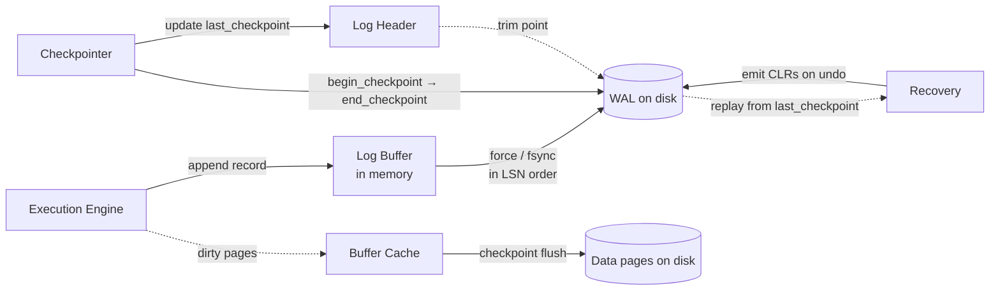

# Write-Ahead Log and Recovery

> **One-sentence summary.** The write-ahead log is an append-only, LSN-ordered stream of operation records that must hit disk *before* the page it describes is allowed to move, turning crash recovery into replaying a sequential file and letting the page cache stay lazy without sacrificing durability.

## How It Works

The core invariant is the **WAL rule**: every operation that modifies database state must be logged, and its log record must be forced to durable storage *before* the corresponding modified page is allowed to be written. That single rule is what makes the page cache (see [[01-page-cache-and-buffer-management]]) safe to be lazy: dirty pages can sit in memory arbitrarily long, because the log already describes how to reconstruct them. The log itself is append-only and writes sequentially, which is the one access pattern both HDDs and SSDs are fastest at — you are never seeking, never updating in place, just pushing bytes onto the end of a file.

Each record carries a **log sequence number** (LSN), a monotonically increasing counter (or timestamp) used to identify records, order them, and point into them from page headers and checkpoint records. Records are first staged in an in-memory **log buffer**; a **force** (effectively an `fsync`) flushes the buffer to disk. Forces are triggered when the buffer fills, when the page cache wants to steal a dirty page, or when a transaction commits. Commit semantics fall out of this directly: **a transaction is not committed until the log has been forced up to the LSN of its commit record**. Everything before the force is revocable; everything after it is durable.

Left alone, the log would grow forever, and recovery would have to replay it from the beginning. **Checkpoints** solve that by marking a point past which log records describe only already-flushed pages, so earlier records can be trimmed. A **sync checkpoint** flushes every dirty page, pauses activity, and is simple but stalls the system. A **fuzzy checkpoint** is what real systems use: it writes a `begin_checkpoint` record, asynchronously flushes dirty pages in the background, writes an `end_checkpoint` record listing the dirty-page table and transaction table, and only then updates a `last_checkpoint` pointer in the log header to the `begin_checkpoint` LSN. Recovery starts from that pointer. During undo on recovery, each reversal is itself written as a **compensation log record (CLR)** so a second crash mid-recovery doesn't re-undo work already undone.

What a log record *contains* is a separate axis. **Physical logs** store before/after page images (or byte ranges) — replay is just "overwrite this page with these bytes." **Logical logs** store operations like `insert X for key Y` plus an undo `remove Y` — smaller, but replay depends on the page being in a compatible state. Most production systems take the hybrid path: **physical (or "physiological") redo** for fast replay that doesn't care about tree shape, and **logical undo** so that undoing one transaction doesn't block others touching the same page.

## When to Use

Reach for a WAL whenever you need **crash recovery + high write throughput** and cannot afford a force policy (flushing every modified page at commit). Concretely:

- **OLTP databases** where commit latency matters and working sets don't fit in memory — WAL lets you commit with one sequential write instead of random page writes.
- **Any system with a page cache that wants `no-force`** — the WAL is what makes `no-force` safe (see [[04-steal-force-policies-and-aries]]).
- **Replicated systems** — the log is also a natural replication stream; shipping LSNs to followers gives you physical replication almost for free.

The main alternative, **shadow paging** (System R, copy-on-write), avoids an explicit log by atomically flipping a pointer from an old page to a new one. It works, but it fragments on-disk layout and is a poor fit for B-trees, which is why nearly every modern RDBMS uses a WAL instead.

## Trade-offs

| Aspect | Physical log | Logical log | Physical-redo + Logical-undo |
|---|---|---|---|
| Record size | Large (page images or byte ranges) | Small (one operation per record) | Medium |
| Replay cost | Fast — byte-copy a page | Slower — re-execute operations | Fast redo, cheap undo |
| Concurrency during undo | Poor — whole-page rollback blocks neighbors | Good — per-record undo doesn't touch unrelated keys | Good (undo is logical) |
| Fidelity after schema/format change | Fragile — page layout must match | Robust — operations are layout-independent | Robust for undo, fragile for redo across format versions |
| Typical user | Simple embedded engines | Pure logical replication | ARIES and its descendants (Postgres, InnoDB, DB2) |

## Real-World Examples

- **PostgreSQL WAL**: log is split into fixed-size 16 MB **segments**; a background **checkpointer** process runs fuzzy checkpoints and advances the redo pointer; old segments are archived (for PITR) or recycled. Physical/physiological records are used for both recovery and streaming replication.
- **MySQL / InnoDB redo log**: a small, fixed-size **ring buffer** of log files (`ib_logfile0`, `ib_logfile1` historically). The LSN tracks how far around the ring we are; checkpoints advance the tail so the head can keep writing. Undo information lives separately in rollback segments (MVCC) — redo is physical, undo is logical.
- **SQLite WAL mode**: an alternative to the older rollback journal. Readers see a consistent snapshot by reading from the database file plus an index into the WAL; a **checkpoint** copies WAL pages back into the main file. WAL mode dramatically improves concurrency at the cost of a separate `-wal` file.
- **The `fsync()` horror story**: on Linux, `fsync` unsets the kernel dirty flag *even on I/O error*, and errors are reported only to file descriptors that were open at the time of failure. PostgreSQL's checkpointer did not always keep those fds open, so errors could be silently swallowed — the checkpointer believed data was durable when it wasn't. Resolving this required both kernel changes and the well-known `fsyncgate` rework in Postgres.

## Common Pitfalls

- **Assuming a successful `fsync` means the data is durable.** If the fd that saw the write error has been closed by the time the checkpointer calls `fsync` on a fresh fd, you get "success" on top of lost writes. Keep the fd alive, or `PANIC` on any reported error.
- **Forcing records out of LSN order.** The log must reach disk in monotonic LSN order; otherwise recovery can replay a later record before the earlier one it depends on. Guard the force path with an LSN barrier.
- **Trimming the log before its pages are actually flushed.** The `last_checkpoint` pointer may only advance once every dirty page listed in the corresponding `end_checkpoint` is durable. Advancing it early bricks recovery.
- **Pure physical logging across schema or page-format changes.** A replay of a physical record assumes byte-identical page layout. After a migration or storage-format upgrade, physical redo can corrupt pages — one of the reasons production systems use logical undo and often logical elements in redo too.

## See Also

- [[01-page-cache-and-buffer-management]] — what the WAL protects, and why a lazy page cache is safe only because of the WAL rule
- [[04-steal-force-policies-and-aries]] — how WAL enables `steal/no-force` and drives the ARIES analysis/redo/undo recovery sequence
- [[06-concurrency-control-strategies]] — how WAL records underpin MVCC version chains and 2PL commit durability
