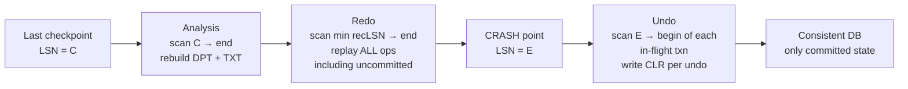

# Steal/Force Policies and ARIES

> **One-sentence summary.** Two orthogonal buffer-manager choices — whether uncommitted pages may hit disk (steal) and whether committed pages must hit disk before commit returns (force) — fix exactly which logs you need, and ARIES is the canonical steal/no-force recipe that makes the fastest combination crash-safe with physical redo, logical undo, and a three-phase restart.

## How It Works

Steal and force are **orthogonal** choices about when the [[01-page-cache-and-buffer-management]] may write a dirty page to disk; each fixes a logging obligation the [[03-write-ahead-log-and-recovery]] must satisfy.

- **Steal**: the buffer manager may flush a dirty page of an *uncommitted* transaction. If that transaction aborts or the system crashes, uncommitted bytes are already on disk, so recovery must undo them — requiring **UNDO log records** written to the WAL before the steal.
- **No-steal**: dirty pages of an uncommitted transaction are *pinned* in cache until commit. Disk never sees uncommitted data, so no UNDO — but long transactions can pin enough pages to exhaust the buffer pool.
- **Force**: every dirty page is flushed *before* commit returns. Data is durable in-place, so recovery replays nothing — no REDO. Commit latency scales with pages-touched × fsync.
- **No-force**: pages stay dirty after commit and are flushed lazily. Commit only forces the *log* up to the commit record. A crash before those pages reach disk means recovery must **REDO** them from the log.

The four combinations form a gradient. **No-steal/force** is trivially recoverable (no UNDO, no REDO) but performs terribly: commits fsync every page and long transactions starve the cache. **Steal/no-force** needs *both* UNDO and REDO but decouples commits from page flushes: commit is one sequential log write, evictions happen on their own schedule. Every mainstream RDBMS picks steal/no-force, and ARIES exists to make it crash-safe.

ARIES is the canonical steal/no-force algorithm. It uses **physical REDO** (before/after page-byte images, so reinstalling a change is a memcpy that doesn't depend on the current logical state of the page) and **logical UNDO** (inverse operations like "delete row with key Y", applicable regardless of how the page was reorganized — a prerequisite for fine-grained locking and [[06-concurrency-control-strategies]]). It maintains the WAL plus a **dirty page table** (each dirty page with its `recLSN`, the LSN that first dirtied it) and a **transaction table** (each live transaction with its `lastLSN`). **Fuzzy checkpoints** snapshot these tables without forcing all dirty pages, so checkpoints don't stall the system. During UNDO, ARIES writes a **compensation log record (CLR)** for every reverted operation; a CLR records what was undone and points past the undone record, making recovery itself *idempotent* — a second crash mid-recovery replays CLRs instead of undoing an already-undone change.

On restart, ARIES runs three phases in order:

1. **Analysis** — scan the log forward from the last checkpoint, rebuilding the dirty page table and transaction table. Output: pages that *might* need redo and transactions in-flight at crash time that must be undone.
2. **Redo** — start from the smallest `recLSN` across all dirty pages (the earliest operation whose effect might not be on disk) and replay **every** logged operation to the end of the log — including ops of transactions that never committed. This is "repeating history": the database is brought back to its exact pre-crash state.
3. **Undo** — walk backward through the in-flight transactions, undoing their operations in reverse LSN order and writing a CLR for each undo. When every in-flight transaction reaches its begin record, the database holds only committed state.

## When to Use

Steal/no-force with ARIES-style logging is the default for any general-purpose OLTP database: transaction sizes are unpredictable, and commit latency dominates user experience. No-steal is tolerable only when transactions are reliably small (pinning won't blow the cache), or when the primary store lives in memory and "disk" is an append-only log — how Hekaton, Silo, and Redis AOF approach durability. Force is almost never chosen for throughput; the few systems that use it have single-page-update workloads where commit-time fsync is already on the critical path.

## Trade-offs

| | **Force** (flush dirty pages before commit) | **No-force** (flush lazily after commit) |
|---|---|---|
| **No-steal** (pin dirty pages until commit) | UNDO: **no**. REDO: **no**. Commit cost: high (fsync every page). Recovery cost: zero. Cache pressure: high. | UNDO: **no**. REDO: **yes**. Commit cost: one log force. Recovery cost: redo only. Rarely used — still caps transaction size by cache. |
| **Steal** (may flush dirty pages anytime) | UNDO: **yes**. REDO: **no**. Commit cost: high. Recovery cost: undo only. Rarely used — worst of both worlds on the fast path. |  UNDO: **yes**. REDO: **yes**. Commit cost: one log force. Recovery cost: analysis + redo + undo (**ARIES**). The mainstream choice. |

## Real-World Examples

- **IBM DB2**: the original ARIES implementation; the 1992 paper's structures (DPT, TXT, CLRs, fuzzy checkpoints) map almost 1:1 to what shipped.
- **PostgreSQL**: steal/no-force with physical redo; instead of logical undo it stores old row versions in the heap itself (MVCC) and relies on VACUUM rather than an undo pass.
- **MySQL InnoDB**: steal/no-force with separate redo and undo logs, fuzzy checkpoints, and ARIES-style recovery.
- **SQL Server**: ARIES-style analysis/redo/undo recovery; Azure SQL's accelerated recovery adds a persistent version store so undo doesn't block the database coming online.
- **In-memory OLTP (Hekaton, Silo)**: no buffer pool to steal from, no pages to force — only an append-only log plus periodic snapshots. "Steal vs force" stops being a knob.

## Common Pitfalls

- **Forgetting CLRs during undo.** If a crash happens *during* recovery and undo operations aren't themselves logged, the next recovery will redo the original change and then undo it again — or miss it entirely. CLRs exist specifically to make undo idempotent.
- **Confusing steal with force.** They are orthogonal: steal is about *uncommitted* writes reaching disk early, force is about *committed* writes reaching disk on time. Pick either independently.
- **Picking force to "go faster".** Force hurts commit latency; it does not help throughput. Every real high-throughput system is no-force precisely to keep page flushes off the commit path.
- **Starting redo from the checkpoint LSN instead of the earliest `recLSN`.** The earliest dirty-page recLSN can be older than the checkpoint; redoing from the checkpoint loses updates that were dirtied before it and still unflushed.
- **Assuming redo only touches committed transactions.** ARIES redoes *everything*, then undoes the in-flight set. Skipping uncommitted redo breaks the invariants the undo phase relies on.

## See Also

- [[03-write-ahead-log-and-recovery]] — the LSN-ordered log that UNDO and REDO records live in, and that ARIES's three phases scan.
- [[01-page-cache-and-buffer-management]] — the buffer pool whose eviction policy is exactly what steal and force constrain.
- [[06-concurrency-control-strategies]] — why logical undo matters: fine-grained locking and MVCC both need undo operations that don't depend on current page layout.
