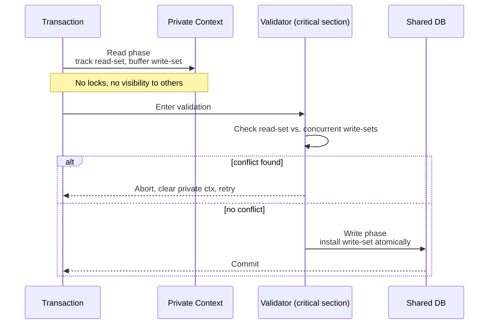
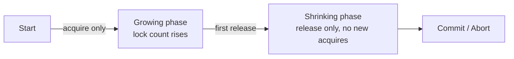

# Concurrency Control: OCC, MVCC, and PCC

> **One-sentence summary.** Concurrency control is the scheduler that turns overlapping transactions into a serializable history, and the three families — optimistic, multiversion, and pessimistic — differ entirely in what they assume about how often transactions actually fight.

## How It Works

Concurrency control answers one question: given N transactions arriving at once, which interleavings of their reads and writes are permitted? The three families differ by their default stance toward conflict.

**Optimistic Concurrency Control (OCC)** bets that conflicts are rare and defers all checking to commit time. A transaction runs in three phases. During the *read phase*, it operates in a private context — every read is tracked into a *read-set* and every intended write is buffered into a *write-set*, with nothing visible to anyone else. At commit, the *validation phase* compares this transaction's sets against concurrently running transactions: *backward-oriented* validation checks against transactions that have already committed during our read phase, while *forward-oriented* validation checks against transactions still in their own validation window. If our read-set overlaps anyone else's write-set, or our write-set overlaps theirs, we restart. If validation passes, the *write phase* installs the write-set into the shared database atomically. Validate-and-write is a critical section — no two transactions commit simultaneously. OCC is cheap when it wins and expensive when it loses: a loser has done all its reads for nothing and must retry from scratch.

**Multiversion Concurrency Control (MVCC)** removes the read-write conflict entirely by keeping multiple versions of each record, each tagged with the transaction ID or timestamp that produced it. A reader sees a consistent snapshot as of the moment it began; it never blocks on a writer. MVCC distinguishes *committed* from *uncommitted* versions (the last committed being "current"), and the transaction manager aims to keep at most one uncommitted version per record alive at a time. MVCC is a storage discipline, not a scheduler — it rides on top of 2PL, timestamp ordering, or validation. Its most common use is powering snapshot isolation.

**Pessimistic Concurrency Control (PCC)** assumes conflict is the normal case and blocks or aborts early rather than at commit.

- *Timestamp ordering* is lock-free PCC. Each transaction gets a timestamp; each record carries a `max_read_timestamp` and `max_write_timestamp`. A read whose timestamp is older than `max_write_timestamp` is aborted (someone newer already wrote). A write older than `max_read_timestamp` is aborted (a newer reader has already observed the "before" state). A write older than `max_write_timestamp` is silently dropped — the *Thomas Write Rule* — because its effect is already overwritten.
- *Two-phase locking (2PL)* is lock-based PCC. A transaction has a *growing phase* acquiring locks, followed by a *shrinking phase* releasing them; no lock acquisition after any release. This rule alone guarantees serializability. The cost is deadlock: detect via cycles in a waits-for graph (abort one participant, usually the most recent waiter), or avoid via priority rules — *wait-die* (older txn waits, younger aborts) or *wound-wait* (older aborts younger, younger waits for older).

For 2PL, the lock-count profile of a transaction is the signature:

## When to Use

The right family is a workload decision, not a style preference.

- **Read-mostly with low contention** — OCC. Validation almost always succeeds, and you pay no lock overhead on the hot read path.
- **Mixed read/write with long-running analytical reads** — MVCC. Readers get a stable snapshot without blocking the OLTP write path, which is exactly what reporting workloads need.
- **Heavy contention on narrow keys** (counters, inventory, seat inventory) — 2PL. Pessimistic blocking prevents the retry storm OCC would produce; a short wait beats a full restart.
- **Append-heavy event logs, monotonically keyed inserts** — timestamp ordering. There are no genuine write-write conflicts, so the Thomas Write Rule disposes of most collisions without locking.

## Trade-offs

| Strategy | Blocking? | Conflict Cost | Read Overhead | Good For |
|---|---|---|---|---|
| OCC | Only at validation critical section | Full restart of losing txn | None on reads | Low-conflict, read-mostly workloads |
| MVCC | Readers never block writers | Version chain traversal; GC pressure | Version lookup + visibility check | Snapshot isolation, long reads alongside OLTP |
| Timestamp Ordering (PCC) | No locks; abort on conflict | Restart with a *new* timestamp | Timestamp metadata per record | Append-heavy, monotonic-key workloads |
| 2PL (PCC) | Yes, blocks on lock waits | Wait or deadlock abort | Lock acquisition on every read (if S-lock) | High-contention, narrow hot keys |
| Hybrid (MVCC + 2PL or OCC) | Partial — reads don't block, writes do | Depends on writer strategy | Version check per read | Production OLTP engines |

## Real-World Examples

- **PostgreSQL** — MVCC via per-tuple xmin/xmax visibility, with an SSI (Serializable Snapshot Isolation) overlay for the serializable isolation level that tracks read-write dependencies and aborts cycles.
- **MySQL InnoDB** — MVCC for reads (undo-log chains), 2PL for writes. Repeatable-read is a snapshot; `SELECT ... FOR UPDATE` drops back into lock-based semantics.
- **MongoDB / WiredTiger** — MVCC for the storage engine, OCC on document updates; losing updaters get a `WriteConflict` and the engine retries transparently.
- **CockroachDB** — MVCC plus optimistic execution plus intent-based locking: writes leave a "write intent" record that subsequent transactions resolve via timestamp cache and priority rules.
- **FoundationDB** — pure OCC over an MVCC store: transactions buffer client-side, a centralized resolver validates read-set against committed writes, and clients retry on conflict.

## Common Pitfalls

- **Assuming OCC "has no locks".** OCC has a validation critical section — validate-and-write must be atomic against other validators — and under contention that section becomes the bottleneck, not the lock manager.
- **MVCC without vacuum/compaction.** Every update produces a new version, and dead versions accumulate. Postgres's bloat, InnoDB's history list, and WiredTiger's oldest-timestamp lag are all the same failure mode: the GC couldn't keep up.
- **2PL deadlock storms on hot keys.** When many transactions fight over a small set of rows, waits-for cycles form constantly; deadlock detection runs, one transaction aborts, retries, deadlocks again. The fix is usually a schema change (split the counter, shard the hot row), not a scheduler tweak.
- **Reusing timestamps on abort.** In timestamp ordering, an aborted transaction that retries with its *original* timestamp is guaranteed to abort again — the record's `max_*_timestamp` values have moved on. Always assign a fresh timestamp on retry.
- **Treating "snapshot isolation" as "serializable".** MVCC snapshot isolation is vulnerable to write skew: two transactions each read state, check an invariant, and write non-overlapping rows that together violate the invariant. Only an SSI-style or 2PL-style extension closes the gap — see [[05-isolation-levels-and-anomalies]].

## See Also

- [[05-isolation-levels-and-anomalies]] — the anomaly taxonomy these strategies are paid to prevent
- [[07-locks-latches-and-btree-concurrency]] — the latch layer beneath the lock manager, and why it needs different guarantees
- [[03-write-ahead-log-and-recovery]] — how the commits decided here become durable on disk
