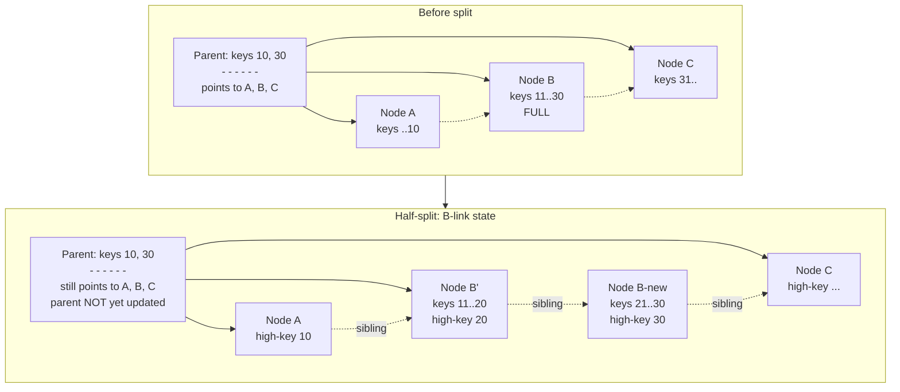

# Locks, Latches, and B-Tree Concurrency

> **One-sentence summary.** Inside a database engine "lock" and "latch" mean the opposite of what systems programmers call them, and getting that distinction right is what lets a B-Tree survive thousands of concurrent writers without serializing on the root.

## How It Works

First, the vocabulary — DB literature swaps the names you learned from OS textbooks. **Locks** are *logical*, key-based, held for the **entire transaction duration**, managed by a dedicated lock manager with a wait-for graph, and they guard *database objects* (row, key range, table). **Latches** are *physical*, page-based, held for **microseconds**, have no central manager, and they guard *in-memory data-structure integrity* — a B-Tree page being split, a free-list being updated, a buffer descriptor being pinned. What an OS person calls a "mutex" is, in DB terminology, a latch. The two concerns are orthogonal: even a lockless MVCC engine still takes latches, because something must protect page bytes while a writer rearranges them.

Latches are usually implemented as **readers-writer (RW) locks** so many concurrent readers on a hot page don't serialize. The compatibility matrix:

|  | Reader | Writer |
|---|---|---|
| **Reader** | ✓ | ✗ |
| **Writer** | ✗ | ✗ |

Implementation splits two ways. **Busy-wait (spinlock)** burns cycles testing a flag; cheap under low contention because there's no kernel crossing and the critical section is nanoseconds long. **Queueing latches** (MCS-style, compare-and-swap to enqueue a per-thread node) scale far better under high contention because each waiter spins on *its own* cache line, avoiding the cache-line ping-pong a naive spinlock causes when many cores hammer the same address.

The hard problem is **B-Tree concurrency**. The naive strategy — grab an exclusive latch at the root, descend, latch each child, release the parent only at the leaf — turns the root into a global mutex. The production technique is **latch crabbing** (or latch coupling): grab the parent, then the child, and *release the parent as soon as you can prove the child won't propagate a structural change upward* — not full on insert, not near-underflow on delete. Most descents release every ancestor before reaching the leaf; only the leaf latch is held during the actual modification. A further refinement, **latch upgrading**, takes *shared* latches the whole way down (reads co-exist) and only upgrades the leaf to *exclusive* when a write is needed. If the optimistic descent guessed wrong and a structural change has to climb back up, you release and retry — "pointer chasing." It's rare because in a healthy tree the root changes last: all its children fill up first.

**Blink-trees** (B-link trees, Lehman & Yao) eliminate even the leaf-level bottleneck during splits. Each node stores a **high key** (the largest key any descendant can hold) plus a **sibling pointer** to its right neighbor on the same level. A split executes in two observable steps: first, the new sibling is linked in and the old node's high key is lowered — the "half-split" state above, where the parent *still points only to the old node*. Second, the parent is updated to include the new separator. Between the two steps, a reader that descended via the stale parent pointer detects the situation (its target key is greater than the current node's high key) and simply **follows the sibling pointer** to find it. Correctness is preserved without ever holding a parent latch during the split — the tree-wide "everyone waits for the root" bottleneck vanishes.

## When to Use

- **RW latches belong on every hot shared in-memory structure**: buffer-pool descriptors, free-lists, page frames, transaction tables. Anywhere a reader/writer asymmetry exists and the critical section is short.
- **Latch crabbing** is mandatory in any disk-based B-Tree under concurrent write load. The moment you have more than one writer, top-down exclusive latching is a throughput cliff.
- **Blink-trees** are the right default for B-Tree indexes in general-purpose OLTP databases — splits are the worst concurrency case for plain crabbing, and B-links make that case roughly free for readers.
- If your whole data structure fits in memory and you can afford one global mutex around it, you don't need any of this. At real scale you always do.

## Trade-offs

| Aspect | Lock | Latch |
|---|---|---|
| **Scope** | Logical database object (row, key range, table) | Physical in-memory structure (page, descriptor, list node) |
| **Duration** | Transaction lifetime (milliseconds to minutes) | A handful of instructions (microseconds) |
| **Granularity** | Coarse (table) to fine (row/key) — policy choice | Fixed to the object being guarded |
| **Manager** | Centralized lock manager, hash table of lock requests | Embedded in the structure itself, no manager |
| **Deadlock handling** | Detection via wait-for graph, victim selection and abort | Programmer-prevented via a strict acquisition order |
| **Fails how** | Waits, aborts, or cascades across transactions | Corrupts memory if wrong — this is a *correctness* primitive |

## Real-World Examples

- **PostgreSQL**: heavyweight locks cover tables, rows, and advisory keys; **LWLocks** (lightweight locks) are the system's latches — RW mutexes protecting buffer descriptors, shared memory, and WAL insertion. Its B-Tree implementation is a direct descendant of the Lehman/Yao B-link design.
- **MySQL / InnoDB**: row-level locks enforce isolation; **mutexes and rw-latches** guard buffer-pool pages, the adaptive hash index, and the undo log. The InnoDB monitor cleanly separates the two in its output.
- **Oracle**: uses **latches** (short-duration in-memory) and **enqueues** (long-duration logical locks) — same distinction, different words.
- **Lehman & Yao (1981)**: the original B-link paper remains the canonical reference for concurrent B-Tree access.

## Common Pitfalls

- **Confusing "lock" and "latch" when reading documentation.** InnoDB's "latches" are not its "locks"; a "LATCH wait" in a trace is a microsecond memory-barrier event, a "lock wait" is a transaction blocking on a row. Conflating them leads to tuning the wrong thing.
- **Holding a latch across disk I/O.** A latch held for milliseconds while a page is read from disk stalls every other thread that touches that structure. Latches must be released before any blocking syscall; use page *pins* (a reference count) to keep the page alive and *re-latch* when needed.
- **Mixing shared and exclusive crabbing.** Readers must crab with shared latches and writers with exclusive ones. Upgrading a shared parent latch to exclusive mid-descent, while another reader holds the same parent shared, is a classic deadlock recipe — always release-and-reacquire instead of upgrading.
- **Optimistic descent without a retry path.** Latch upgrading only works if pointer-chasing retries are actually implemented; skipping them turns rare splits into rare corruption.

## See Also

- [[06-concurrency-control-strategies]] — what sits *above* latches: the lock-based, timestamp, or optimistic policy that decides which transactions see which values
- [[01-page-cache-and-buffer-management]] — the owner of the pages that get latched; pin counts and eviction policy interact directly with how long a latch is held
