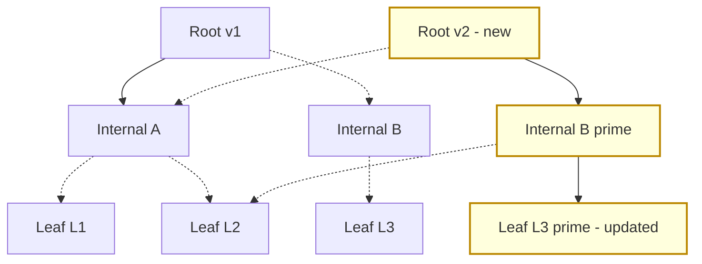

# Copy-on-Write B-Trees

> **One-sentence summary.** A Copy-on-Write (COW) B-Tree never mutates a page in place: writers copy the entire root-to-leaf path into fresh pages and atomically swing the root pointer, so readers traverse old versions lock-free while structural integrity is guaranteed by a single pointer swap.

## How It Works

Classical B-Trees protect in-place updates with latches, recovery logs, and careful ordering rules. A Copy-on-Write B-Tree sidesteps that complexity by treating pages as immutable. When a writer wants to change a leaf, it does not touch the original page at all. Instead, it allocates a brand-new leaf, writes the update there, then allocates a new parent that points at the new leaf plus the old siblings, and so on all the way up to a freshly allocated root. The result is a "parallel tree" that reuses every untouched subtree from the previous version. Only when the entire new path is durable does the writer publish the change by atomically overwriting the topmost pointer. Because no page in the old tree is ever modified, readers that are already descending through it cannot observe a torn state, and a crash in the middle of a write simply leaves the old root in place — there is nothing to undo.

The canonical implementation is LMDB, the Lightning Memory-Mapped Database that backs OpenLDAP. LMDB is a single-level store: the database file is memory-mapped into the process and read operations are served directly from that mapping with zero copies and no application-level page cache. Because every write creates a new root, LMDB needs no write-ahead log, no checkpointing, and no compaction — the atomic root swap is the commit. At any moment LMDB only retains two root versions: the current one and the one the active writer is building. Once all readers still referencing an old root have finished, the pages it kept alive are reclaimed and reused, so the append-only behavior does not translate into unbounded file growth. One consequence of the design: LMDB leaf pages carry no sibling pointers, because sibling pointers would have to be updated on every neighbor's rewrite and defeat the sharing. Sequential scans therefore ascend to the parent to find the next leaf instead of chasing a sideways link.

The other notable property is that the tree is inherently multiversioned. Each root version corresponds to a consistent snapshot, so MVCC falls out of the data structure for free — a reader simply holds onto a root pointer for the duration of its transaction.

Solid edges mark the freshly copied root-to-leaf path; dashed edges are pointers that reuse untouched subtrees from v1. A single atomic publish of `Root v2` exposes the new version to readers.

## When to Use

- **Read-heavy workloads where readers must not be blocked.** LDAP directories, configuration stores, and embedded key-value engines typically have overwhelmingly more lookups than writes and cannot tolerate latch contention. LMDB's lock-free readers make it a natural fit.
- **You want MVCC without building it.** Each published root is a self-consistent snapshot, so long-running analytical reads or point-in-time queries work without an explicit version vector or undo log.
- **Crash safety without a WAL.** The atomic root swap is the durability boundary, which suits embedded or edge deployments where running and recovering a WAL is operationally expensive.

## Trade-offs

| Aspect | Advantage | Disadvantage |
|--------|-----------|--------------|
| Write amplification | Writes never partially overwrite an old page | An entire root-to-leaf path (O(log N) pages) is rewritten on every update |
| Space usage | Old pages reclaimed quickly when readers finish | Old versions are retained for the lifetime of any reader still pinning them |
| Reader concurrency | Fully lock-free, direct mmap reads | Readers can drift arbitrarily far from latest if long-lived |
| Writer concurrency | No latch coordination with readers | Writers are serialized with each other — there is one active root-in-progress |
| Crash safety | Atomic root swap; no WAL, no redo, no checkpoint | Any half-written pages below the unpublished root are simply garbage until reclaimed |
| Range scans | Fine when sibling traversal is rare | LMDB has no sibling pointers; scans must ascend to the parent, increasing traversal cost |

## Real-World Examples

- **LMDB**: The archetype. Single-level memory-mapped B-Tree used by OpenLDAP, with exactly two live root versions and no page cache.
- **BoltDB**: A Go key-value store directly inspired by LMDB, embedding the same COW-B-Tree design inside applications like etcd's earlier versions.
- **CouchDB**: Uses an append-only B-Tree file format where every update rewrites the path and appends a new root at the end of the file; compaction later reclaims the abandoned prefix.
- **ZFS**: Applies the same idea at the filesystem block level — every modified block is rewritten to a new location and the uberblock is updated atomically. Not a B-Tree, but the same structural insight: immutability plus a single atomic root swap.

## Common Pitfalls

- **Long-running readers pin old pages.** Because reclamation only happens after every reader has released a given root, one stuck transaction can cause the live set to grow indefinitely. Monitor reader duration the way you would monitor VACUUM in PostgreSQL.
- **Confusing COW-B-Trees with LSM Trees.** Both embrace immutability, but an LSM Tree buffers writes into memtables and flushes sorted runs that are later compacted, while a COW-B-Tree is still a single balanced tree — just one where writers republish a whole path each time. They solve different problems.
- **Assuming writer concurrency.** "Lock-free" only describes the reader side. Writers are still serialized against each other: there is one "next root" under construction at a time, so a COW-B-Tree will not scale write throughput by adding cores.
- **Expecting fast range scans by default.** If the implementation drops sibling pointers (as LMDB does), scanning N leaves costs an ascent per leaf rather than a single linked-list walk.

## See Also

- [[02-lazy-b-trees-and-buffering]] — a different response to the same update-cost problem: buffer writes per node rather than copy the path.
- [[03-fd-trees]] — takes immutability further by turning levels into immutable runs, SSD-friendly and LSM-flavored.
- [[04-bw-trees]] — another latch-free design, but achieves it via delta chains and CAS on an in-memory mapping table instead of whole-path copies.
- [[05-cache-oblivious-b-trees]] — orthogonal concern: layout over the memory hierarchy rather than concurrency model.
- [[05-buffering-immutability-ordering]] — the three storage levers introduced in chapter 1; Copy-on-Write B-Trees are the clearest concrete instance of the **immutability** lever applied to an in-place data structure.
