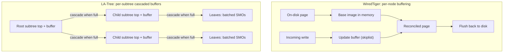

# Lazy B-Trees (WiredTiger and LA-Tree)

> **One-sentence summary.** Lazy B-Trees attach small in-memory *update buffers* to tree nodes (or subtrees) so that many logical writes can be absorbed cheaply and then flushed to disk as a single batched, reconciled page update.

## How It Works

A classical B-Tree does in-place updates: to change a single record, the engine locates the leaf page, mutates it, and eventually writes the whole page back to disk. If the same page is touched a hundred times before a flush, that is a hundred page-sized rewrites for what is logically a hundred small edits. The core idea of lazy B-Trees is to *defer and batch*: keep the on-disk page untouched, collect pending changes in a lightweight in-memory structure, and reconcile them into the page only when something forces a flush.

**WiredTiger** applies this idea at the granularity of a single node. When a page is read from disk, the engine builds a *base image* in memory straight from the on-disk bytes. Writes do not touch that base image. Instead, each incoming update lands in an *update buffer* attached to the page, implemented as a **skiplist** — chosen because skiplists offer search-tree-like complexity while allowing lock-free concurrent writers, which matters when many threads hit the same hot page. On read, the engine merges the base image with the update buffer to produce the current logical state. A page is *clean* if it has no buffer attached and *dirty* otherwise. When a dirty page is flushed, a background thread runs *reconciliation*: the buffer is merged into the base image, the page is rewritten, and if the reconciled page exceeds the max size it is split. Crucially, splits, merges, and reconciliation run off the critical path, so foreground readers and writers never block on them.

**LA-Tree (Lazy-Adaptive Tree)** pushes the same trick up a level. Instead of one buffer per node, it groups neighbouring nodes into subtrees and attaches a single update buffer to each *subtree top*. Incoming writes hit the root's buffer first. When the root buffer fills, its contents *cascade* downward: entries are partitioned and copied into the buffers of the child subtree tops, which in turn cascade into their children, recursively until the updates reach the leaves. Only at the leaves do the batched inserts, updates, and deletes actually touch tree pages — and because many writes are applied together, any resulting splits and merges propagate back up the tree in a single consolidated structural modification instead of one SMO per write.

## When to Use

- **Hot-page update workloads.** When the same page is touched many times inside a flush window — counters, per-user state, queue tails — buffering collapses N physical page writes into one.
- **I/O-bound systems with spare RAM.** If you have memory to spend on buffers and your bottleneck is disk bandwidth or flash write cycles, lazy B-Trees trade memory for write I/O.
- **Mixed OLTP + range-scan engines.** Because reads merge the base image with a small buffer, point reads stay fast and range scans still walk a mostly-contiguous on-disk image — useful for general-purpose storage engines that must serve both patterns.

## Trade-offs

| Aspect | Advantage | Disadvantage |
|--------|-----------|--------------|
| Write I/O | Many writes coalesce into one page flush | Crash recovery must replay buffered updates from the WAL |
| Read cost | Base image is a plain B-Tree page | Every read must also consult the buffer and merge |
| Memory | Buffers amortize over many writes | Extra overhead per node (WiredTiger) or per subtree (LA-Tree) |
| Reconciliation | Runs in the background, off the critical path | Reconciliation logic is intricate; concurrency with readers is non-trivial |
| SMO latency | Splits and merges deferred and batched | A single cascade or reconciliation can still trigger parent-level SMOs |
| Granularity | WiredTiger: per-node, fine-grained, quick to flush hot pages | More buffers, more metadata, no cross-node batching |
| Granularity | LA-Tree: per-subtree, fewer buffers, cascades amortize across many nodes | Coarser — a single hot leaf still incurs a cascade through its ancestors |

Within this family, WiredTiger opts for **finer granularity with higher metadata cost**, while LA-Tree opts for **coarser granularity with better cross-node batching**.

## Real-World Examples

- **WiredTiger** — the default storage engine in MongoDB. Its row-store B-Tree keeps separate in-memory and on-disk page formats; dirty pages hold a base image plus a skiplist update buffer, and a background thread reconciles and splits them before flush.
- **LA-Tree** — an academic design (Agrawal et al., VLDB 2009) aimed at flash devices. Batching amortizes the expensive erase-program cycles flash chips pay for small random writes, making the cascade model a particularly good fit for SSDs.
- The chapter explicitly flags that this buffering idea generalizes further: push the buffer all the way out and you get a two-component LSM tree, and push buffers *between levels* and you get FD-Trees. See [[03-fd-trees]] for the next step along that spectrum.

## Common Pitfalls

- **Forgetting the merge on reads.** A lazy B-Tree's on-disk page is intentionally stale. Any read path that only consults the base image — or worse, only the buffer — returns wrong data. Every read must merge both.
- **Mis-sizing the buffer.** Too small and the engine reconciles constantly, defeating the point. Too large and read-side merges dominate CPU, memory pressure rises, and crash recovery has more WAL to replay.
- **Assuming "lazy" means "free".** Reconciliation, cascades, splits, and merges still happen — the laziness just shifts them to background threads and batches them. A write storm still eventually pays for its SMOs; you just don't see it on the hot path.
- **Concurrency on buffers.** WiredTiger picks skiplists for a reason: a naive tree-backed buffer becomes a contention point for hot pages. Any reimplementation must preserve that lock-friendly profile.

## See Also

- [[01-copy-on-write-b-trees]] — the opposite design choice: never mutate a page in place, rewrite a path instead. Good contrast for thinking about where "staleness" lives.
- [[03-fd-trees]] — pushes buffering further: one small mutable head tree feeds a cascade of immutable sorted runs, bridging toward LSM Trees.
- [[04-bw-trees]] — logs *deltas* against a base node and chains them in memory, replaying on read. A lock-free cousin of per-node buffering.
- [[05-cache-oblivious-b-trees]] — optimizes the memory-hierarchy side of the same problem: layout for free, regardless of block size.
