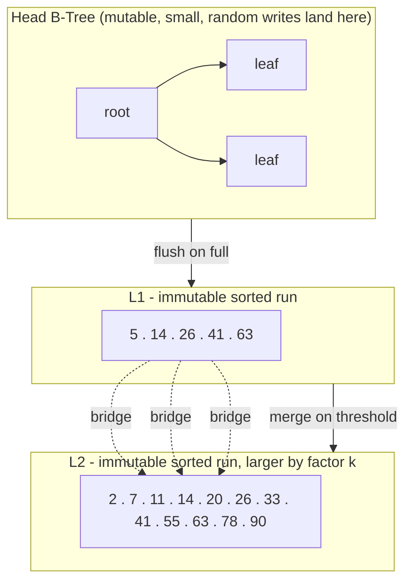
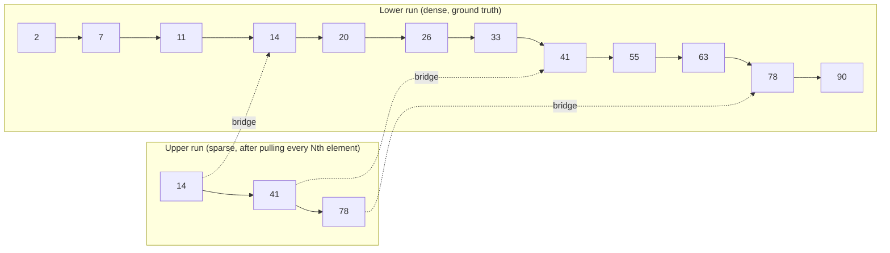

# FD-Trees and Fractional Cascading

> **One-sentence summary.** An FD-Tree absorbs writes into a tiny mutable B-Tree and spills them into a cascade of logarithmically-sized, immutable sorted runs linked by fractional-cascading bridges, so nearly every write is a sequential append and every read narrows its search as it walks down the levels.

## How It Works

The FD-Tree design starts from a hardware observation: on SSDs, random page updates are expensive because they force background garbage collection of erase blocks; on HDDs they cost a seek. Per-node buffering schemes like the ones discussed in [[02-lazy-b-trees-and-buffering]] only pay off when the same node is hit repeatedly — writes spread across a large key space still hammer random locations. An FD-Tree takes a more radical stance: the only place that ever sees in-place updates is one small B-Tree held near the top of the structure. Everything below that is append-only. All bulk writes become sequential I/O, which is precisely what flash and spinning disks both reward.

The structure is layered. A small mutable **head tree** — a regular B-Tree — buffers incoming inserts, updates, and deletes. When it fills, its contents are drained into a new immutable **sorted run** called L1. Over time L1 grows; when it crosses a threshold, it is merged with L2 to produce a new, larger L2, and the old L1 is discarded. Level sizes increase by a factor of *k*, so the runs are logarithmically sized, very much in the style of an LSM Tree. Deletes cannot physically remove records from immutable runs, so they propagate as tombstones (the FD-Tree paper calls these **filter entries**). A tombstone shadows any record for the same key on lower levels and is itself dropped once it reaches the bottom run, where there is nothing left below it to hide.

The clever part is the read path. Without help, a point lookup would have to binary-search the head tree and then every run separately, paying O(log n) per level for a total of O(L · log n). **Fractional cascading** closes that gap. Every *N*th element from a lower run is *pulled up* into the run above it as a **bridge** (the paper also calls these **fences**). The bridge records remember where in the lower run their counterpart lives. When you search for a key, you binary-search the top level once; on each subsequent level you do not start from scratch — the bridge you just passed tells you exactly which small window to search. Per-level cost collapses from O(log n) to O(log N), where N is the bridge spacing. The book's worked example with arrays A1, A2, A3 makes this concrete: once you have located where key 26 fits in A1, the nearest bridge tells you the narrow region of A2 to inspect, and another bridge does the same for A3. You still traverse every level, but each traversal is cheap.

## When to Use

- **Write-heavy workloads on flash.** If your index is hammered with inserts and updates, turning them into sequential appends plus periodic merges avoids the GC and write-amplification cliffs that in-place B-Trees suffer on SSDs.
- **Read paths that can tolerate a few extra hops.** FD-Trees are ideal when you can spend a handful of extra page fetches per lookup in exchange for an order-of-magnitude reduction in write amplification.
- **LSM semantics with ordered range reads.** Range scans are naturally ordered across the runs, so FD-Trees suit workloads that want LSM-style ingest but also need B-Tree-style sorted iteration without leaning on bloom filters to skip SSTables.

## Trade-offs

| Aspect | Advantage | Disadvantage |
|--------|-----------|--------------|
| Write amplification | Writes are sequential appends; in-place updates are confined to a tiny head tree | Compaction merges still rewrite lower-level runs, amplifying writes by the level fan-out *k* |
| Space amplification | Immutability plus a bounded head tree keeps mutable state small | Multi-version records for the same key live across levels until merges reach the bottom |
| Point-read cost | Fractional cascading reduces per-level work from O(log n) to O(log N) | Still must visit every level; L levels means L page fetches in the worst case |
| Range-read cost | Runs are sorted, so ordered scans merge cleanly | Must merge-iterate across head tree plus every run, deduplicating on key |
| Delete handling | Filter-entry tombstones propagate cleanly and self-retire at the bottom level | If merges stall, tombstones linger and obsolete records eat space |
| Operational complexity | Conceptually simple: append, merge, bridge | Two independent knobs (head-tree size, bridge density) both need tuning per workload |
| vs. plain LSM Tree | Fractional-cascading bridges avoid bloom-filter false positives and work for range queries, not just point lookups | LSMs with per-level indexes plus bloom filters are simpler and have mature tooling (compaction strategies, throttling) |

## Real-World Examples

- **FD-Tree itself.** Introduced in 2010 by Li et al. (VLDB 2010, Hong Kong UST and Microsoft Research Asia), aimed squarely at flash-resident indexes. The design targeted devices where random writes were several orders of magnitude slower than sequential ones.
- **LevelDB and RocksDB.** Chapter 7 covers LSM Trees in full. They share the merge-on-threshold structure and the use of tombstones, but they replace fractional cascading with per-SSTable bloom filters and sparse per-level indexes. Bloom filters help point lookups but not range queries; fractional cascading accelerates both at the cost of storing bridge metadata inside the runs.
- **Related B-Tree variants.** See [[01-copy-on-write-b-trees]] for a different write-amplification strategy (path copy on write, no merges) and [[02-lazy-b-trees-and-buffering]] for the per-node buffering school that FD-Trees deliberately rejected.

## Common Pitfalls

- **Head-tree sizing.** Too small and it overflows constantly, generating an L1 run per handful of writes and starting a merge cascade. Too large and the head tree itself becomes the random-write bottleneck the design was meant to avoid.
- **Bridge density tuning.** Pulling every element into the level above makes lookups almost free but inflates metadata to the point where runs become unwieldy. Pulling too few leaves large gaps per bridge, so the next-level search window is wide and the cascading win evaporates.
- **Stalled merges, silent bloat.** Tombstones and shadowed records only disappear when merges reach the bottom level. If compaction is deprioritized under load, deleted keys keep consuming space and every read pays to skip over them.
- **Assuming LSM intuition applies verbatim.** Without bloom filters, a miss still touches every level — sizing and monitoring need to reflect that the read path is bridge-bounded, not filter-bounded.

## See Also

- [[01-copy-on-write-b-trees]] — a different immutability-based B-Tree that trades merges for path copying and MVCC.
- [[02-lazy-b-trees-and-buffering]] — per-node and per-subtree buffering, the write-deferral school FD-Trees generalize beyond.
- [[04-bw-trees]] — another low-write-amp B-Tree variant, but via in-memory delta chains and compare-and-swap rather than append-only runs.
- [[05-cache-oblivious-b-trees]] — a structural rather than write-pattern answer to the same block-transfer problem FD-Trees attack on flash.
