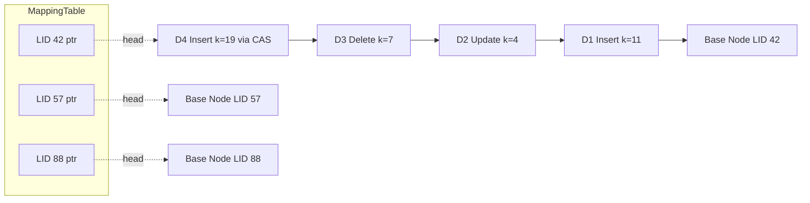

# Bw-Trees: Delta Chains and Compare-and-Swap

> **One-sentence summary.** A latch-free B-Tree where each logical node is a base page plus a prepended chain of delta records, addressed through an in-memory mapping table that readers and writers coordinate on using compare-and-swap.

## How It Works

Classical B-Trees carry three simultaneous problems: **write amplification** (rewriting a whole page for a tiny change), **space amplification** (pages kept half-full to amortize splits), and **concurrency bottlenecks** (latches per page become contention hot spots on many-core hardware). The earlier variants in this chapter attack one axis at a time. [[01-copy-on-write-b-trees]] kills the concurrency problem by making pages immutable, but amplifies both writes and space. [[02-lazy-b-trees-and-buffering]] (WiredTiger, LA-Tree) suppresses writes via update buffers but still relies on latches for structural changes. The Bw-Tree is engineered to hit all three at once: latch-free concurrency, small incremental writes, and no reserved slack in nodes.

The logical node is not a page anymore — it is a **base node plus a singly-linked chain of delta records** prepended over time. Each delta encodes one insert, update, or delete. Base nodes and deltas are treated as immutable: a new modification is not written into an existing page, it is allocated as a fresh delta whose back-pointer points at the current head of the chain. A reader walks from the head toward the base, most-recent-first, applying effects as it goes, so the chain plays the role of an in-memory write-ahead journal for the node (conceptually similar to the replay model used in LA-Tree's subtree buffers).

Prepending a delta would, in a naive tree, force every parent to update its child pointer on every write — a fatal cost. The Bw-Tree breaks this by inserting a layer of indirection: an in-memory **mapping table** from logical node ID to the current head pointer. Tree edges store logical IDs, never physical addresses. The write protocol is therefore: locate the target leaf, allocate a delta pointing at the current head, then **compare-and-swap** the mapping-table slot from the old head to the new delta. CAS gives atomicity without latches; on conflict the writer retries. This CAS-on-the-mapping-table is the central algorithm that all other Bw-Tree machinery builds on.

Structural Modification Operations (SMOs) — splits and merges — span multiple nodes and so cannot complete in a single CAS. Bw-Tree makes them **multi-step and cooperative**. A split installs a *split delta* on the overflowing node (a half-split state, in the spirit of B-link trees) and then updates the parent to point to the new sibling. A merge installs a *remove delta* on the right sibling, a *merge delta* on the left, and finally rewrites the parent to drop the right child. Any thread that stumbles onto an in-progress SMO is required to help finish it before proceeding with its own work. Concurrent SMOs on the same parent are serialized by installing an *abort delta*, which behaves like a write lock at SMO granularity. Meanwhile, delta chains lengthen and reads slow down, so once a chain crosses a threshold the system triggers **consolidation**: merge base + deltas into a new base node, CAS the mapping table to swing the logical ID onto it. Old base and deltas cannot be freed immediately because concurrent readers may still hold pointers into them; Bw-Tree uses **epoch-based reclamation** to track which readers could possibly see the old state and to defer reclamation until the epoch drains.

## When to Use

- **Very high write concurrency** where per-page latches on hot leaves become the bottleneck and CPU cores outnumber the points of contention.
- **In-memory or memory-mapped storage engines** where the append-only delta model and the memory cost of a mapping table are acceptable trades for linear write scaling.
- **Modern-hardware-native designs** — high core count, NVMe, persistent memory — where the architectural goal is scaling write throughput approximately linearly with cores rather than fitting a rotational disk model.

## Trade-offs

| Aspect | Advantage | Disadvantage |
|--------|-----------|--------------|
| Write amplification | Only the delta record is written, not the full page | Each delta carries per-record metadata overhead |
| Space amplification | No reserved slack in nodes; append-only | Live deltas plus dead-but-unreclaimed versions inflate memory until GC catches up |
| Read cost | Recent deltas hot in cache serve most reads quickly | Traversing a long chain to reconstruct state is linear in chain length |
| Concurrency | Latch-free writes via CAS on the mapping table | High contention on a single hot key still serializes via CAS retries |
| SMO complexity | Splits and merges progress without blocking other traffic | Multi-step, cooperative protocol with split, remove, merge, and abort delta types |
| Memory overhead | No per-node latch state | Must hold a mapping table sized to the logical node count plus epoch metadata |
| GC complexity | Fine-grained, per-epoch, never blocks writers | Epoch reclamation is subtle; mistakes are use-after-free bugs |

## Real-World Examples

- **Microsoft Research** — the Bw-Tree originates from Levandoski, Lomet, and Sengupta (ICDE 2013) as part of the research program feeding SQL Server's in-memory OLTP engine (Hekaton).
- **OpenBw-Tree (CMU Database Group)** — Wang et al., SIGMOD 2018, published a practical, open re-implementation that documents where theory meets engineering reality, especially around SMO races and epoch reclamation.
- **Sled** — an experimental embedded key/value store in Rust whose on-disk engine is Bw-Tree-inspired, illustrating how far the design stretches outside its original in-memory niche.

The same chapter lineage continues with "LLAMA and Mindful Stacking," the log-structured cache/storage substrate that sits beneath the Bw-Tree and handles persistence for the deltas and consolidated bases.

## Common Pitfalls

- **Unbounded delta chains.** Forget to consolidate aggressively and read latency explodes because every lookup replays a longer journal. Consolidation thresholds must be tuned, not left at defaults.
- **Hand-rolled epoch reclamation.** The invariants (who might still hold a pointer, when is it safe to free) are subtle, and a wrong release produces use-after-free crashes that are nearly impossible to reproduce. Use a vetted library or follow a published protocol exactly.
- **Assuming CAS is free.** CAS is non-blocking but not wait-free under contention; losers retry, and every retry burns a cache line. A pathologically hot key still bottlenecks on the mapping-table slot.
- **Buggy cooperative SMO helpers.** Because any thread that sees an in-progress split or merge must help finish it, every participant runs the same protocol. A deterministic, provably correct SMO state machine is non-negotiable — one miscoded helper can silently corrupt the structure.

## See Also

- [[01-copy-on-write-b-trees]] — shares the "never mutate a page in place" instinct but copies the root-to-leaf path instead of threading deltas.
- [[02-lazy-b-trees-and-buffering]] — also defers work via per-node buffers, but still uses latches and reconciles whole buffers rather than per-record deltas.
- [[03-fd-trees]] — another write-amplification-killer, but built on append-only sorted runs and fractional cascading instead of CAS.
- [[05-cache-oblivious-b-trees]] — attacks the memory-hierarchy axis via layout rather than the concurrency axis.
