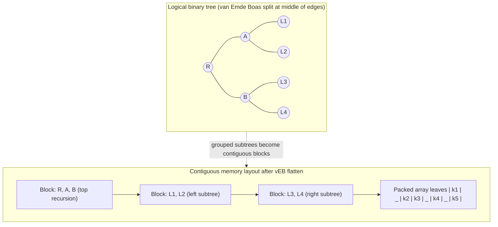

# Cache-Oblivious B-Trees and van Emde Boas Layout

> **One-sentence summary.** A cache-oblivious B-Tree lays a static van Emde Boas tree on top of a packed array with reserved gaps, achieving asymptotically optimal block-transfer cost at every level of the memory hierarchy without being told any block or cache size.

## How It Works

Every B-Tree variant covered so far in this chapter is *cache-aware*. Copy-on-Write trees pick a page size for the write-path clones; Lazy B-Trees size their per-node update buffers against a chosen node size; FD-Trees pull one element per block into the next level; Bw-Trees consolidate deltas against a target base page. In each case the algorithm reads block size, node size, and sometimes cache-line size as input parameters and tunes its shape to exploit them. This is the classical two-level memory model: one fast tier, one slow tier, one known block size `B` moving between them.

Cache-oblivious algorithms keep the same asymptotic block-transfer cost — `O(log_B N)` for a search — but are allowed to know *neither* `B` nor the cache capacity. The trick is a theoretical observation: if a data structure is optimal for *any* two adjacent levels of a memory hierarchy, then by the same argument it is optimal for *every* pair of adjacent levels. A single layout that doesn't mention `B` can therefore be simultaneously optimal for L1/L2, L2/L3, L3/DRAM, DRAM/SSD, and SSD/disk. One implementation, zero per-platform tuning.

The static piece of the construction is the **van Emde Boas layout**. Given a balanced tree of height `h`, split it horizontally at the middle of its edges, giving a top half of height `h/2` and roughly `sqrt(N)` bottom halves, each also of height `h/2`. Recursively lay each half out the same way. When you flatten the recursion into memory, every sufficiently small recursive subtree ends up in a contiguous run of bytes. Whatever the true block size `B` turns out to be, some level of the recursion produces subtrees that fit exactly in one block — so a root-to-leaf walk touches only `O(log_B N)` blocks, matching a perfectly tuned B-Tree despite never naming `B`.

The van Emde Boas tree by itself is static. To support inserts and deletes, cache-oblivious B-Trees place the actual keys in a **packed array**: a contiguous region with *reserved gaps* sized by a density threshold. An insert shuffles a handful of neighbors into an adjacent gap; when a local window becomes too dense or too sparse, that window is rebuilt. The static vEB tree acts as an index over the packed array and is updated as elements shift. The net effect is that random insertions on disk look, asymptotically, like contiguous-array maintenance.

## When to Use

- **Heterogeneous targets.** A single binary shipped to machines with different L1/L2/L3 sizes, different page sizes, different SSD block sizes — no per-platform tuning pass needed.
- **Deep hierarchies.** NUMA, GPU, and multi-tier storage systems expose more than two memory levels; hand-tuning block size per pair becomes intractable, and one cache-oblivious layout covers them all.
- **Byte-addressable persistent memory (NVM).** When the DRAM/disk boundary dissolves into a multi-tier byte-addressable stack, the assumption baked into cache-aware designs (one known block size) weakens, and cache-oblivious layouts become more attractive.

## Trade-offs

| Aspect | Cache-Oblivious B-Tree | Cache-Aware B-Tree |
|--------|------------------------|--------------------|
| Block-transfer cost | `O(log_B N)` — same asymptotic bound | `O(log_B N)` — same bound, but tuned |
| Parameter tuning | None required | Block size, node size, cache line all inputs |
| Implementation complexity | High — vEB recursive layout + packed array + density-threshold rebalancing | Moderate — standard paged node layout |
| Range scan | Good — packed array leaves are contiguous | Good — sibling pointers on leaves |
| Portability across hardware | Excellent — one layout for any hierarchy | Rebuild/retune per target |
| Practical benefit today | Minimal — paging and eviction still dominate real workloads | Well-understood, battle-tested |

## Real-World Examples

- **Academic foundation.** Bender, Demaine, and Farach-Colton formalized the construction in *SIAM Journal on Computing* (2005). That paper is still the canonical reference for cache-oblivious B-Trees and is cited by every survey of the idea.
- **Non-academic implementations.** The chapter is explicit that the author was unaware of a non-academic cache-oblivious B-Tree implementation at the time of writing. In practice, production stores use cache-aware B-Trees or LSM Trees.
- **Sibling algorithms.** The same "recurse until a subproblem fits in whatever the cache happens to be" idea appears in cache-oblivious sorting (funnel sort) and cache-oblivious matrix transpose. The vEB layout is the B-Tree instance of a broader algorithmic template.
- **NVM as a possible revival.** Byte-addressable non-volatile memory could change the economics: when block transfers stop being the dominant cost and byte-granular moves within a multi-tier stack matter, the parameter-free quality of cache-oblivious layouts becomes more than an aesthetic win.

## Common Pitfalls

- **Thinking "cache-oblivious" means "no cache cost."** It means asymptotically optimal block transfers. Paging, eviction, and TLB misses still happen and often dominate real-world latency.
- **Using the vEB layout alone.** Without the packed-array leaves and density-threshold rebalancing, the structure is a static index — inserts destroy the invariant almost immediately.
- **Over-engineering production systems.** For almost any shipped database, a well-tuned cache-aware B-Tree or an LSM Tree will beat a cache-oblivious B-Tree on wall-clock time. Reach for this construction when portability or a genuinely deep hierarchy is the pain point, not as a default.
- **Forgetting that the asymptotic bound is the *same*.** Cache-oblivious does not mean "faster than cache-aware"; it means "equally fast without needing the knobs."

## See Also

- [[01-copy-on-write-b-trees]] — the archetypal cache-aware variant, explicitly tuned to a chosen page size.
- [[02-lazy-b-trees-and-buffering]] — WiredTiger and LA-Tree size their update buffers against a known node size.
- [[03-fd-trees]] — fractional cascading uses block-size-aware stride to bridge adjacent levels.
- [[04-bw-trees]] — delta chains and consolidation thresholds assume a target base-page size.
