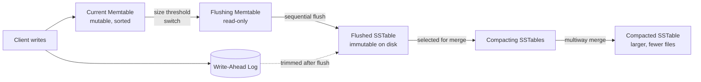

# LSM Tree Structure and Lifecycle

> **One-sentence summary.** A Log-Structured Merge (LSM) Tree absorbs every write into a small sorted in-memory table backed by a write-ahead log, periodically flushes that table as an immutable sorted file on disk, and lazily merges those files in the background — converting what would be random-access updates into strictly sequential I/O.

## How It Works

An LSM Tree separates the data structure that receives writes from the data structure that stores them. Writes land in a **memtable**: a mutable, in-memory, sorted container — typically a skiplist or a balanced tree — that absorbs inserts, updates, and deletes with no disk seeks. Because the memtable is volatile, every write is first appended to a **write-ahead log** (WAL) so it can be replayed after a crash. When the memtable exceeds a size threshold it is "switched": a new empty memtable becomes the write target while the previous one is frozen and flushed sequentially to disk as an immutable **sorted string table** (SSTable). Since records were already sorted in memory, the flush is a single sequential pass — no seeks, no in-place rewrites, no fragmentation. The moment the flush completes, the corresponding section of the WAL can be trimmed, since its contents now live in a durable on-disk file.

After many flushes the tree accumulates more and more SSTables. A background **compaction** process periodically picks several of them, merges their sorted streams, and writes the result out as a single larger SSTable; the inputs are then discarded. Without compaction, reads would have to inspect an ever-growing pile of files, and obsolete versions plus tombstones would accumulate indefinitely. Crucially, compaction is still sequential: it streams sorted inputs and streams sorted output, never randomly mutating a page.

The memtable moves through a well-defined lifecycle: a **current memtable** receives writes and serves reads; during a switch it becomes a **flushing memtable** that is read-only but still participates in lookups; the partially-written **on-disk flush target** is invisible to readers because its contents are incomplete; once the flush finishes it becomes a **flushed table**; later it may enter a **compacting** state alongside siblings; finally the merged output emerges as a **compacted table**. Three invariants make the switch safe: *as soon as* the flush starts, every new write goes to the new memtable; *during* the flush, both the disk-resident and flushing memtable remain readable; *after* the flush, publishing the new table and discarding the old memtable plus WAL segment must happen atomically.

A two-component LSM Tree — one memtable plus exactly one on-disk B-Tree-shaped component — was the design in the original O'Neil paper, but no real system uses it, because every memtable flush forces a merge against the entire disk component and the write amplification becomes untenable. Production systems use **multicomponent** LSM Trees: the memtable flushes as a fresh standalone SSTable, and compaction is a separate, rate-limited process that decides when and which files to merge. This decoupling is what makes LSM performance tunable.

## When to Use

- **Write-heavy workloads.** Ingest pipelines, event streams, telemetry, and logging systems with far more writes than reads benefit from sequential-only I/O; B-Trees would thrash the cache with random page updates.
- **SSD-backed storage.** Flash prefers large sequential writes to amortize program/erase cycles and cooperate with the FTL's own garbage collector; LSM's flush-and-compact pattern aligns naturally with this.
- **Time-series and metrics stores.** Monotonic keys plus TTL semantics let time-window compaction drop whole SSTables instead of rewriting them — a pattern B-Trees cannot replicate.
- **Many small writes per key.** The memtable amortizes many small writes into one sequential disk run, exactly where B-Trees pay the most per-key overhead.

## Trade-offs

| Aspect | Advantage | Disadvantage |
|--------|-----------|--------------|
| Write path | Purely sequential, no seeks; writes never wait on random I/O | Every record is rewritten multiple times by compaction (write amplification) |
| Read path | Immutable files allow lock-free reads and cheap replication | A lookup may fan out across memtable + many SSTables (read amplification) |
| Concurrency | Readers and writers never touch the same bytes — no latch coordination on data pages | Memtable switch, flush finalization, and WAL trimming are the only synchronization points, but they must be truly atomic |
| Durability | WAL guarantees recovery of any acknowledged write before flush | WAL must be fsynced on the write path; trimming is tricky if flush fails |
| Space | High density (100% packing in flushed SSTables) | Obsolete versions and tombstones coexist until compaction reclaims them (space amplification) |
| Tunability | Compaction policy is a separate knob — can be tuned per workload | Compaction scheduling bugs directly translate into unbounded read or space amplification in production |

## Real-World Examples

- **RocksDB** and **LevelDB**: The canonical C++ embeddable LSM engines; both default to leveled compaction for predictable read amplification. RocksDB exposes compaction strategy as a first-class knob.
- **Apache Cassandra** and **ScyllaDB**: Distributed wide-column stores whose per-node storage is an LSM Tree, historically defaulting to size-tiered compaction with leveled and time-window strategies available per table.
- **Apache HBase**: Uses an LSM Tree atop HDFS; each region server holds memtables ("MemStores") that flush into immutable HFiles compacted in the background.
- **Apache Kafka tiered storage and many time-series DBs** (InfluxDB, Prometheus's TSDB blocks): Follow the same memtable/flush/compact pattern, often with time-window compaction.

Compaction policy differences across these systems are significant enough to warrant a dedicated discussion in [[03-compaction-strategies]].

## Common Pitfalls

- **Forgetting WAL durability semantics.** The memtable is not durable until fsync has returned on the WAL; batched or async flushes silently trade acknowledged writes for throughput.
- **Assuming reads are cheap.** A naive lookup checks the memtable plus every SSTable that might contain the key; without Bloom filters (see [[05-bloom-filters-and-skiplists]]), read amplification is unbounded.
- **Treating LSM as a drop-in for a B-Tree.** Range scans multiway-merge live iterators, point queries may pay several disk reads, and space is not reclaimed until compaction runs — tail latencies look nothing like a B-Tree.
- **Ignoring memtable switch atomicity.** Writes leaking to the old memtable, or reads from a half-flushed on-disk target, silently corrupt snapshots — the three before/during/after rules must all hold.
- **Skipping WAL truncation coordination.** Trimming before the SSTable is durable loses data on crash; trimming too late replays writes that already live on disk.

## See Also

- [[02-tombstones-and-merge-reconciliation]] — how immutable SSTables represent deletes and how lookups reconcile duplicates across them.
- [[03-compaction-strategies]] — leveled, size-tiered, and time-window policies that govern when and what to merge.
- [[04-rum-conjecture-and-amplification]] — the Read/Update/Memory trade-off triangle that explains why LSM knobs exist.
- [[05-bloom-filters-and-skiplists]] — the read-path optimizations (Bloom filters, skiplists, SSTable indexes) that keep fan-out affordable.
- [[06-unordered-log-structured-storage]] — Bitcask and WiscKey, which drop the "sorted on disk" constraint and trade range scans for cheaper writes.
- [[07-log-stacking-and-hardware-awareness]] — what happens when an LSM Tree runs on top of a log-structured filesystem on top of a log-structured flash device.
