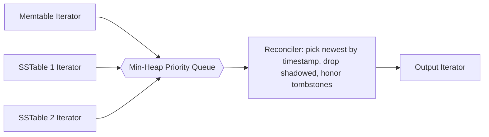

# Tombstones, Merge-Iteration, and Reconciliation

> **One-sentence summary.** Because LSM disk tables are immutable, writes never locate prior versions; instead deletes become tombstones and updates become shadowing entries, and every read multiway-merges iterators over memtable plus SSTables through a min-heap that reconciles duplicates by timestamp.

## How It Works

In an LSM Tree, a write never looks for the record it supersedes — it is appended to the memtable, flushed, and eventually compacted. That "don't locate on write" policy is what makes writes sequential and what forces the read path to do all reconciliation. A naive delete breaks the model immediately. Consider a disk table that already holds `k1 → v1` and a memtable that has overwritten it with `k1 → v2`:

| Disk Table | Memtable |
|------------|----------|
| `k1 → v1`  | `k1 → v2`|

If we "delete" by erasing `v2` from the memtable, the next flush leaves only the disk table — which still says `v1`. The delete has **resurrected** an older value. To prevent this, deletes are recorded *explicitly* as a **tombstone** (a delete entry or dormant certificate): a record that sorts with the other keys but carries a "deleted" marker and a timestamp. Reads see the tombstone and reconciliation filters out whatever it shadows.

| Disk Table | Memtable         |
|------------|------------------|
| `k1 → v1`  | `k1 → <tombstone>` |

Since tombstones are just records, the same mechanism extends to **range tombstones** (predicate deletes): one record whose predicate covers a key range, e.g. `DELETE FROM t WHERE key ≥ "k2" AND key < "k4"`. Cassandra uses these to avoid emitting one tombstone per key in a bulk delete. Resolution gets subtler because a range can straddle SSTable boundaries and partially overlap live records, so the reader must evaluate the predicate against every candidate row.

On the read path, every component that might hold the key — the memtable plus every live SSTable — is a sorted iterator. The engine runs a multiway merge-sort over those iterators using a **min-heap priority queue**. One entry per iterator sits in the heap (at most `N`, hence `O(N)` memory); popping the smallest key is `O(log N)`, and after each pop the engine pulls the next record from that iterator and pushes it back, preserving the invariant that the heap always holds the smallest unseen element from every non-exhausted source. When two entries pop with the same key they came from different iterators by construction, and **reconciliation** compares their timestamps and keeps only the newest — tombstone beats any older value, newer value beats older. This is upsert semantics by default: because the writer never looks for old records, *insert* and *update* are the same operation, and "who wins" is deferred until read or compaction.

A worked walkthrough: given `I1 = {k2:v1, k4:v2}` and `I2 = {k1:v3, k2:v4, k3:v5}`, the heap first holds `{k1:v3, k2:v1}`. Pop `k1:v3` and refill from `I2`, giving `{k2:v1, k2:v4}` — two entries for `k2`, reconcile by timestamp, emit the winner, refill both iterators to get `{k3:v5, k4:v2}`, pop both in order. Merged result: `{k1:v3, k2:v4, k3:v5, k4:v2}`. Compaction is the same machinery run to exhaustion instead of stopping at a lookup key, writing the reconciled stream back out as a new SSTable.

## When to Use

This is not optional — it is *inherent* to any LSM store. If the engine flushes immutable sorted runs, it cannot avoid tombstones (deletes must be representable) or merge-iteration (reads span multiple runs). The same merge-sort primitive shows up in two other places: during **compaction**, where the output is a new SSTable instead of a query result, and during **multiget / range scans**, where the read path fans out across many SSTables and reconciles on the fly. One merge-and-reconcile module serves the write path, the read path, and the background compactor.

## Trade-offs

| Aspect | Point Tombstones | Range Tombstones |
|--------|------------------|-------------------|
| Size on disk | One record per deleted key | One record per deleted range |
| Bulk-delete cost | Linear in number of keys | Constant per range |
| Resolution complexity | Simple equality match during merge | Must evaluate predicate vs. every candidate key; overlap rules needed |
| Shadowing semantics | Covers exactly one key | Covers every key falling in the predicate, including keys not yet written |

| Aspect | Timestamp-Based Reconciliation | Sequence-Number-Based Reconciliation |
|--------|-------------------------------|---------------------------------------|
| Source of order | Wall-clock (or HLC) timestamp | Monotonic local counter |
| Works across nodes | Yes (if clocks are reasonable) | No — sequence numbers are local |
| Failure mode | Clock skew flips winner of concurrent writes | Requires a total order broadcast to replicate |
| Typical user | Apache Cassandra | RocksDB, LevelDB (single-node) |

## Real-World Examples

- **Apache Cassandra** — timestamp-based reconciliation with both point and range tombstones; exposes range deletes in CQL and retains tombstones until the configurable **GC grace period** elapses so that replicas observing the delete later can still converge.
- **RocksDB / LevelDB** — per-record sequence numbers and explicit point tombstones; RocksDB added `DeleteRange` for bulk deletion and keeps tombstones alive until they migrate to the bottommost level.
- **HBase** — explicit **delete markers** (column, column-family, and version-level) written into the MemStore and merged with HFiles on read; retention is governed by major compactions.

## Common Pitfalls

- **Data resurrection from early tombstone removal.** A tombstone can only be dropped once no older table anywhere in the store can still hold a shadowed record for its key. Drop it one compaction too early and the "deleted" record re-emerges on the next read — a silent correctness bug. RocksDB keeps tombstones until the bottommost level; Cassandra keeps them for the GC grace period on every replica. Size-tiered compaction is especially prone to this via **table starvation**, where small compacted tables fail to rise to higher levels and their tombstones stay in play indefinitely.
- **Range tombstone overlap resolution.** Ranges from different SSTables can partially overlap live data and each other, and the reader must evaluate all of them against every candidate key. A buggy resolver either hides live data or reveals shadowed data. Treat range tombstones as first-class members of the heap, folded in timestamp order — not a post-filter.
- **Clock skew in distributed LSM stores.** Timestamp-based reconciliation assumes approximately monotonic clocks across replicas. Under real skew, a write with a future timestamp permanently shadows later, correctly-ordered writes. Hybrid logical clocks or bounded-skew guarantees mitigate this; naive wall-clock time does not.
- **Treating updates like true updates.** Because the writer never reads, every application-level "update" is an upsert. Any property that depends on the prior value (conditional writes, CAS) must be built with a compare-and-set loop on top — the storage layer will not catch a blind overwrite.

## See Also

- [[01-lsm-tree-structure]] — establishes the memtable + SSTable lifecycle whose immutability makes tombstones and merge-reconciliation necessary in the first place.
- [[03-compaction-strategies]] — decides *when* tombstones can finally be dropped and exposes failure modes like table starvation.
- [[05-bloom-filters-and-skiplists]] — the read-path shortcut that lets merge-iteration skip SSTables that definitely do not contain the key, shrinking `N` in `O(log N)`.
