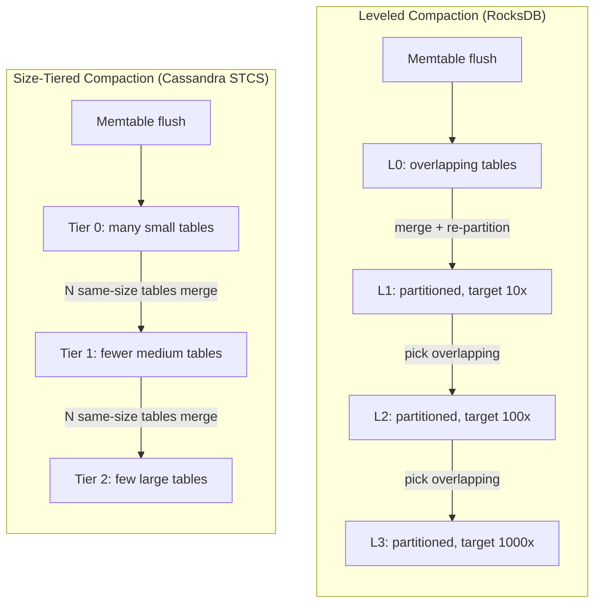

# Compaction Strategies: Leveled, Size-Tiered, and Time-Window

> **One-sentence summary.** Compaction is the background merge process that keeps an LSM Tree from drowning in tables; the strategy you pick — leveled, size-tiered, or time-window — decides how many files a read must touch, how many times each byte is rewritten, and how much free disk you must reserve.

## How It Works

Every LSM Tree flush produces another immutable disk table, and every table adds another iterator the read path must merge. Left alone, the count grows without bound, tombstones never get collected, and shadowed versions keep eating disk. Compaction bounds all three: it picks some set of tables, runs the same merge-iterator used for reads (see [[02-tombstones-and-merge-reconciliation]]), writes a new consolidated table, and atomically retires the inputs. Because inputs and output are all sorted, the loop only holds iterator heads in memory — a handful of pointers regardless of dataset size. The real cost is on disk: old tables remain readable for the duration of the merge, so the engine must reserve free space roughly equal to the output. Multiple compactions can run concurrently but must operate on non-intersecting sets of tables, since atomic replacement cannot tolerate overlap.

The three strategies differ on one question: *which tables get merged together?*

**Leveled compaction** — RocksDB's default — organises tables into numbered levels. Level 0 (L0) is the landing zone for memtable flushes, so its tables can overlap in key range. Every level above L0 is *partitioned*: within a single level, tables hold strictly non-overlapping key ranges. Each level has a target size that grows by a fixed fan-out (typically 10x) over the previous level. L0 → L1 is special: since L0 overlaps, the engine either partitions L0 into L1's key ranges, or merges all of L0 plus overlapping L1 and re-partitions the result. For higher levels, an L*n* compaction picks a table from L*n* and the L*(n+1)* tables whose ranges overlap it. The invariant means **a point lookup touches at most one table per level**, bounding read amplification to roughly log of the dataset size.

**Size-tiered compaction** — the classical Cassandra strategy — ignores key ranges and groups tables by size. Level 0 holds the smallest (freshly flushed) tables; when enough same-sized tables accumulate, they are merged into one larger table promoted to the next tier. Tables are never pre-partitioned, so same-tier tables can overlap in key space. It is simpler and writes each byte fewer times, but a lookup may have to probe every table on every tier.

**Time-window compaction** (Cassandra's TWCS) groups tables by *write timestamp* bucket. A one-hour window collects everything written in that hour; when the window closes, its tables are compacted once and left alone. If those records carry a TTL, the whole file can be dropped when the TTL expires — no rewrite, no merge cost at all.

## When to Use

- **Leveled** — read-heavy workloads and datasets small enough that the extra write cost is affordable. The partitioned levels cap read amplification and space amplification; the price is that nearly every byte is rewritten on its way from L1 to the bottommost level.
- **Size-tiered** — write-heavy workloads with spare disk. Each record is rewritten only when a whole tier is promoted, so write amplification stays low, but you can temporarily need several copies of your dataset on disk while the biggest tier is compacting.
- **Time-window (TWCS)** — time-series, metrics, event logs, and anything with a TTL. When data ages out in well-defined chunks, whole window files can be deleted without a merge. Out-of-order writes break this, so TWCS is a poor fit for late-arriving data.

## Trade-offs

| Strategy | Write Amp | Read Amp | Space Amp | Workload Fit |
|----------|-----------|----------|-----------|--------------|
| Leveled (LCS) | High — records are rewritten at every level they pass through, fan-out × levels | Low — at most one table per level above L0, plus L0 | Low — fan-out keeps shadowed versions close to the bottom | Read-heavy, bounded dataset, SSDs that can absorb rewrites |
| Size-tiered (STCS) | Low — each record is rewritten once per promotion, roughly log of the dataset | High — multiple overlapping tables per tier, no per-level bound | High — up to 2x during compaction of the biggest tier; shadowed versions linger | Write-heavy, ingest-dominated, generous free space |
| Time-window (TWCS) | Near-zero for TTL data — expired windows drop without merging | Moderate — one file per window, reads touch windows that overlap the query time range | Bounded by retention — old windows evaporate | Time-series with TTL, append-only telemetry, strictly time-ordered writes |

## Real-World Examples

- **RocksDB** — leveled compaction is the default and tuned heavily for it. RocksDB also ships a "universal" compaction mode that behaves like size-tiered, meant for write-heavy ingest pipelines where write amplification matters more than read latency.
- **Apache Cassandra** — offers STCS (default historically), LCS (leveled, for read-heavy tables), and TWCS (for time-series with TTL). The choice is per-table, reflecting that most real clusters mix workloads.
- **ScyllaDB** — introduced an *incremental* compaction strategy that is size-tiered in spirit but compacts in smaller chunks, smoothing the large space-amplification spikes that plague classic STCS when the top tier merges.
- **LevelDB** — the original leveled implementation; RocksDB forked from it and inherited the level-partitioning invariant.

## Common Pitfalls

- **Table starvation in size-tiered.** When a compaction's output is mostly tombstones and shadowed records, the resulting table can be small enough that it stays in the same size class it came from. Higher tiers never accumulate enough same-sized tables to trigger their own compaction, tombstones never reach the bottom, reads degrade. The fix is to periodically *force* a major compaction even when the tier-size heuristic does not ask for one.
- **Forgetting the disk-space reservation.** Every strategy needs free space equal to the largest in-flight compaction's output. Leveled can surprise operators because L*n* → L*(n+1)* may pull in many L*(n+1)* tables; STCS's top-tier merge is the classical 2x-disk landmine.
- **Compaction storms after bulk load.** A massive import fills L0 or Tier 0 with tables that then trigger cascading merges, competing with foreground writes for I/O. Rate-limiting the load or pre-sorting the input and using an SSTable-ingest API avoids this.
- **Compaction starving flushes.** If compaction threads saturate disk I/O, the memtable cannot flush, the WAL grows without bound, and write latency spikes. Separating read, write, and compaction I/O budgets (RocksDB's rate limiter, Cassandra's throughput throttles) is essential in production.

## See Also

- [[01-lsm-tree-structure]] — why flushes produce so many tables in the first place, and what the memtable / WAL / SSTable lifecycle looks like.
- [[02-tombstones-and-merge-reconciliation]] — the merge-iteration and tombstone-shadowing mechanics that compaction reuses at scale, and why tombstones must survive until the bottommost level.
- [[04-rum-conjecture-and-amplification]] — the Read-Update-Memory framework that makes the write/read/space amplification trade-offs in the table above formal.
