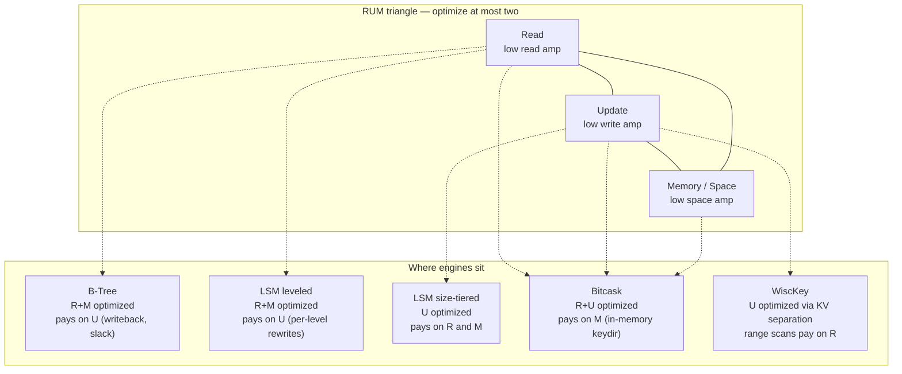

# RUM Conjecture and the Three Amplifications

> **One-sentence summary.** The RUM conjecture says a storage engine can optimize at most two of Read, Update, and Memory overhead — the third always gets worse — and LSM design decisions slide along the same triangle as *read amplification*, *write amplification*, and *space amplification*.

## How It Works

The **RUM conjecture** [Athanassoulis 2016] is a cost-model observation: every storage structure pays for three things — **R**ead overhead, **U**pdate overhead, and **M**emory (space) overhead — and improving any two inevitably makes the third worse. No ideal structure exists with cheap reads, cheap writes, and a compact footprint at once. The conjecture is a lens for comparing engines, not a theorem: you pick which pair of axes your workload values and accept the third will be uncomfortable.

Inside the LSM-Tree literature the same triangle shows up under workload-specific names — the three **amplifications** of immutable, on-disk storage:

- **Read amplification.** Because flushed SSTables are immutable and overlapping, a point lookup may have to probe multiple disk-resident tables (memtable + each level's SSTables) before it finds the newest record for a key. A single logical read turns into 2x, 5x, or worse physical I/Os.
- **Write amplification.** Compaction continuously rewrites data. Under leveled compaction, a record can be rewritten once per level it traverses on its way from L0 to Lmax. A single logical write becomes many physical writes to disk.
- **Space amplification.** Until compaction catches up, the disk stores shadowed older versions and tombstones alongside live records. The live dataset is smaller than the bytes on disk.

The same trade-off lives in B-Trees, but it is sourced differently. B-Tree write amplification comes from **writeback of a full page after a tiny in-place edit**, repeated same-page updates, and reserved slack left inside pages for future inserts. LSM-Tree write amplification comes from **compaction rewrites**. The chapter is explicit: comparing the two raw numbers without naming the *source* of amplification is misleading — they are measuring different things.

Two controls slide an LSM engine around this triangle. **Aggressive compaction** lowers read amp (fewer tables per lookup) and space amp (fewer shadowed records) but raises write amp (more rewrites). **Lazy compaction** inverts every one of those. A **Bloom filter** is the rare optimization that breaks the triangle asymmetrically: it cuts read amp sharply for a small, fixed memory cost and essentially no write-amp penalty (see [[05-bloom-filters-and-skiplists]]).

## When to Use

Use RUM as the **first question** when picking or tuning a storage engine: *what does my workload actually care about?*

- **Write-heavy ingest (metrics, logs, event streams).** Bias toward update-optimized engines (size-tiered LSM, WiscKey, Bitcask). Accept extra reads or extra bytes on disk.
- **Read-heavy OLTP with stable working set.** Bias toward read-optimized engines (B-Tree, leveled LSM with aggressive Bloom filters). Accept extra writeback or extra compaction churn.
- **Memory-constrained embedded stores.** Bias toward space-efficient structures. Accept slower reads or writes. Avoid Bitcask — its in-memory keydir explodes the M axis.

Reframe the question as "writes-per-dollar vs. reads-per-dollar": the engine choice is an explicit bet on which axis you can afford to pay.

## Trade-offs

| Engine | Read Amp | Write Amp | Space Amp | Memory Amp | Optimized For |
|--------|----------|-----------|-----------|------------|---------------|
| B-Tree | Low (one root-to-leaf walk) | Medium (writeback + same-page repeats + slack) | Medium (reserved slack in pages) | Low (cached inner nodes) | Reads + point updates |
| LSM Leveled | Low-Medium (Bloom + few tables) | High (rewrite per level) | Low (aggressive compaction) | Medium (Bloom + indexes) | Reads, steady writes |
| LSM Size-Tiered | Medium-High (more overlapping tables) | Low-Medium (fewer rewrites) | High (duplicates persist) | Medium | Write throughput |
| Bitcask | Very Low (hash to logfile offset) | Low (append-only) | Low | **Very High** (all keys in RAM) | Point reads + writes, small keyspaces |
| WiscKey | Medium for scans (random vLog I/O) | Low (keys compact, values untouched) | Low | Medium | Large-value workloads on SSD |

## Real-World Examples

- **RocksDB.** Ships tunables that directly move the engine along RUM axes. `level0_file_num_compaction_trigger`, the level size multiplier, and the rate-limited compactor all trade write amplification against read and space amplification. Operators pick their poison per deployment.
- **Apache Cassandra.** Defaults to size-tiered compaction for write throughput. Pushing consistency to `CL=ALL` magnifies read amplification because every replica must be probed across its overlapping SSTables, which is a practical reminder that the RUM axes compound across the distributed layer too.
- **InfluxDB and time-series stores.** Use a time-window compaction strategy so whole files can be dropped when their TTL elapses — space amplification is forced toward zero without paying the write-amp cost of rewriting records that will soon be deleted anyway (see [[03-compaction-strategies]]).
- **Bitcask (Riak).** Explicitly accepts high memory amplification to win on read and write axes simultaneously. The in-memory *keydir* is the price of the trade — the full keyspace must fit in RAM (see [[06-unordered-log-structured-storage]]).

## Common Pitfalls

- **Treating the conjecture as a proof.** It is an empirical rule of thumb. The chapter is explicit that the model ignores latency, access patterns, implementation complexity, maintenance overhead, hardware specifics, and distributed-system concerns like replication and consistency. Use it for first-order reasoning, not final decisions.
- **Ignoring the Memory axis.** Teams benchmark read and write amp and forget memory amp — then discover Bloom filters, block indexes, partition summaries, and keydir hashmaps dominate RAM in production. The M in RUM is not a footnote.
- **Conflating filesystem write amp with SSD FTL write amp.** An LSM engine's compaction rewrites are *application-level* write amplification. The SSD's flash translation layer adds another layer of rewrites underneath (garbage collection, wear leveling). Stacking log-structured layers multiplies the amplification factor; a "3x write amp" engine can easily become 10x at the flash level.
- **Comparing B-Tree and LSM write amp without naming sources.** B-Tree amp comes from writeback and slack; LSM amp comes from compaction rewrites. The *number* alone tells you almost nothing without knowing what workload drives it.

## See Also

- [[01-lsm-tree-structure]] — the memtable-plus-SSTables lifecycle that is the immediate cause of all three amplifications.
- [[03-compaction-strategies]] — how leveled, size-tiered, and time-window policies each pick a different corner of the RUM triangle.
- [[05-bloom-filters-and-skiplists]] — the canonical example of bending the read-amp axis without paying much write amp.
- [[06-unordered-log-structured-storage]] — Bitcask and WiscKey as extreme points on the triangle (memory-heavy and scan-heavy respectively).
