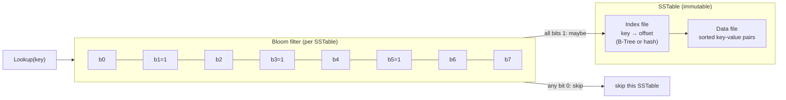
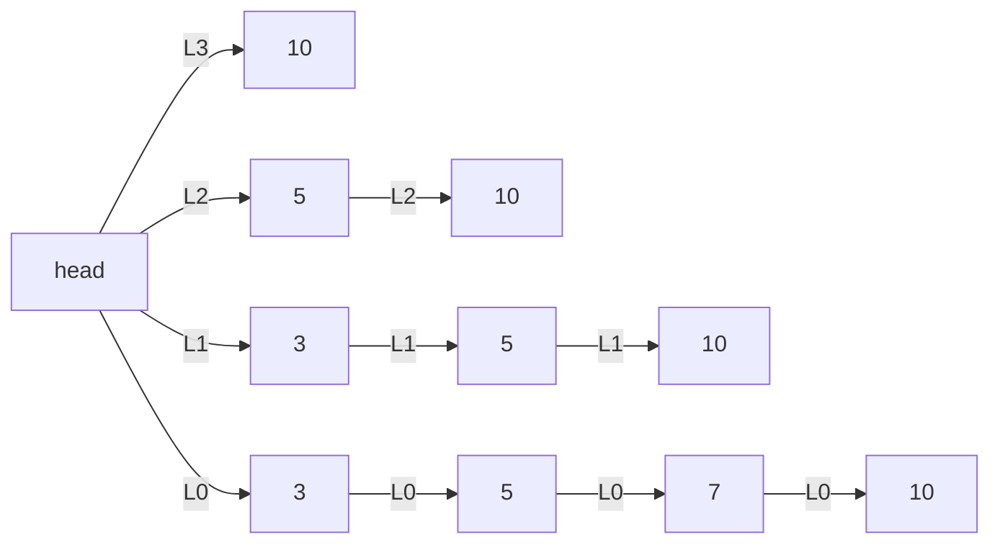

# Read-Path Optimizations: SSTables, Bloom Filters, and Skiplists

> **One-sentence summary.** LSM reads are cheap only when the engine can ignore most of its tables: SSTables make each disk file a sorted, sequentially-scannable unit; Bloom filters let a lookup skip tables that definitely don't contain the key; and skiplists give the memtable tree-like search complexity without any tree rotations.

## How It Works

A disk-resident table in an LSM Tree is almost always an **SSTable** (Sorted String Table). It is split into two files: an *index file* mapping each key to its byte offset, and a *data file* holding concatenated key-value records in sorted key order. The index can be a B-Tree (logarithmic lookups) or a hash table (constant-time lookups) — and because the data file is itself sorted, even a hashtable index still supports range scans: locate the first key, then read sequentially along the data file while the range predicate holds. The SSTable is written once and never mutated. That immutability makes compaction cheap: two SSTables merge by a straight sequential read of their data files without consulting indexes at all, because merge-iteration is order-preserving. Cassandra's **SASI** (SSTable-Attached Secondary Indexes) extends this life cycle to non-primary fields — per-SSTable secondary indexes built during flush and compaction, plus a separate in-memory structure for the memtable.

Reading an LSM Tree can touch many SSTables — one per level, sometimes more. Most will not contain the key, but the engine cannot know that without probing each one. A **Bloom filter** (Bloom, 1970) fixes this with a tiny probabilistic set-membership test attached to each SSTable: a bit array of size *m* plus *k* hash functions. Insertion hashes the key *k* ways and sets those *k* bits to 1. Lookup hashes *k* ways and inspects the same bits: if *any* is 0 the key is **definitely not** present; if *all* are 1 the key **might** be present. False positives happen (collisions), false negatives never do. Files whose filter says "no" are skipped entirely, collapsing read amplification on missing keys to near zero. The false-positive rate is roughly `(1 - e^(-kn/m))^k` — more bits lower collisions, more hashes tighten the "all-1s" check but also drive more bits toward 1 and cost more CPU per probe.

A 16-bit, 3-hash example from the chapter: `key1` sets bits {3, 5, 10}; `key2` sets bits {5, 8, 14}. Probing `key3` (never inserted) hashes to {3, 10, 14} — all already 1 from the earlier inserts, so the filter returns a **false positive** and the engine pays a wasted SSTable read. Probing `key4` hashes to {5, 9, 15} — bit 9 is 0, so the filter returns a **definite negative** and the SSTable is skipped entirely.

The memtable on the write side needs a sorted, concurrent, in-memory structure that handles random inserts cheaply. A **skiplist** (Pugh, 1990) is a linked list of sorted nodes where each node carries a random-height tower of forward pointers: level 0 links every node, level 1 roughly every other, level 2 every fourth, and so on, so lookups "skip" across long stretches at the top and drop down only when they overshoot. Height is drawn from a geometric distribution at insert time, giving O(log n) expected search and update without any rotation or relocation. That rotation-free property is what makes skiplists appealing for concurrency: inserts and deletes are localized to a few neighbour pointers, and lock-free variants use a `fully_linked` compare-and-swap flag to publish a new node atomically once all its levels are wired up, with hazard pointers or reference counting to reclaim memory safely. The cost is cache unfriendliness — skiplist nodes are small and scattered, so an in-memory B-Tree can win on single-threaded scans; *unrolled* linked lists (several keys per node) claw some of that back.

## When to Use

- **Bloom filters** anywhere you can cheaply rule out absence: per-SSTable in an LSM, per-partition in a sharded store, or in front of a slow remote cache. They shine when the dominant read pattern is *not-found* lookups (uniqueness checks, write-through caches, dedup pipelines).
- **Skiplists** when you want an ordered in-memory container under concurrent writers without lock-free tree rotations. They are the canonical LSM memtable and a good fit for any sorted-set-under-contention workload.
- **SSTables** whenever your writes can be batched into sorted, immutable files — log-structured engines, analytics ingest, and time-series rollups all benefit from the sequential-read compaction path.

## Trade-offs

| Bloom filter sizing | False-positive rate | Memory cost (per key) |
|---|---|---|
| Small (e.g., 4 bits/key, k=3) | ~14.7% — skipping gains drop | Tiny; fits on boot cores |
| Medium (10 bits/key, k=7) | ~0.8% — typical RocksDB default | ~1.25 B/key; adds up on large tables |
| Large (20 bits/key, k=14) | ~0.004% — near-perfect skipping | 2.5 B/key; can dominate memtable budget |

| Structure | Advantage | Disadvantage |
|---|---|---|
| Skiplist (memtable) | No rotations; naturally lock-free via `fully_linked` CAS; simple to implement | Small, scattered nodes are cache-unfriendly; pointer overhead per level |
| In-memory B-Tree (memtable) | Dense, cache-friendly pages; tighter memory layout | Rotations and splits complicate concurrency; more code to get right |
| Hash-indexed SSTable | O(1) point lookup | Index only helps the first key of a range scan |
| B-Tree-indexed SSTable | O(log n) lookup plus natural range support | Slightly larger index, slightly slower point access |

## Real-World Examples

- **RocksDB** attaches a Bloom filter to every SSTable (and in newer versions supports full-key plus prefix-key filters simultaneously, so prefix scans also get to skip files). Default is ~10 bits per key.
- **Apache Cassandra** uses Bloom filters per SSTable and layers SASI on top for secondary indexes, with a skiplist memtable for the in-memory secondary index. The main memtable is also a skiplist-family structure.
- **LevelDB** uses a skiplist as its memtable — the canonical reference implementation that everything else followed.
- **WiredTiger** uses skiplists for in-memory operations, notably as the update-buffer structure attached to dirty pages (see [[02-lazy-b-trees-and-buffering]]).
- **Redis** adopts the same probabilistic mindset for a different problem: HyperLogLog for cardinality estimation. Count-Min Sketch plays an analogous role for frequency estimation in streaming systems.

## Common Pitfalls

- **Undersizing Bloom filters for a growing dataset.** FPR climbs as *n/m* rises. A filter sized for 1M keys drifts from 0.8% FPR to double-digits by 10M keys, and read amplification creeps back unnoticed.
- **Ignoring Bloom filter memory cost.** 10 bits/key sounds cheap, but a 1B-key store pays ~1.25 GB of RAM just for filters. Memory-constrained deployments often need prefix or per-level filters.
- **Running a skiplist with a bad level-promotion probability.** *p = 1/2* gives balanced levels but fat towers; *p = 1/4* is more memory-efficient and usually faster in practice.
- **Trusting an SSTable index to filter misses.** The index tells you *where* a key would be, not *whether* it is present. Without a Bloom filter (or at least a key-range metadata check) every lookup pays an index probe per table.

## See Also

- [[01-lsm-tree-structure]] — where SSTables come from in the write path and why they are immutable.
- [[02-tombstones-and-merge-reconciliation]] — how the sorted structure of SSTables enables order-preserving merge-iteration during compaction.
- [[04-rum-conjecture-and-amplification]] — Bloom filters are the canonical tool for trading a small memory overhead for a big drop in read amplification, a direct move on the RUM triangle.
