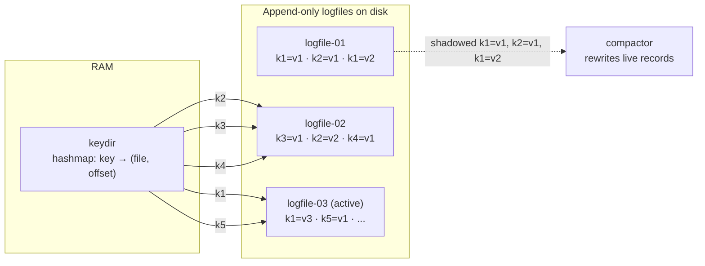
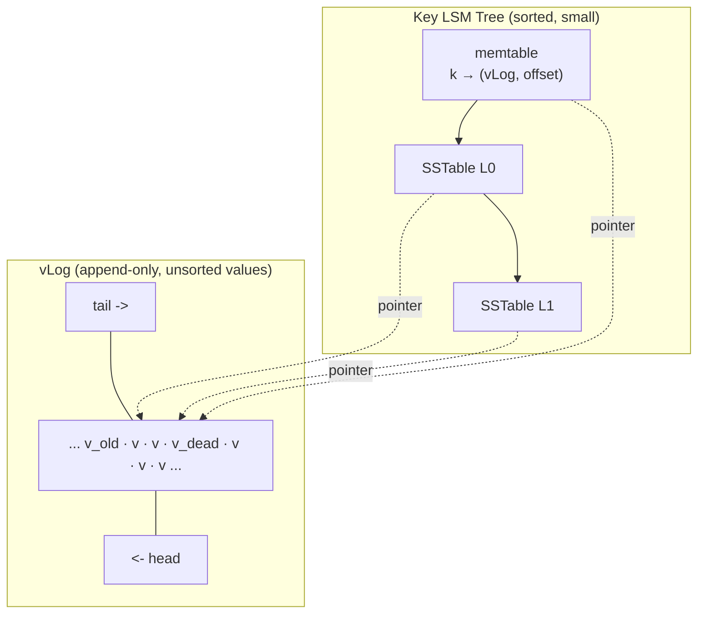

# Unordered Log-Structured Storage: Bitcask and WiscKey

> **One-sentence summary.** Unordered log-structured engines skip the in-memory sort by writing records in insertion order; Bitcask reaches that extreme with a pure append-only logfile and a RAM-resident keydir, while WiscKey splits the problem — sorted keys in an LSM Tree, unsorted values in a vLog — to recover range scans and shrink compaction cost.

## How It Works

Classical LSM Trees (see [[01-lsm-tree-structure]]) buffer writes in a memtable so they can be *sorted* before being flushed to an SSTable. That sort enables range scans and merge-based compaction, but it costs CPU on every write and forces every merge to rewrite both keys and values. Unordered stores ask: what if we wrote records to disk in arrival order and rebuilt structure later? Writes stay purely sequential, the memtable sort disappears, and in some designs the WAL disappears too because the data file *is* the log.

**Bitcask**, the Riak-era engine described in [Sheehy 2010], takes the radical path. There is no memtable; each write is appended to the current logfile, and a pointer to its offset is inserted into an in-memory hashmap called the **keydir** that maps every live key to `(file_id, offset, size, timestamp)`. A point query is one hashmap lookup plus one positioned read. Because the logfile itself durably records every accepted write, a separate WAL is redundant. Older, shadowed versions sit in previous logfiles until a background compactor sweeps them out, rewriting each segment to keep only records still pointed at by the keydir. The price: the entire key set must fit in RAM, and after a crash the keydir must be rebuilt by scanning every logfile — startup time is proportional to total data size.

**WiscKey** [Lu 2016] accepts Bitcask's insight — values do not need to be sorted — but refuses its RAM and startup costs. It puts the key index back into an **LSM Tree** (sorted, durable, incrementally rebuildable from the WAL) and keeps values in a separate unordered **vLog**. Keys are tiny compared to values, so the LSM compaction surface shrinks dramatically: merges rewrite pointers, not payloads, and write amplification drops by roughly the key-to-value size ratio. Range scans walk keys in sorted order through the LSM and dereference each into the vLog with random reads, exploiting SSD internal parallelism and prefetching. Deletes create garbage in the vLog; WiscKey tracks live regions with `head` and `tail` pointers but still has to consult the key LSM to decide which vLog records are live — GC cannot be decided locally.

These two designs illuminate the buffering / immutability / ordering trade-off from the chapter's end-of-part summary. Bitcask picks *immutability without ordering or buffering*. WiscKey picks *immutability with partial ordering* — keys are ordered, values are not — and uses buffering only on the key side. A classical LSM Tree picks all three.

## When to Use

- **Bitcask** fits ultra-fast-point-query key-value workloads where the full key set comfortably fits in per-node RAM: session stores, feature-flag caches, online feature stores, metadata lookups. If the access pattern is "given a key, give me its blob, as fast as possible, no scans," Bitcask is close to optimal.
- **WiscKey** fits workloads dominated by large values — KB-to-MB blobs, serialized objects, ML embeddings — where the key set is modest but the data volume is large. Blob stores, CDN edge caches, and secondary caching tiers over object storage all benefit from separating the sorted index from the heavy payload.
- Both designs assume **SSD-class storage**. Bitcask's seek-per-point-query and WiscKey's random vLog reads both depend on low-latency random I/O; on spinning disks the economics collapse.

## Trade-offs

| Aspect | Bitcask | WiscKey | Classical sorted LSM |
|---|---|---|---|
| Point query cost | 1 hash lookup + 1 positioned read | LSM lookup (+ bloom) + 1 vLog read | LSM lookup across levels, may touch several SSTables |
| Range scan support | **Not supported** — data is unordered | Supported but random-I/O-bound on the value side | Native, sequential per SSTable |
| Startup cost | High: scan all logfiles to rebuild keydir | Low: replay WAL into memtable as usual | Low: standard LSM recovery |
| Memory footprint | One entry *per live key* resident forever | Standard LSM memtable + block cache | Standard LSM memtable + block cache |
| GC complexity | Simple: merge logfiles, drop shadowed records | Hard: must cross-check key LSM to decide vLog liveness | Well-understood; see [[03-compaction-strategies]] |
| Write amplification | Very low (single append + periodic GC) | Lower than classical (keys only in the compaction surface) | Higher (whole key+value rewrites on every compaction) |
| WAL needed | No (logfile is the WAL) | Yes (for memtable durability) | Yes |

## Real-World Examples

- **Riak KV** used Bitcask as its default backend for workloads that could afford keeping the key set in RAM. The design made Riak's point-query tail latencies remarkably flat.
- **BadgerDB**, the Go embedded KV store behind Dgraph, is WiscKey-inspired: its LSM holds keys and pointers, its vLog holds values, and it ships with tunable GC.
- **TiKV and PebblesDB** have experimented with key-value separation ideas in RocksDB-style engines, trading some implementation complexity for cheaper compaction on large values.
- **Classical RocksDB / LevelDB** deliberately keep keys and values together in SSTables — a useful baseline to contrast against on the [[04-rum-conjecture-and-amplification]] triangle.

## Common Pitfalls

- **Bitcask key set outgrowing RAM.** The keydir has no paging story; once your key count overruns physical memory, the engine degrades catastrophically. Plan capacity in keys, not bytes.
- **Bitcask cold-start latency.** A crashed or restarted node must scan every logfile to rebuild the keydir. At multi-TB scale this dominates operational incident response, even if steady-state throughput is excellent.
- **WiscKey vLog GC stalls.** Because liveness information lives in the key LSM, compacting the vLog requires iterating the key tree, which can become a bottleneck when the key tree is itself large or under heavy load.
- **Assuming SSD economics.** Both engines are fundamentally SSD-oriented. On HDDs, Bitcask's random-read-per-query and WiscKey's range-scan random reads produce seek-bound latencies that erase any design benefit. Log stacking (see [[07-log-stacking-and-hardware-awareness]]) matters here too — the vLog layered above a log-structured filesystem and an FTL multiplies GC work.

## See Also

- [[01-lsm-tree-structure]] — the sorted baseline both Bitcask and WiscKey deliberately deviate from.
- [[03-compaction-strategies]] — what WiscKey's smaller compaction surface is actually shrinking.
- [[04-rum-conjecture-and-amplification]] — positions Bitcask and WiscKey on the Read / Update / Memory triangle against B-Trees and classical LSMs.
- [[07-log-stacking-and-hardware-awareness]] — why both designs' assumptions about "sequential writes" depend on what is underneath them.
