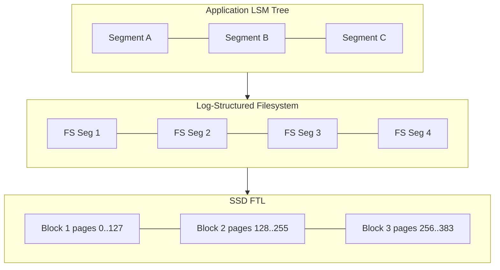
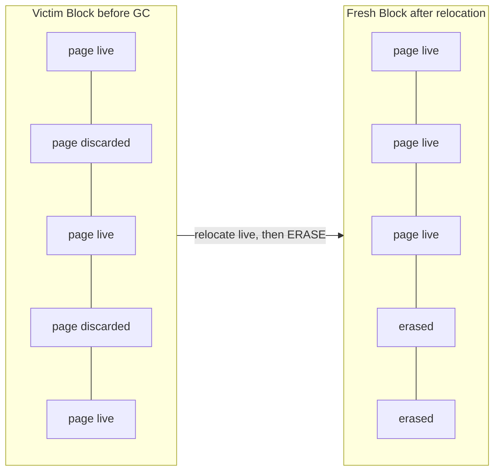

# Log Stacking: FTL, Filesystem Logging, LLAMA, and Open-Channel SSDs

> **One-sentence summary.** An LSM tree on top of a log-structured filesystem on top of an SSD flash translation layer is three logs stacked three-deep, each buffering and garbage-collecting independently — unless the layers expose their internals to each other, the stack duplicates work and fragments what looks sequential from above.

## How It Works

A modern storage engine rarely runs alone. A typical write travels through at least three log-structured subsystems: the database's own LSM tree, a log-structured filesystem (F2FS, ZFS, Btrfs), and the SSD's flash translation layer. Each layer independently buffers small writes, packs them into large sequential segments, and periodically garbage-collects stale segments — the "buffering, immutability, ordering" triad that Part I of the book keeps returning to. When the layers are unaware of each other, they duplicate bookkeeping and their segment boundaries drift out of alignment, so discarding one logical segment at the top leaves a fragmentation scar at every layer beneath.

The bottom layer — the FTL — exists because NAND flash has an asymmetric interface: you can *program* (write) at page granularity, but you can only *erase* at block granularity, where a block holds 64-512 pages. So the FTL cannot overwrite a page in place. Instead it runs a **program-erase cycle**: allocate a new page for every write, mark the old one discarded, and when free pages run low, relocate the still-live pages from a victim block into a fresh block, then erase the victim. On top of that, every block has a finite number of erase cycles before it wears out, so the FTL performs **wear leveling** to spread program-erase counts evenly across the device. All of this is hidden behind a pretense of "just write to this logical address."

The picture above is deliberately drawn with misaligned segment counts: an LSM segment rarely maps cleanly onto a filesystem segment, which rarely maps cleanly onto an erase block. Discarding one LSM segment typically invalidates a scattered set of flash pages, which forces the FTL to relocate survivors during its next program-erase cycle.

Filesystem logging makes the mismatch worse. F2FS, ZFS, and Btrfs log their own metadata and data into their own segments, and a database's concurrent write streams — WAL, SSTable flushes, compaction output — interleave at the filesystem level before they ever reach flash, so apparent sequentiality vanishes by the time the device sees the bytes. Tactical fixes help: keep partitions aligned to the hardware, keep writes aligned to page size, and park the WAL on a separate device so its stream does not braid with compaction output.

A richer fix is to make the layers *aware* of each other. **LLAMA** — Latch-free, Log-structured, Access-Method-aware — is the cache/storage substrate underneath the [[04-bw-trees]] Bw-Tree. The "access-method-aware" adjective carries the weight: LLAMA's garbage collector knows about Bw-Tree delta chains, so during GC it can consolidate many deltas for a single logical node into one base page, and if two deltas cancel (an insert followed by a delete of the same key) it can drop both. A generic log would blindly copy the delta records forward. Shorter chains mean faster reads, and cancelled deltas mean the pass reclaims more space — both benefits come purely from a richer API between the layers.

The most aggressive option is to skip layers entirely. **Open-Channel SSDs** expose channels, blocks, and erase semantics directly to the application, removing the FTL's opaque indirection. LOCS (LSM tree on OC-SSD), **LightNVM** in the Linux kernel, and SDF (Software Defined Flash) are the canonical examples; SDF deliberately exposes asymmetric read/write units with the write unit sized to the erase block. The application now owns wear leveling, garbage collection, and data placement — much harder to engineer, but two log layers vanish.

## When to Use

- **Tuning any LSM store on SSD.** You cannot reason about write amplification without counting all three logs; otherwise compaction rewrites look sequential but are actually triggering relocation inside the FTL.
- **Owning both the index and its persistence layer.** If your system controls the storage engine *and* the substrate beneath it (as Microsoft does with Hekaton/Bw-Tree + LLAMA), access-method-aware GC is low-hanging fruit.
- **Hyperscale deployments that can afford to manage flash.** Hyperscalers running millions of drives (reports from Alibaba and ByteDance point this way) get enough return on eliminating the FTL to justify Open-Channel hardware.

## Trade-offs

| Approach | Advantage | Disadvantage |
|----------|-----------|--------------|
| Transparent stacking (LSM + FS + FTL) | Simple portable API, works on commodity hardware | Redundant buffering and GC at every layer; misaligned segments cause fragmentation and hidden write amplification |
| Access-method-aware substrate (LLAMA) | GC consolidates deltas and cancels no-ops; shorter chains, better space reclaim | Tightly coupled layers; substrate and index must co-evolve |
| FTL bypass (Open-Channel SSDs) | Removes two log layers; direct control over wear leveling, placement, scheduling | Application now owns correctness of wear leveling and GC; scarce hardware and kernel support |

## Real-World Examples

- **RocksDB tuning guidance** recommends aligning partitions to the SSD's page and erase-block sizes and placing the WAL on a separate device so its stream does not interleave with SSTable flushes and compaction output.
- **Microsoft Hekaton / Azure Cosmos DB** use the Bw-Tree on LLAMA, the canonical example of access-method-aware stacking paying off in a shipping system.
- **LightNVM** in the mainline Linux kernel is the open-source reference for driving Open-Channel SSDs; **LOCS** is the matching research LSM engine.
- **Samsung and Western Digital** have shipped experimental Open-Channel and zoned-namespace drives aimed at exactly this workload class.

## Common Pitfalls

- **Unaligned writes** at the filesystem or partition level trigger read-modify-write at the FTL, silently multiplying write amplification for workloads that look sequential to the application.
- **Co-locating WAL and SSTable streams** on one device interleaves independent sequential streams into something the SSD cannot recognize as sequential.
- **Assuming `fsync` implies sequentiality.** `fsync` only guarantees durability of a write; it says nothing about how the FTL will lay the bytes out on flash.
- **Ignoring wear-leveling headroom.** Write-heavy workloads on small devices exhaust program-erase budgets on hot blocks unless GC and overprovisioning are sized for the workload, and this is invisible from above the FTL.

## See Also

- [[01-lsm-tree-structure]] — the top log in the stack; sequential-looking segments here become random I/O at the flash layer without alignment.
- [[04-rum-conjecture-and-amplification]] — write amplification analysis is incomplete until you account for all three nested logs.
- [[06-unordered-log-structured-storage]] — Bitcask and WiscKey reduce the compaction surface and therefore the pressure they put on lower-layer GC.
