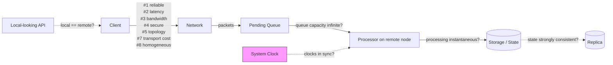

# Fallacies of Distributed Computing

> **One-sentence summary.** A catalogue of the implicit assumptions — the network is reliable, latency is zero, bandwidth is infinite, clocks are in sync, processing is instantaneous, the topology is stable — that feel true while you design a system and quietly produce the weirdest bugs once it runs at scale.

## How It Works

Peter Deutsch's 1994 list names eight things engineers silently assume when they replace a function call with an RPC: (1) **the network is reliable**, (2) **latency is zero**, (3) **bandwidth is infinite**, (4) **the network is secure**, (5) **topology doesn't change**, (6) **there is one administrator**, (7) **transport cost is zero**, (8) **the network is homogeneous**. Every one of them is a shortcut the brain takes because a local function call makes them genuinely true. They become wrong the instant a message crosses a process boundary, and each wrong assumption is a different failure mode: lost packets, p99 latency spikes, saturated links, MITM attacks, rerouted traffic, conflicting deploys, egress bills, protocol mismatches between heterogeneous nodes.

The chapter extends the list with five more that the original eight don't cover because Deutsch focused on the wire: **processing is instantaneous** (the remote CPU is busy too), **queue capacity is infinite** (piling requests grows latency without adding throughput and eventually OOMs), **clocks are in sync** (wall-clock timestamps drift unless you use a specialized time source with uncertainty bounds, as Spanner does), **local and remote execution are the same** (hiding remote calls behind a local-looking API conceals two-way transport, serialization, consistency, paging, and partial failure), and **state is strongly consistent** (replicas diverge; schema and cluster-membership views propagate at different speeds, which is how Cassandra hit its schema-propagation corruption bug).

Each fallacy leaks at a specific layer of the request path. Seeing them laid out on the path makes it obvious where the mitigation has to live — you can't fix a queue overflow with a better cipher, and you can't fix clock drift with a retry.

## When to Use

This isn't a component you deploy; it's a checklist you apply to any design that crosses a process boundary. Reach for it:

- **During a design review of anything that makes a network call.** For each arrow in the diagram, name which fallacy it would invoke if it held, then show the mitigation (timeout, retry budget, circuit breaker, checksum, idempotency key, backpressure).
- **When you're converting a local function into a remote one** — an in-process call becoming an RPC, a library call becoming a sidecar, a database move from embedded to networked. Every implicit guarantee of the local version needs an explicit replacement.
- **When you notice a missing timeout, unbounded queue, synchronous retry loop, or timestamp comparison between hosts.** Each is a fallacy leaking through. Missing timeouts assume latency is zero *and* processing is instantaneous; unbounded queues assume queue capacity is infinite; tight retry loops assume the network is reliable; cross-host `now()` comparisons assume clocks are in sync.

## Trade-offs

Each fallacy has a cost of acknowledgement. Eliminating its impact is never free — the engineering question is always which price to pay, not whether to pay one.

| Fallacy | Naive assumption cost | Mitigation cost |
|---|---|---|
| Network is reliable | Hung requests, silent data loss | Timeouts + retries add latency; retries need idempotency or dedup (see [[03-link-abstractions-and-delivery-semantics]]) |
| Latency is zero | Chatty APIs become unusable at WAN distances | Batching and coarser APIs hurt composability and freshness |
| Bandwidth is infinite | Replication storms, hot links | Compression, sampling, selective sync — CPU cost and data fidelity loss |
| Clocks are in sync | Out-of-order events, wrong TTLs, duplicate IDs | GPS/atomic clocks (Spanner TrueTime) are expensive; logical clocks lose wall-clock meaning |
| Queue capacity is infinite | Unbounded latency, OOM kills, tail amplification | Backpressure slows producers; load shedding drops work |
| Processing is instantaneous | Tail latency driven by slowest replica | Hedged requests, parallel fan-out — wasted work and duplicate effects |
| Topology doesn't change | Stale routes, split brains on rebalance | Service discovery, gossip, health checks — extra moving parts |
| State is strongly consistent | Subtle corruption during propagation | Strong consistency costs latency and availability (CAP) |

## Real-World Examples

- **Flash Boys and the latency-is-zero fallacy.** Michael Lewis documents HFT firms spending millions to shave milliseconds off stock-exchange links by laying straighter fiber. Whether or not it produces durable alpha, the existence of the arms race is empirical proof that milliseconds of network latency are economically real — and that any system assuming zero is leaving money or correctness on the table.
- **The Cassandra schema-propagation bug and the state-is-consistent fallacy.** Cassandra offered quorum reads for data, which lulled engineers into assuming *all* cluster state was consistent. Schema changes actually propagated asynchronously. During the window, one node could encode a row using the new schema while another decoded it using the old schema — silent corruption. The fix required making schema agreement an explicit, versioned protocol rather than an assumed property.
- **Distributed locks over unreliable networks.** A lock service that hands out a lease, followed by a partition that hides the renewal ACK, leaves two clients each believing they hold the lock — Martin Kleppmann's "distributed locks are broken" critique of Redlock. This is the reliability, latency, and clock fallacies compounding: the lock holder's TTL is measured against *its* clock, the arbiter's against *its*, and the network between them is not reliable enough to close the gap.

## Common Pitfalls

- **Adding a retry without adding idempotency.** If the original call succeeded but the ACK was lost, the retry double-executes. Charging a credit card twice is the canonical horror. Fix: attach a client-supplied operation ID and dedup on the server, or design the operation itself to be idempotent.
- **Using `System.currentTimeMillis()` (or `time.time()`) to order events across hosts.** Non-monotonic, drifts by seconds under NTP correction, jumps backward on leap seconds. Any "happened-before" comparison built on it will silently lie. Fix: logical clocks, HLCs, or TrueTime-style uncertainty intervals; use monotonic clocks for local durations.
- **Unbounded client queues in front of a slow service.** When the downstream slows down, the queue absorbs the burst "for resilience" — but nothing is happening to those messages while they wait, and memory grows until the process dies. Fix: bounded queues plus an explicit overflow policy (shed, reject, fail fast) and backpressure upstream.
- **Hiding remote calls behind a local-looking API.** An ORM method that transparently joins across a remote service looks like a property access and costs 80 ms of WAN round-trip. Callers write N+1 loops without realizing. Fix: make remote calls visibly remote in the type signature (async, `Result`/`Either`, explicit batch API), and expose latency in observability.

## See Also

- [[02-partial-failures-and-cascading-failures]] — what the fallacies produce in practice: slow nodes, retry storms, and one hiccup snowballing into a cluster-wide outage.
- [[03-link-abstractions-and-delivery-semantics]] — the principled response to "the network is reliable": fair-loss → stubborn → perfect links, and what exactly-once processing really costs.
- [[06-system-synchrony-models]] — the formalization of "latency is zero" and "clocks are in sync" as asynchronous / synchronous / partial-synchrony assumptions, and which algorithms each model can support.
