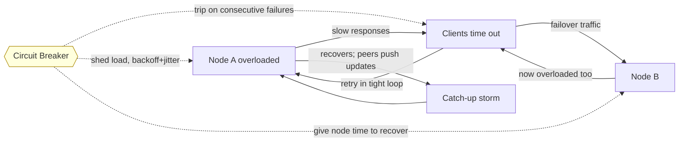

# Partial Failures and Cascading Failures

> **One-sentence summary.** In a distributed system, failure is rarely clean — different observers see different states, and a single slow or dead node can amplify into a cluster-wide outage unless the system is deliberately bounded with circuit breakers, exponential backoff with jitter, backpressure, and integrity checks.

## How It Works

A **partial failure** is the distributed-systems symptom that has no single-node analogue: one process crashes, a link drops packets in one direction only, or a node responds but so slowly that it may as well be dead — and different observers disagree on what is actually broken. When a client times out, it cannot distinguish crash from slowness from an unreachable route; when a replica stops acknowledging, peers cannot tell whether its disk is full, its clock jumped, or a switch lost a cable. Asymmetric link failures are especially nasty: `A → B` works while `B → A` silently drops, so heartbeats pass one way and the two sides form contradictory views of cluster membership. A **network partition** is the extreme case where whole groups of nodes cannot exchange messages at all and each side is free to keep making decisions, risking split-brain.

A **cascading failure** is what happens when the system's own reactions to partial failure make things worse. One node tips over under load. Clients reconnect in tight loops, each retry adding work to the already-overloaded survivors. Healthy peers take on the dead node's share of traffic and cross their own tipping point. A node that was merely offline for maintenance comes back, and well-meaning peers immediately stream it every update it missed — a **catch-up storm** that saturates the network and knocks the recovered node over a second time. Corruption can cascade too: an un-checksummed replication stream happily propagates a bit-rotted page to every replica, overwriting the only good copies.

The defense is to break the feedback loop at every link. A **circuit breaker** trips after consecutive failures, short-circuiting further calls to the sick dependency and giving it room to recover instead of piling on. **Exponential backoff** widens the gap between a client's own retries, and **jitter** randomizes those gaps so independent clients don't all wake up and retry in lockstep. **Backpressure** pushes the slowness back to the producer rather than letting it accumulate silently in a queue. **Checksums** at every replication hop stop corrupted data from spreading further. **Chaos testing** validates that all of these actually work under the failure modes that production will eventually produce.

## When to Use

These mitigations are not optional add-ons — they are the baseline for any service that calls another service over a network. Reach for them when:

- **Designing any RPC client, replication stream, or failover path.** The first draft always retries immediately; the production draft always has backoff, jitter, and a circuit breaker.
- **An existing service is seeing retry storms or thundering herds.** Symptoms: error rate spikes correlated with recovery events, load on survivors rising to match the dead node's share plus the clients' retry budget, 100% CPU spent on handshakes.
- **Introducing replication or gossip.** Any time a node streams state to peers on startup or catch-up, cap the bandwidth and validate with checksums so a single bit-flip cannot propagate.
- **Auto-scaling or autonomous failure response is in the loop.** Automation reacts faster than humans and amplifies feedback loops faster; circuit breakers and rate limits keep the automation from eating the cluster.

## Trade-offs

| Strategy | Latency (happy path) | Availability under partial failure | Blast radius |
|---|---|---|---|
| Retry immediately | Best — one round trip if it works | Collapses: retries amplify the original overload | Large — every caller hammers the sick node |
| Exponential backoff | Slightly worse on first failure; great on recovery | Good — gives the dependency room to heal | Still per-client; synchronized clients can still dogpile |
| Backoff + jitter | Same as backoff | Best — retries spread across time | Smallest — no synchronized waves |
| Circuit breaker | Trivial overhead; failures fail fast | Protects caller and callee; risk of false trips | Bounded — trips isolate one dependency |
| Shed load / backpressure | Rejections under overload | Preserves the system's ability to serve the subset it can | Producer sees errors early rather than late |

## Real-World Examples

- **AWS S3 2017 us-east-1 outage.** An operator command meant to take a few servers offline removed more than intended; the affected indexing and placement subsystems then had to be fully restarted, and their recovery required reading enormous amounts of metadata — a catch-up storm at planetary scale that kept S3 degraded for hours and took dependent services (Lambda, ECS, even the AWS status page) down with it.
- **Netflix Chaos Monkey.** A production tool that randomly terminates instances during business hours so that engineers are forced to build services that tolerate partial failure by construction. The broader Simian Army adds Latency Monkey and Chaos Gorilla (whole-AZ outage) to exercise the same mitigations under harsher conditions.
- **Cassandra hinted handoff.** When a replica is unreachable, coordinators store "hints" and replay them when the replica returns — bounded in size and rate so the recovering node isn't crushed by a catch-up storm, which is exactly the cascading-failure footgun the mitigation is designed to avoid.
- **Database replication catch-up storms.** A follower that falls far behind the leader (e.g., after a long GC pause or a network blip) asks for a large chunk of WAL; naive implementations ship it at line rate and saturate the leader's disk and NIC, starving live traffic. Production-grade replication rate-limits the catch-up stream.
- **Chaos and fault-injection tooling.** *Toxiproxy* injects latency, bandwidth caps, and dropped connections between services; *CharybdeFS* and *CrashMonkey* simulate disk and filesystem faults to verify that persistence code survives power loss and bit rot.

## Common Pitfalls

- **Retries without jitter.** Pure exponential backoff still synchronizes N clients that all failed at the same instant — they all wake at `t+1`, `t+2`, `t+4`, and re-dogpile the recovering server. Always add a random component to the wait interval.
- **Unbounded queues masquerading as resilience.** A "big enough" queue looks like it absorbs bursts, but it actually *hides* the backpressure signal: producers keep producing, latency quietly balloons to minutes, and a crash loses everything queued. Bound queues and let overload surface as rejections upstream where the caller can slow down or shed work.
- **Retrying non-idempotent operations on timeout.** A timeout means "I don't know" — the server may have committed the write. Blind retries double-charge credit cards, double-insert rows, and double-send emails. Either make the operation idempotent (e.g., client-supplied request IDs with server-side dedup — see [[03-link-abstractions-and-delivery-semantics]]) or surface the ambiguity to the caller.
- **Missing checksums on replication and disk paths.** Without end-to-end integrity checks, a single bit-flip on a network hop or a single corrupt sector on the leader gets dutifully replicated to every follower, converting a recoverable local fault into an unrecoverable global one. Verify on write, verify on read, verify on every hop.

## See Also

- [[01-fallacies-of-distributed-computing]] — the implicit assumptions (reliable network, zero latency, instantaneous processing) that, when they fail, manifest as the partial failures this article mitigates.
- [[03-link-abstractions-and-delivery-semantics]] — how acknowledgments, sequence numbers, and deduplication provide the idempotence that makes safe retries possible.
- [[07-failure-models]] — the formal hierarchy (crash-stop, crash-recovery, omission, Byzantine) that names the failure modes cascading across the cluster here.
