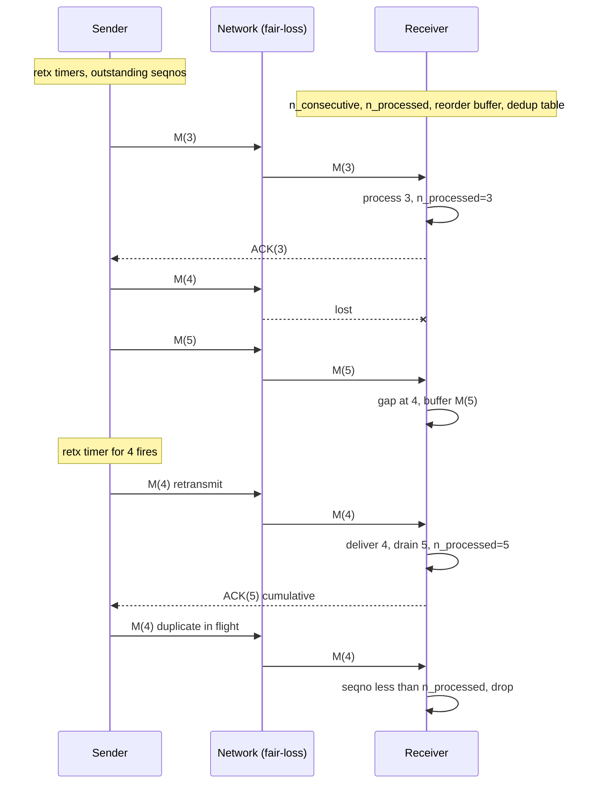

# Link Abstractions and Delivery Semantics

> **One-sentence summary.** A point-to-point link is built as a ladder — fair-loss links permit infinite retries with finite duplication, stubborn links retry forever without acks, and perfect links layer acknowledgments, sequence numbers, reorder buffers, and deduplication on top to deliver each message reliably, in order, and exactly once *from the application's perspective*.

## How It Works

The starting assumption is that the network is hostile: messages can be lost, delayed, duplicated, or reordered (see [[02-partial-failures-and-cascading-failures]]). Rather than pretend otherwise, distributed systems literature names a ladder of link abstractions, each strengthening the one below by adding a protocol mechanism. You pick the rung you need, and you pay only for what that rung requires.

The bottom rung is the **fair-loss link**. Its three guarantees are weak by design: *fair loss* (if a correct sender retransmits infinitely often, the message is delivered infinitely often), *finite duplication* (no message is delivered an unbounded number of times), and *no creation* (the link never invents messages that were not sent). That's it — no ack, no ordering, no dedup. UDP is the canonical example. Useful as a building block, too weak to use alone.

Climb one rung by adding indefinite retransmits without acknowledgments and you get a **stubborn link**: the sender keeps resending forever. Delivery is guaranteed as long as the link is not permanently partitioned, but the receiver is drowning and the sender has no idea when (or whether) to stop. Stubborn links are a theoretical stepping stone, not something you deploy.

The **perfect link** is what real systems want. Build it by combining every mechanism so far plus a few more:

1. **Sequence numbers** (or any unique ID, possibly a hash) tag each message so the receiver can order and dedup.
2. **Acknowledgments** let the sender know a specific seqno has been received.
3. **Retransmit timers** fire when an ack is overdue, turning the fair-loss layer into at-least-once delivery.
4. A **reorder buffer** on the receiver holds messages that arrived ahead of gaps — if message 5 arrives before 4, keep 5 aside until 4 shows up.
5. Two counters drive the buffer: `n_consecutive` is the highest seqno such that all smaller seqnos have been received, and `n_processed` is the highest seqno passed up to the application.
6. A **dedup table** (or just "discard anything with seqno ≤ `n_processed`") ensures that a retried message is delivered up only once.

The guarantees produced — *reliable delivery*, *no duplication*, *no creation* — match a single TCP session. The critical caveat: those guarantees are scoped to the session. If the connection dies and the application reconnects, it is on a new perfect link with no memory of what the old one processed.

## When to Use

The delivery semantic you choose is an *application* decision about how much the sender cares:

- **At-most-once — fire and forget.** No ack expected, no retry. Right for metrics, telemetry, log shipping, and gossip pings where a lost sample is cheaper than the overhead of reliability and duplicates would skew aggregates.
- **At-least-once — retry until ack.** The default for RPC and messaging. The cost is that the receiver will *sometimes* see duplicates, so the operation must be idempotent or dedup must happen on the receiver. Use this for payment APIs (with an idempotency key), order placement, and any external side-effecting call where losing the request is worse than rarely retrying one.
- **Exactly-once processing via receiver-side dedup.** Exactly-once *delivery* is provably impossible, but exactly-once *processing* is achievable by combining at-least-once delivery with a persistent dedup horizon on the receiver. Use it for financial ledger entries, inventory decrements, state-machine inputs, and anywhere duplicate application of an op is unacceptable and you cannot make the op naturally idempotent.

## Trade-offs

Link abstractions:

| Link | Guarantees | Mechanisms | Overhead | Real analog |
|---|---|---|---|---|
| Fair-loss | Fair loss, finite dup, no creation | None beyond "send" | Minimal | UDP |
| Stubborn | Eventual delivery via infinite retry | Retransmit only | Unbounded (no ack = no stop) | None in practice |
| Perfect (per session) | Reliable delivery, no dup, no creation | Acks + seqnos + retx + reorder buffer + dedup | Bandwidth for acks, memory for buffer & dedup state | TCP session |

Delivery semantics:

| Semantic | Sender must | Receiver must | Failure mode | Op requirement |
|---|---|---|---|---|
| At-most-once | Send once | Accept and process | Message silently lost | None |
| At-least-once | Retry until ack | Dedup or tolerate duplicates | Duplicate processing if not handled | Idempotent op *or* dedup |
| Exactly-once *processing* | Retry until ack, stable message ID | Durable dedup table keyed by ID | Dedup state bloat / expiry mistakes | Deterministic op + stable IDs |

## Real-World Examples

- **UDP** — fair-loss link straight from the textbook. DNS queries, QUIC's underlying transport, and video/voice codecs build their own retry/dedup above it.
- **TCP** — a perfect link *within a single session*. Sequence numbers, cumulative acks, retransmit timers, reorder buffers, and per-connection dedup are all there. Across reconnects, the guarantees reset.
- **Kafka** — producer configs map directly onto the ladder: `acks=0` is at-most-once, `acks=all` with retries is at-least-once, and `enable.idempotence=true` plus transactions gives you exactly-once *processing* via a per-producer sequence number and broker-side dedup.
- **AWS SQS** — at-least-once by default on standard queues; consumers are expected to be idempotent. FIFO queues add a message-deduplication ID and a 5-minute dedup window, bounding dedup state.
- **Stripe and other payment APIs** — accept an `Idempotency-Key` header so the client can retry safely on network errors. The server keeps a dedup table keyed by `(api_key, idempotency_key)` and returns the cached response on replay.

## Common Pitfalls

- **Assuming TCP delivers exactly-once across reconnects.** TCP's no-duplication guarantee is scoped to one session. If the connection drops after the receiver processed a request but before the ack arrived, the client legitimately thinks the request failed and retries — the application layer needs its own idempotency key or dedup to cover that gap. See [[04-two-generals-problem]] for why this gap is fundamental.
- **Retrying non-idempotent operations.** "Charge card" is the textbook counterexample — at-least-once without idempotency turns one intended charge into two. Either make the op idempotent (check-then-set with a stable ID) or put dedup on the receiver before the side effect.
- **Unbounded dedup state.** A dedup table that grows forever is a memory leak and a disk-space bomb. Every exactly-once-processing system needs a horizon: a window (SQS FIFO's 5 min), a sequence-number floor (`n_processed`), an epoch-scoped table (Kafka's producer epoch), or a checkpoint that can safely retire older IDs.
- **Assuming order survives across TCP sessions.** FIFO is a per-session property. On reconnect, in-flight messages and retries can interleave with fresh sends. If ordering matters end-to-end, make it explicit with application-level sequence numbers and let the receiver re-establish `n_consecutive`.

## See Also

- [[02-partial-failures-and-cascading-failures]] — the network failure modes that fair-loss links expose and that perfect links paper over
- [[04-two-generals-problem]] — why even a perfect link cannot produce common knowledge, capping what delivery semantics can achieve
- [[07-failure-models]] — crash-stop vs crash-recovery changes whether a reconnecting peer remembers its dedup horizon at all
