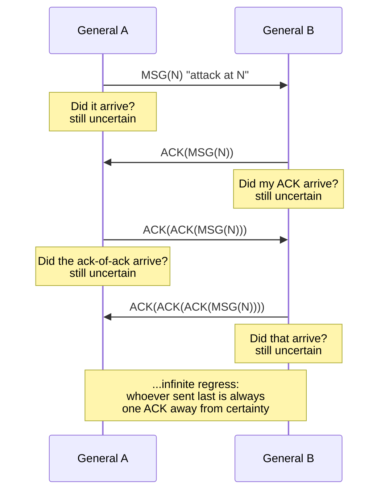

# Two Generals' Problem

> **One-sentence summary.** Over an asynchronous, lossy link, no finite exchange of acknowledgments can make two parties *commonly* know they've agreed — whoever sent the last message is always one unconfirmed ACK short of certainty, so real systems must trade agreement for timing assumptions, idempotency, or weaker semantics.

## How It Works

Two generals camp on opposite sides of a fortified city. Their armies can only win if they attack *simultaneously*; if one attacks alone, it is slaughtered. The generals cannot see each other and must coordinate through messengers that cross hostile territory, where messengers can be captured and the message lost without either side knowing. The question: is there any protocol — any sequence of messages and acknowledgments — that lets both generals become *certain* their counterpart will also attack?

General `A` sends `MSG(N)` — "attack at time N if you agree." `A` now doesn't know whether the messenger arrived. If `B` receives it, `B` sends `ACK(MSG(N))`. But then `B` doesn't know whether *his* ACK arrived. `A` can send `ACK(ACK(MSG(N)))` to reassure `B` — and now `A` doesn't know if *that* reached `B`. The problem is symmetric and recursive: whoever sent the last message is always exactly one unconfirmed hop away from knowing the other side is committed. The **proof sketch** is a short induction: suppose there existed some shortest protocol of `N` messages that guarantees agreement. Consider what happens if the `N`-th message is lost — the sender never learns whether it arrived, so it must either proceed without confirmation (breaking agreement when the message really was lost) or wait for another ACK (making the protocol `N+1` messages, contradicting minimality). Therefore no finite-length protocol works.

The deeper concept under this is **common knowledge** — the state where "`A` knows `X`, and `B` knows `X`, and `A` knows that `B` knows `X`, and `B` knows that `A` knows that `B` knows `X` …" holds at every level of nesting. Shared knowledge (both sides know the fact) is cheap; common knowledge requires an infinite regress of nested knowledge, and no finite exchange of messages over an unreliable channel can close that regress. Perfect links (see [[03-link-abstractions-and-delivery-semantics]]) retransmit forever under the hood, but they only promise *eventual* delivery if both parties stay alive — they do not deliver common knowledge, and they cannot, because the problem is asynchronous and makes no timing assumption.

## When to Use

The Two Generals' Problem is not a *technique* to apply — it's a lens to recognize situations that are doomed and stop trying to solve them with more messages. Pull it out in these moments:

- **Design reviews** where two services must atomically commit a joint decision over a network (cross-region transfer, dual-write to two databases, distributed transaction). If the design assumes "we'll just keep ACKing until we're sure," name the problem and redirect the discussion toward timeouts, idempotency, or reconciliation.
- **"Why can't we just get exactly-once?" debates** — engineers often conflate "TCP is reliable" with "exactly-once application delivery." The Two Generals shows why perfect links do not imply perfect agreement; exactly-once is achievable only as exactly-once *processing* built from at-least-once delivery plus deduplication.
- **Scoping network-layer guarantees** — when deciding what belongs in the RPC framework vs. the business logic. The network can retry; it cannot tell the caller whether the server's side-effect ran. That ambiguity must be handled above the wire.

## Trade-offs

Practical systems cannot achieve guaranteed agreement, so they pick a workaround that relaxes one assumption:

| Strategy | Relaxed assumption | Pros | Cons |
|---|---|---|---|
| **Timeouts + retry** | Synchrony — assume a response within `T` means alive, else retry | Simple; works well under partial synchrony | False positives (retry a completed op), false negatives (declare a live peer dead) |
| **Idempotent operations + keys** | Uniqueness of effect — make re-delivery harmless | Retries become safe; composes with at-least-once transport | Requires dedup state (keys, TTLs, storage); not always natural (monetary transfers, counters) |
| **Two-phase commit (2PC)** | A trusted coordinator + stable storage | Gives atomic commit across nodes under synchronous assumptions | Blocks if the coordinator dies mid-commit; not fault-tolerant without 3PC / Paxos Commit |
| **Weaker semantics (eventual, at-least-once)** | Strict agreement itself | Highly available, tolerant of partitions and loss | Clients must tolerate duplicates, stale reads, and out-of-order effects |
| **Consensus protocols (Raft, Paxos)** | Partial synchrony + quorum | Agreement among a majority despite lost messages | Needs odd-sized quorums, leader election, and still cannot terminate under full async ([[05-flp-impossibility-and-consensus]]) |

## Real-World Examples

- **TCP connection termination** uses a 4-way handshake (`FIN / ACK / FIN / ACK`) and a `TIME_WAIT` state on the active closer. The `TIME_WAIT` exists precisely because the final ACK might be lost, and the peer may retransmit its `FIN`; the closer must linger to respond. Even so, TCP cannot *guarantee* both peers agree the connection ended — it just makes the probability of residual confusion astronomically small.
- **2PC blocking on coordinator failure** — if a coordinator crashes after sending `PREPARE` but before sending `COMMIT`, participants sit holding locks indefinitely. They cannot safely decide alone: committing risks disagreement, aborting risks disagreement. This is the Two Generals in operational clothing.
- **Distributed payment processing** uses **idempotency keys** (Stripe, PayPal) because "did my charge go through?" is exactly the Two Generals question. The client retries on timeout with the same key; the server replays the prior response. Agreement isn't achieved — ambiguity is absorbed by making retries safe.
- **Database client commits that succeed server-side but time out client-side** — the server wrote and forced the WAL; the network dropped the response. The client doesn't know the commit landed. Correct clients either re-issue as an idempotent upsert or query the server to reconcile; incorrect clients retry and double-charge the user.

## Common Pitfalls

- **Assuming TCP delivery implies the peer processed it.** TCP's ACK is a kernel-level ACK that bytes arrived in a receive buffer — it says nothing about whether the application read them, whether the transaction committed, or whether the process crashed milliseconds later. Application-level acknowledgment is a separate concern.
- **Treating a missing ACK as definitive failure.** A timeout is *ambiguity*, not "it failed." The operation may have completed, may have partially completed, or may still be in flight. Designs that branch on timeout as if it were a no-op are how duplicate charges, orphan writes, and split brains are born.
- **Retrying non-idempotent operations on ambiguous failure.** If a retry produces a different effect from the original (append-only counters, non-keyed inserts, `UPDATE balance = balance - 100`), the retry strategy silently corrupts state under exactly the failure modes it was supposed to handle. Either make the operation idempotent or pair retries with a reconciliation read.
- **Designing for "exactly-once" over a lossy channel with no reconciliation step.** The network layer cannot deliver exactly-once; only the application can, by deduplicating at-least-once delivery. Any architecture that claims exactly-once without showing you the dedup table, sequence numbers, or reconciliation job is hiding the Two Generals behind marketing.

## See Also

- [[03-link-abstractions-and-delivery-semantics]] — why "perfect links" still cannot give common knowledge, and how at-least-once + dedup is the practical substitute
- [[05-flp-impossibility-and-consensus]] — the generalization to `N` processes: agreement under full asynchrony is impossible even with a single crash
- [[06-system-synchrony-models]] — how partial-synchrony assumptions (bounded delay, eventually) buy back the progress that Two Generals and FLP take away
