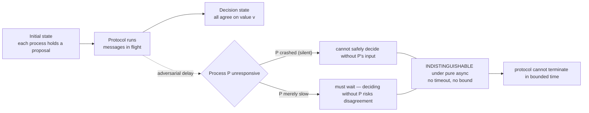

# FLP Impossibility and Consensus Properties

> **One-sentence summary.** Fischer, Lynch, and Paterson proved in 1985 that no deterministic consensus protocol can simultaneously guarantee agreement, validity, and termination in a purely asynchronous network if even a single process may crash silently — so every real consensus system (Paxos, Raft, ZAB) buys termination by weakening one of those assumptions, usually by adding timeouts.

## How It Works

A consensus protocol brings a set of processes from an *initial state*, where each holds its own proposed value, to a *decision state*, where every non-faulty process has committed to a single common value. To be called a consensus protocol at all, it must satisfy three properties simultaneously:

- **Agreement** — every non-faulty process decides on the same value; divergent decisions are not consensus.
- **Validity** — the decided value was actually proposed by some participant; a protocol that always outputs `0` trivially agrees but decides nothing meaningful, so validity rules it out.
- **Termination** — every non-faulty process eventually reaches a decision state; a protocol that spins forever has not reached consensus, it has reached stalemate.

The FLP paper makes one modeling assumption: the system is **purely asynchronous**. Processes have no shared clock, messages may be delayed arbitrarily, and there is no upper bound on how long a single step takes. Under that model the paper proves that **no deterministic protocol can guarantee all three properties** when even one process may fail by crashing silently. The intuition is a distinguishability argument: with no timing bounds, a process that has crashed looks identical to a process that is merely slow, because "slow" has no upper limit. An adversarial scheduler can always delay the one message whose arrival would tip the protocol into a decision, keeping it forever one step away from termination without ever violating the rules of asynchrony. This generalizes the flavor of the [[04-two-generals-problem]] — where two parties over an unreliable link cannot achieve common knowledge — from link failures between two participants to crash failures among N participants.

Crucially, FLP rules out **deterministic, bounded-time termination under pure asynchrony**. It does *not* say consensus is unreachable in practice. Randomized protocols like Ben-Or's sidestep the impossibility because the adversary cannot pre-plan against coin flips. Protocols like Paxos and Raft sidestep it by assuming **partial synchrony** — the model where timing bounds hold *eventually* or *most of the time* (see [[06-system-synchrony-models]]) — and by using timeouts to detect suspected crashes and trigger leader re-election.

## When to Invoke This

Reach for FLP whenever a claim about consensus needs to be stress-tested. **Evaluating protocol claims**: if a paper or whitepaper advertises "asynchronous deterministic consensus", FLP says one of the three properties must be conceded or a hidden synchrony assumption must exist — find it. **Explaining design choices**: election timeouts in Raft, leader leases in Multi-Paxos, view-change triggers in PBFT, and failure-detector thresholds (see [[07-failure-models]]) all exist specifically because FLP forces the system to import some synchrony to guarantee progress. **Interview and architecture discussions**: use FLP as the precise reason async consensus cannot both be deterministic and always terminate, and Two Generals as the two-party analogue for unreliable links.

## Trade-offs

| Assumption you make | Property you sacrifice | Example system |
|---|---|---|
| Pure asynchrony + determinism | **Termination** (may hang forever under adversarial scheduling) | The FLP model itself — a theoretical baseline, not shipped |
| Pure asynchrony + randomization | **Determinism** (termination holds with probability 1, not in fixed bounds) | Ben-Or's randomized consensus; many BFT randomized protocols |
| Partial synchrony (timeouts, leases) | **Liveness during timing violations** (progress stalls until bounds hold again) | Paxos, Raft, ZAB, PBFT |
| Weakened coordination | **Agreement** (replaced with eventual consistency or causal ordering) | Dynamo-style stores, CRDT systems |

## Real-World Examples

- **Paxos / Multi-Paxos**: safety (agreement, validity) holds in pure asynchrony; liveness requires a period of synchrony long enough for a stable leader to emerge. Leader election relies on timeouts — a direct response to FLP.
- **Raft**: uses randomized election timeouts so two candidates rarely split the vote; once a leader is elected under a partially synchronous window, log replication proceeds. A network that violates timing assumptions indefinitely produces repeated elections and no progress, exactly as FLP predicts.
- **ZooKeeper (ZAB)**: leader-based atomic broadcast with epoch numbers and heartbeat timeouts; safety survives arbitrary asynchrony, liveness requires a quorum to agree on a leader within the timeout.
- **Ben-Or's randomized consensus**: each round broadcasts and flips a coin; decision probability per round is nonzero so termination holds almost surely, dodging FLP by dropping determinism.
- **Ethereum Proof-of-Stake (Gasper)**: combines a BFT finality gadget (Casper FFG) with a fork-choice rule (LMD-GHOST); finality requires a synchronous bound on message delivery, and blocks pause finalizing when that assumption breaks.

## Common Pitfalls

- **Confusing FLP with CAP.** CAP is about what a *partitioned* system can offer (consistency vs. availability under a network split); FLP is about what a *non-partitioned but asynchronous* system can compute deterministically. A protocol can be CP under CAP and still be bound by FLP during a long message delay.
- **Thinking FLP means consensus is impossible.** FLP rules out **bounded-time termination under pure asynchrony with deterministic protocols** — three qualifiers. Real systems routinely reach consensus because they relax at least one.
- **Claiming "asynchronous" when you actually use timeouts.** Any protocol with heartbeats, leases, or election timers has imported synchrony; describe it as partially synchronous. Mislabeling hides where the system is vulnerable to timing-assumption violations (GC pauses, network congestion).
- **Ignoring validity.** A protocol that always decides a hard-coded default satisfies agreement and termination but is not consensus. Validity is what makes the problem interesting — the decided value has to come from the inputs.

## See Also

- [[04-two-generals-problem]] — the two-party link-failure analogue; FLP extends the same flavor of impossibility to N processes with crash failures.
- [[06-system-synchrony-models]] — asynchronous, synchronous, and partial synchrony; FLP is the reason production systems live in the partial-synchrony zone.
- [[07-failure-models]] — crash, omission, and arbitrary faults; FLP uses the mildest model (a single crash) and still proves impossibility, which is what makes the result so strong.
