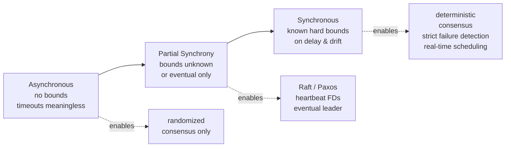

# System Synchrony Models

> **One-sentence summary.** A synchrony model is the set of timing assumptions an algorithm is allowed to make about message delay, clock drift, and relative process speed, and it is the single lever that decides whether timeouts, failure detectors, and consensus are even expressible — let alone correct.

## How It Works

Every distributed algorithm is written against an assumed *timing model*. The model is not about how fast the system actually runs; it is about what the algorithm is permitted to conclude from the passage of time. Three models matter, and they form a spectrum from paranoid to optimistic.

The **asynchronous model** makes no assumption at all. Messages may take arbitrarily long, processes may run at arbitrarily different speeds, and no upper bound is known for either. In this world a timeout teaches you nothing — a silent peer is indistinguishable from a slow one, so failure detection is impossible in the strict sense. This is also the regime in which *FLP Impossibility* bites: no deterministic protocol can guarantee consensus if even one process may crash, because you can never tell "crashed" from "hasn't answered yet." Algorithms designed for pure asynchrony give up either liveness (may never terminate) or determinism (use randomization).

The **synchronous model** is the other extreme. There is a known upper bound on message delivery, a known bound on how much faster one process can run than another, and a known bound on clock drift between process-local clocks. Under these assumptions, a timeout is a reliable failure detector: if a reply does not arrive within *bound + bound*, the peer truly has failed. Leader election, consensus, and group membership become straightforward to design — every primitive that needs "wait long enough, then act" now has a concrete meaning for "long enough." The catch is brittleness: if the real network ever violates the assumed bound, the algorithm's correctness argument collapses with it.

Real networks satisfy neither extreme. Dwork, Lynch and Stockmeyer's 1988 paper introduced **partial synchrony** precisely to capture where production systems live: bounds on delay and drift *exist* but are either unknown to the algorithm, or hold only *eventually* (after some unknown "global stabilization time"). A partially synchronous protocol tolerates arbitrary bad behavior during transients and only needs to make progress once the network settles. This is why Raft, Paxos, and heartbeat-based failure detectors are safe even when GC pauses or a bad switch briefly break timing — they don't *need* bounds during the bad patch, only afterward.

The key insight: **timeouts are not a feature of the network, they are a claim about the synchrony model.** Every time an engineer types `timeout=5s`, they are silently betting that the system is at least partially synchronous with a bound around 5 seconds. Get the bet wrong and you get split-brain leaders, spurious failovers, or hung RPCs.

## When to Use

- **Pick the weakest model your algorithm tolerates.** Designing against partial synchrony gives you Raft/Paxos and works almost everywhere; designing against full synchrony is simpler but only justified when you can enforce the bounds (same rack, dedicated links, RTOS).
- **Pay for tighter synchrony when correctness depends on it.** Spanner invests in GPS-disciplined atomic clocks per datacenter because its external-consistency guarantee needs a hard bound on clock uncertainty — no amount of "eventually" will do when you commit a transaction and need every later reader to see it.
- **Fall back to asynchronous reasoning for safety arguments.** A good protocol proves *safety* (never give a wrong answer) under pure asynchrony, and *liveness* (eventually make progress) only under partial synchrony. That way a network storm costs you availability, never correctness.

## Trade-offs

| Aspect | Asynchronous | Partial Synchrony | Synchronous |
|--------|--------------|-------------------|-------------|
| What it assumes | nothing about timing | bounds exist, unknown or eventual | known hard bounds on delay & drift |
| Algorithms that can terminate | randomized consensus (Ben-Or); gossip convergence | Raft, Paxos, eventual leader election, heartbeat FDs | deterministic consensus, strict FDs, real-time scheduling |
| Engineering cost | minimal; no time infra needed | moderate; tune heartbeats, backoff, GC pauses | high; atomic clocks, dedicated networks, bounded-latency kernels |
| Failure if assumption breaks | n/a — nothing to break | liveness stalls during instability; safety preserved | safety can break; split-brain leaders, wrong failure verdicts |
| Typical domain | theory, CRDTs, anti-entropy | mainstream distributed databases, coordinators | HFT, avionics, Spanner's TrueTime-bounded region |

## Real-World Examples

- **Google Spanner (TrueTime)**: Exposes a `TT.now()` API returning `[earliest, latest]` timestamps with bounded uncertainty (typically under 7ms). Commit waits out the uncertainty interval so that every transaction's commit timestamp truly precedes every later transaction's — turning an assumed synchrony bound into an *enforced* one backed by GPS and atomic clocks.
- **Raft's election timeout**: Assumes partial synchrony. Randomized timeouts (e.g., 150–300ms) rely on the network being *usually* fast enough that a leader's heartbeats arrive before followers time out. When the network misbehaves, Raft may elect multiple would-be leaders, but the term-number safety argument still holds — a lagging leader is forced to step down once it sees a higher term.
- **Cassandra's phi-accrual failure detector**: Uses gossip + a statistical model of past inter-arrival times to output a suspicion level rather than a binary "up/down." This is partial synchrony made explicit: it assumes bounds exist but adapts its threshold to observed reality, degrading gracefully instead of flipping spuriously.
- **etcd and ZooKeeper**: Both run Raft-family / ZAB protocols under partial-synchrony assumptions; operators tune heartbeat intervals and session timeouts against observed p99 RTT, and a long GC pause on the leader will (correctly, by design) trigger a re-election.

## Common Pitfalls

- **Using wall-clock timestamps to order events across nodes.** POSIX clocks drift relative to each other and can jump backward under NTP correction. "Latest write wins" by wall clock routinely loses real writes. Use logical clocks, Lamport timestamps, vector clocks, or a bounded-uncertainty API like TrueTime.
- **Picking a timeout from the mean, not the tail.** If p50 RTT is 2ms but p99 is 400ms, a 50ms timeout will declare healthy peers dead several times a minute. Size timeouts against p99 (or p99.9) of observed RTT plus a safety margin, and re-tune when topology changes.
- **Assuming synchrony to simplify the design, then losing liveness in production.** A system that hangs whenever a TCP connection stalls for 10 seconds has silently assumed synchronous bounds it cannot enforce. Always separate safety (prove under async) from liveness (require partial sync), so network weather costs availability but never correctness.
- **Trusting NTP-sync'd wall clocks to be monotonic.** They aren't — `gettimeofday()` can step backward during slews. For measuring intervals (timeouts, latencies, lease durations), always use the monotonic clock (`CLOCK_MONOTONIC`); reserve wall-clock reads for display and cross-node human correlation, never for ordering.

## See Also

- [[01-fallacies-of-distributed-computing]] — "the network is reliable" and "latency is zero" are the fallacies that make naive synchronous assumptions dangerous
- [[05-flp-impossibility-and-consensus]] — why asynchronous consensus is unsolvable and how partial synchrony is the standard escape hatch
- [[07-failure-models]] — pairs with synchrony: what you assume *can* go wrong × how long you'll wait before deciding it has
