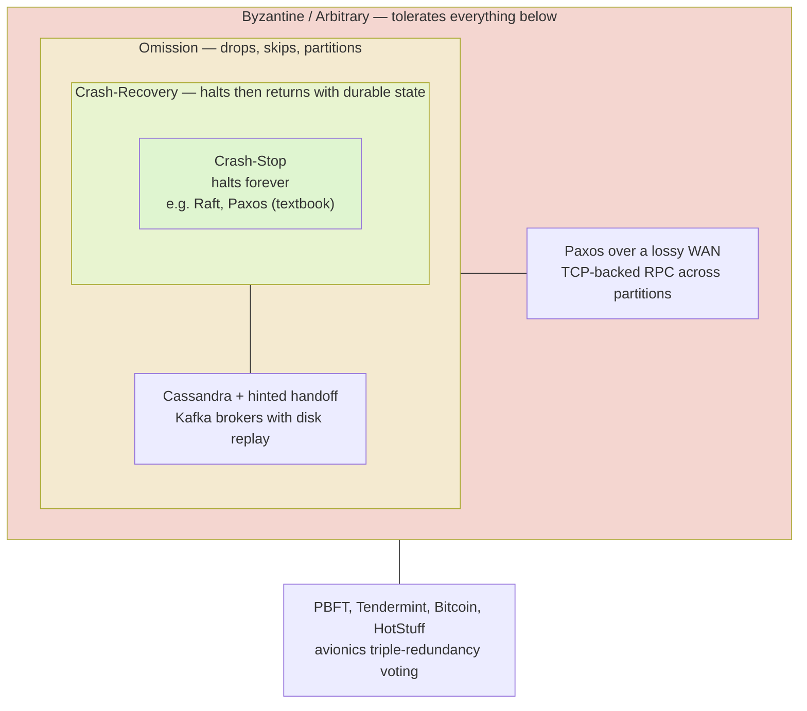

# Failure Models: Crash, Omission, and Byzantine

> **One-sentence summary.** A failure model is a precise specification of the ways a process is permitted to deviate from correctness, and every distributed algorithm is designed, analyzed, and proved safe only against one specific model — pick the wrong one and the algorithm's guarantees quietly evaporate.

## How It Works

Saying "a node failed" is too imprecise to build a protocol around. Before you can reason about tolerance, you have to pin down *how* a process is allowed to misbehave. The standard hierarchy orders these behaviors from tamest to most pathological, and each stronger model strictly subsumes the weaker ones — anything tolerable at a higher level is also tolerable at a lower level, but not vice versa.

**Crash-stop** is the friendliest model. A process either executes the algorithm correctly or halts forever; once it has halted it emits no further messages and is not expected to return. Most textbook algorithms assume this because it is the easiest to reason about: a missing message means the peer is gone, full stop. The crash-stop abstraction doesn't *forbid* recovery — it just says the algorithm's correctness doesn't depend on it. A recovering process can rejoin the next round of negotiations under a fresh identity, but cannot resume the round in which it died.

**Crash-recovery** allows a process to halt, persist durable state, and later come back to continue executing. This requires a recovery protocol and careful thought about which local state survives, because the returning process may try to pick up from the last step it remembers. Viewed from outside, crash-recovery is indistinguishable from omission during the downtime window — peers cannot tell whether silence means "crashed" or "unreachable".

**Omission** covers processes that skip steps or drop messages: a packet lost to a faulty switch, a message dropped from a full queue, a network partition isolating a subset of peers, a slow node whose replies arrive so late they look missing. A crash is just a *total* omission that never ends; asymmetric link failures (A hears B, B doesn't hear A) also live here.

**Byzantine** (or *arbitrary*) faults describe a process that continues sending messages but in ways the algorithm forbids — deciding on a value nobody proposed, signing contradictory statements to different peers, or actively lying. The causes range from innocuous (version mismatch, a subtle bug) to adversarial (a compromised or malicious node). Byzantine is the hardest class because you can no longer trust *any* message at face value.

Defenses scale with the model. Crash-stop is handled by redundancy plus a failure detector — if `f` replicas may crash, a majority quorum of `2f + 1` survives and preserves safety (this is the arithmetic behind Raft and Paxos). Crash-recovery adds a write-ahead log and a recovery protocol so state survives the reboot. Omission adds retries, timeouts, sequence numbers, and deduplication to paper over lost messages. Byzantine demands *cryptographic* evidence and a larger quorum: PBFT-style protocols require `3f + 1` replicas to tolerate `f` Byzantine faults, because honest nodes must form a majority even when the faulty ones pick a side and lie consistently.

## When to Use

Choose the weakest model that plausibly describes your environment — weaker assumptions cost less replication and simpler code.

- **Internal cluster, trusted operators, controlled deployment** — crash-stop. Raft or Paxos over a private network fits here; nodes fail by dying, not by lying.
- **Nodes with durable local disks that can rejoin after reboot** — crash-recovery. Anything backed by a WAL on persistent storage (most production databases) benefits from modeling recovery explicitly.
- **WAN deployments, flaky networks, multi-region clusters** — omission. You must assume messages will be dropped, reordered, and delayed beyond any reasonable timeout; design with idempotence and deduplication.
- **Open participation, mutually distrustful parties, or safety-critical hardware** — Byzantine. Public blockchains, federated consensus across organizations, and avionics flight-control systems all require it.

## Trade-offs

| Model | What can fail | Replicas for `f` faults | Algorithmic complexity | Detection difficulty |
|---|---|---|---|---|
| Crash-stop | Process halts forever | `2f + 1` | Low — a missing message means death | Easy with timeouts under partial synchrony |
| Crash-recovery | Halt plus later return with durable state | `2f + 1` | Medium — need WAL and recovery protocol | Medium — can't distinguish slow from crashed mid-recovery |
| Omission | Dropped/skipped messages, partitions, asymmetric links | `2f + 1` | Medium — retries, dedup, sequence numbers | Hard — slow and dead look identical |
| Byzantine | Arbitrary behavior including lies and collusion | `3f + 1` | High — signatures, quorum certificates, view changes | Very hard — the faulty node is actively hiding |

## Real-World Examples

- **Raft** (etcd, Consul, CockroachDB) — crash-stop with a partial-synchrony timer for leader election; assumes nodes fail silently and recover through log replay on restart.
- **Cassandra** — crash-recovery in practice: nodes persist commitlogs and SSTables, and *hinted handoff* replays writes a peer missed while it was down. Read-repair closes the omission gap.
- **Paxos over a WAN** (Google Chubby, Spanner's Paxos groups) — tolerates omission by retrying proposals and relying on majorities; the algorithm is safe even when an arbitrary subset of messages is lost.
- **PBFT, Tendermint, HotStuff, Bitcoin** — Byzantine fault tolerance for open or federated consensus. PBFT needs `3f + 1` replicas and two rounds of voting; Nakamoto consensus swaps quorum voting for probabilistic longest-chain under proof-of-work.
- **Avionics triple-redundancy voting** — three independent flight computers cross-check outputs; the voter masks a Byzantine failure in any one unit. The same pattern appears in spacecraft attitude control.

## Common Pitfalls

- **Assuming crash-stop when the code can actually recover with stale state.** A process that reboots and rejoins with a ledger older than the cluster has advanced to will violate safety if the algorithm expected it to stay dead. Either use a crash-recovery protocol with proper fencing or make the recovering node wipe its state.
- **Conflating slow with crashed.** A failure detector that flags a merely slow node as dead can trigger spurious leader elections, double writes, and split brain. Timeouts are a heuristic, not a fact — see [[06-system-synchrony-models]].
- **Running a crash-tolerant protocol in a Byzantine environment.** Raft in a setting where any replica might lie is unsafe — a single malicious node can propose conflicting log entries to different peers. If participants aren't mutually trusted, you need `3f + 1` and signatures, not `2f + 1`.
- **Underprovisioning replicas for the intended `f`.** A 3-node crash-tolerant cluster tolerates `f = 1`; a 4-node cluster still only tolerates `f = 1` because the majority is 3. For Byzantine protocols the mistake is worse: 4 replicas give `f = 1`, not `f = 2`. Size the cluster to the model you actually claim.

## See Also

- [[02-partial-failures-and-cascading-failures]] — the operational symptoms these models formalize
- [[05-flp-impossibility-and-consensus]] — why detecting a crash is itself impossible in a purely asynchronous system
- [[06-system-synchrony-models]] — the timing assumptions that make crash detection tractable in the first place
