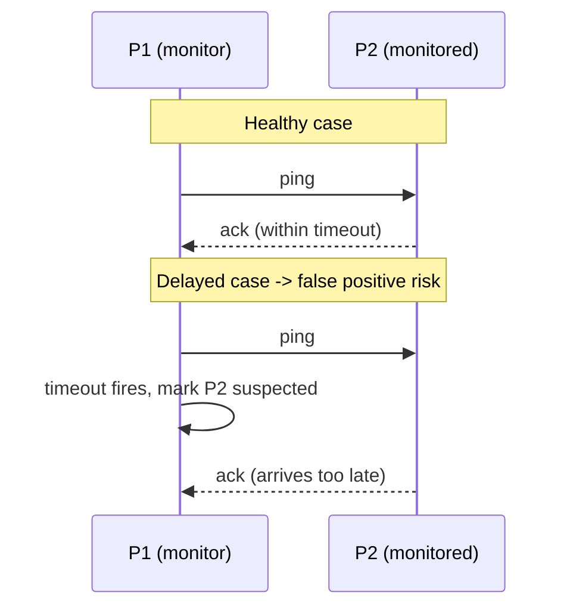

# Failure Detector Properties and Heartbeat/Ping Basics

> **One-sentence summary.** A failure detector is a local subsystem that uses heartbeats or pings to guess which processes have crashed, trading accuracy against efficiency because in an asynchronous system "crashed" and "slow" are fundamentally indistinguishable.

## How It Works

In an asynchronous distributed system there is no upper bound on message delay, so a silent peer might be dead, or it might just be slow — a fact made rigorous by [[05-flp-impossibility-and-consensus]]. A **failure detector** sidesteps this by being a *best-effort*, *local* subsystem on each process that decides when to stop waiting on a peer and declare it *suspected*. The literature uses sharp vocabulary: *dead*, *failed*, and *crashed* describe processes that have truly stopped, while *unresponsive*, *faulty*, *slow*, and *suspected* describe our (possibly wrong) beliefs about them. Failures can live at the **link level** (messages lost or delayed) or the **process level** (the node itself crashed); the detector usually cannot tell these apart. See [[07-failure-models]] for the broader taxonomy.

Two primitive mechanisms drive almost every practical detector:

- **Ping.** The monitor sends a probe and expects an acknowledgment within a deadline.
- **Heartbeat.** The monitored process proactively sends periodic "I'm alive" messages; the monitor watches for their arrival.

Each process keeps a table of peers with their last-seen timestamps. If a peer misses its deadline it is flipped to *suspected*, and the rest of the system (membership, routing, replication) reacts accordingly.

Algorithm quality is judged on three axes. **Completeness** says every nonfaulty process must eventually notice a real failure. **Efficiency** is how fast it notices. **Accuracy** is whether its accusations are true — a detector that cries wolf on live peers is inaccurate. Chandra and Toueg proved you cannot maximize both efficiency and accuracy at once, so every detector picks a point on that curve. These algorithm metrics map onto two system-level guarantees: **liveness** (something good, like detection of a real failure, must eventually happen) and **safety** (something bad, like marking a healthy peer dead, must never happen). False positives violate safety; false negatives violate liveness.

## When to Use

- **Membership and failover.** Clusters need to know who is "in" to elect leaders, reshuffle shards, or re-replicate data. Cassandra, Akka, and Kubernetes all rely on heartbeat-style detectors for this.
- **As a prerequisite for consensus.** Raft, Paxos variants, and atomic broadcast protocols layer on top of a failure detector — it is how they escape FLP and make progress when a leader dies.
- **Excluding slow peers from the hot path.** Even if a node is technically alive, routing traffic past it avoids latency cliffs and cascading backpressure.

## Trade-offs

| Aspect | Advantage | Disadvantage |
|--------|-----------|--------------|
| **Efficiency vs. accuracy** | Short timeouts detect crashes quickly, shrinking recovery windows | Short timeouts cause false positives during GC pauses or network blips |
| **Liveness vs. safety** | Willingness to suspect keeps the system progressing | Over-eager suspicion marks healthy peers dead, causing churn |
| **Heartbeats vs. pings** | Heartbeats amortize one message per interval regardless of monitors; pings give the monitor control over cadence | Heartbeats waste bandwidth when no one cares; pings scale poorly as the monitor set grows |
| **Link-level vs. process-level view** | Local detector is simple and cheap | One process's view cannot distinguish a dead peer from a broken link between them |

## Real-World Examples

- **Akka's deadline failure detector.** A pure timeout-plus-heartbeat design: miss the deadline, you are out. Simple and fast, but fragile under bursty networks.
- **Cassandra and Akka phi-accrual.** Both ship the adaptive [[04-phi-accrual-failure-detector]] as an alternative, precisely because static timeouts misbehave in production.
- **Consul and Serf (SWIM).** Use the indirect-probe trick from [[03-swim-outsourced-heartbeats]] to cut false positives without blasting heartbeats to every peer.
- **Kubernetes node lease.** The kubelet renews a lease object; controllers treat lease staleness as a heartbeat miss.

## Common Pitfalls

- **Timeouts tuned for the median, not the tail.** A 1-second timeout works great until a stop-the-world GC or a cross-AZ hiccup blows through it. Always tune against p99 latency, not averages.
- **Confusing link failures with process failures.** A single monitor cannot tell them apart. Outsourcing probes to multiple peers (SWIM) or gossiping views (see [[05-gossip-failure-detection]]) is the only honest fix.
- **Treating suspicion as certainty.** Some systems immediately fence or kill suspected nodes. With no room for false positives, a brief network partition becomes a self-inflicted outage.
- **Ignoring the FLP boundary.** No detector is perfect; Chandra-Toueg showed consensus stays solvable even with a detector that makes infinite mistakes, so design the consumers of the detector to tolerate error — do not demand oracular truth.

## See Also

- [[05-flp-impossibility-and-consensus]] — the impossibility result that forces failure detection to be heuristic rather than exact
- [[07-failure-models]] — classifies the kinds of failures (crash, omission, Byzantine) detectors try to catch
- [[02-timeout-free-failure-detector]] — drops clocks entirely by counting heartbeat propagations
- [[03-swim-outsourced-heartbeats]] — enlists random peers to cross-check suspected processes
- [[04-phi-accrual-failure-detector]] — replaces the binary up/down verdict with a continuous suspicion level
- [[05-gossip-failure-detection]] — aggregates many local views into a cluster-wide judgment
- [[06-fuse-reversing-failure-detection]] — inverts the pattern, using silence itself as the failure signal
